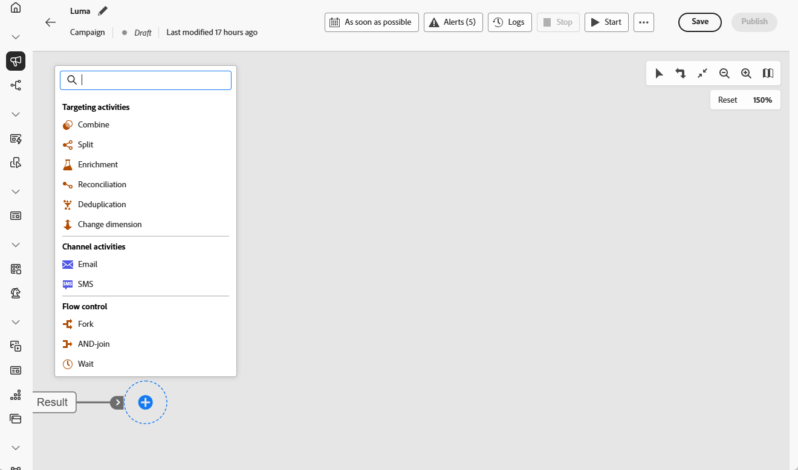
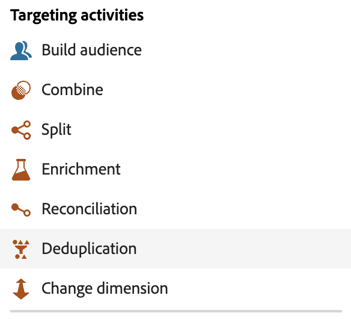
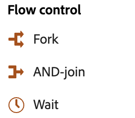

# About orchestrated campaign activities {#orchestrated-campaign-activities}

+++ Table of Contents

| Welcome to orchestrated campaigns | Launch your first orchestrated campaign | Query the database | Ochestrated campaigns activities|
|---|---|---|---|
|[Get started with orchestrated campaigns](../gs-orchestrated-campaigns.md)  [Configuration steps](../configuration-steps.md)  [Key steps for orchestrated campaign creation](../gs-campaign-creation.md)|[Create an orchestrated campaign](../create-orchestrated-campaign.md)  [Orchestrate activities](../orchestrate-activities.md)   [Start and monitor the campaign](../start-monitor-campaigns.md)  [Reporting](../reporting-campaigns.md)|[Work with the Query Modeler](../orchestrated-rule-builder.md)  [Build your first query](../build-query.md)  [Edit expressions](../edit-expressions.md)|[Get started with activities](about-activities.md)  Activities: [And-join](and-join.md) - [Build audience](build-audience.md) - [Change dimension](change-dimension.md) - [Combine](combine.md) - [Deduplication](deduplication.md) - [Enrichment](enrichment.md) - [Fork](fork.md) - [Reconciliation](reconciliation.md) - [Split](split.md) -  [Wait](wait.md)|

{style="table-layout:fixed"}

+++

 

Orchestrated campaign activities are grouped into three categories. Depending on the context, available activities may differ. 

All activities are detailed in the sections below:

* [Targeting activities](#targeting)
* [Channel activities](#channel)
* [Flow control activities](#flow-control)

{width="80%" align="left"}

## Targeting activities {#targeting}

These activities are specific to targeting. They let you build one or more targets by defining an audience and splitting or combining these audiences using intersection, union or exclusion operations.

{width="40%" align="left"}

* [Build audience](build-audience.md): Define your target population. You can either select an existing audience or use the query modeler to define your own query.
* [Change dimension](change-dimension.md): Change the targeting dimension as you are building your orchestrated campaign.
* [Combine](combine.md): Perform segmentation on your inbound population. You can use a union, an intersection or an exclusion.
* [Deduplication](deduplication.md): Delete duplicates in the result(s) of the inbound activities.
* [Enrichment](enrichment.md): Define additional data to process in your orchestrated campaign. With this activity, you can leverage the inbound transition and configure the activity to complete the output transition with additional data.
* [Reconciliation](reconciliation.md): Define the link between the data in Journey Optimizer data and the data in a work table, for example data loaded from an external file.
* [Split](split.md): Segment incoming population into several subsets.

## Channel activities {#channel}

Adobe Journey Optimizer allows you to automate and execute marketing campaigns across multiple channels. You can combine channel activities into the canvas to create cross-channel orchestrated campaign that can trigger actions based on customer behavior. The following **Channel** activities are available: Email and SMS. [Learn how to create a channel action in the context of an orchestrated campaign](channels.md).

## Flow control activities {#flow-control}

>[!CONTEXTUALHELP]
>id="ajo_orchestration_end"
>title="End activity"
>abstract="The **End** activity allows you to graphically mark the end of an orchestrated campaign. This activity has no functional impact and is therefore optional."

{width="30%" align="left"}

The following activities are specific to organizing and executing orchestrated campaigns. Their main task is to coordinate the other activities:

* [And-join](and-join.md): Synchronize multiple execution branches of an orchestrated campaign.
* [Fork](fork.md): Create outbound transitions to start several activities at the same time.
* [Wait](wait.md): Momentarily pause execution of a part of an orchestrated campaign.
<!--* [Test](test.md): Enable transitions based on specified conditions.-->

>[!NOTE]
>The **End** activity graphically marks the end of an orchestrated campaign. This activity has no functional impact and is therefore optional
