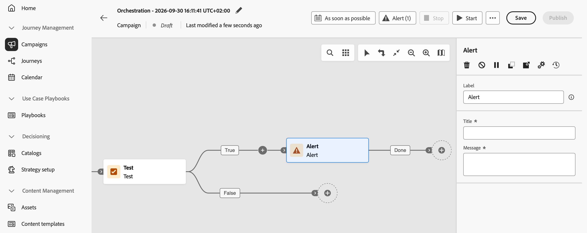

# Alert {#alert}

>[!CONTEXTUALHELP]
>id="ajo_orchestration_alert"
>title="Alert"
>abstract="The **Alert** activity notifies subscribers when Orchestrated campaign execution reaches it. Its position in the flow and upstream logic determine when it fires. For conditional alerts, place it on the relevant branch of a **Test** activity."

>[!BEGINSHADEBOX]

**On this page:** Learn how to configure the Alert flow control activity to notify subscribers when execution reaches a specific point in an Orchestrated campaign.

>[!ENDSHADEBOX]

The **[!UICONTROL Alert]** activity is a **[!UICONTROL Flow control]** activity. Use it to notify subscribers when campaign execution reaches the activity on the canvas.

The activity has no independent trigger or condition configuration. Its position in the flow and the upstream orchestration logic determine when it fires. For conditional alerts, place it on the relevant branch of a [Test activity](test.md).

## Configure the Alert activity {#alert-configuration}

1. Add an **[!UICONTROL Alert]** activity to your Orchestrated campaign canvas.

1. Connect it to the transition where you want an alert to fire.

    

1. Select the activity and configure the following fields:

  * **[!UICONTROL Label]**: Enter a name to identify the activity on the canvas.
  * **[!UICONTROL Title]** (required): Enter a short, plain-text title for the alert.
  * **[!UICONTROL Message]** (required): Enter a plain-text message that describes what subscribers need to know.

The title and message are static. Dynamic tokens are not supported.

For information on subscribing to alerts in Journey Optimizer, see [Subscribe to alerts](../../reports/alerts.md#subscribe-alerts).

## Example: Low population alert {#low-population-example}

Notify subscribers when a query returns fewer than 10,000 profiles:

1. Add a [Build audience activity](build-audience.md) and use the rule builder to define your query.

1. Add a **[!UICONTROL Test]** activity after it and define a condition that checks whether the population count is less than 10,000.

1. Place an **[!UICONTROL Alert]** activity on the transition for that condition.

1. Enter a static title, such as `Low audience population`, and a message, such as `The query returned fewer than 10,000 profiles.`

The Alert activity fires when the Test condition matches and execution reaches the alert. The value of 10,000 is an example threshold that you configure in the Test activity, not a product limit.

{{$include /help/_includes/do-not-localize/orchestrated/ai-augmented-activities-alert.md}}
