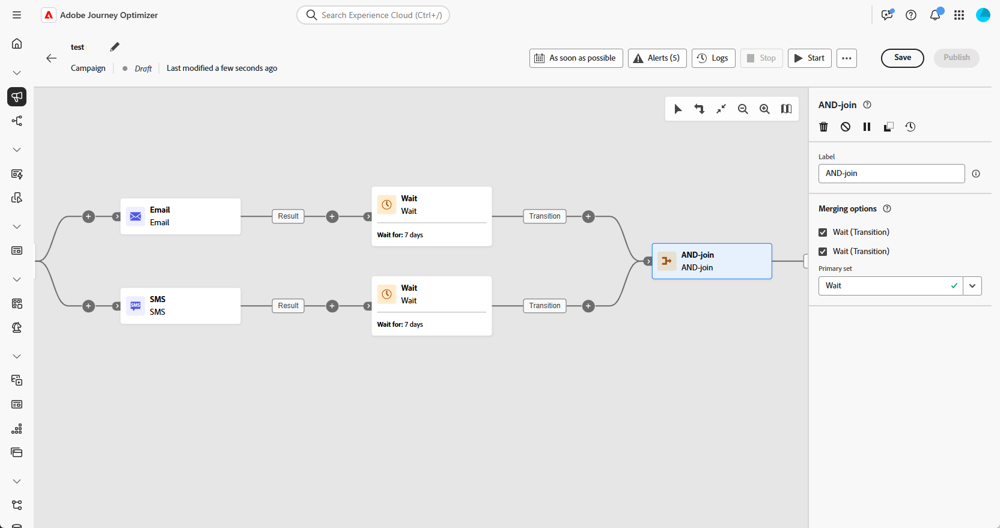
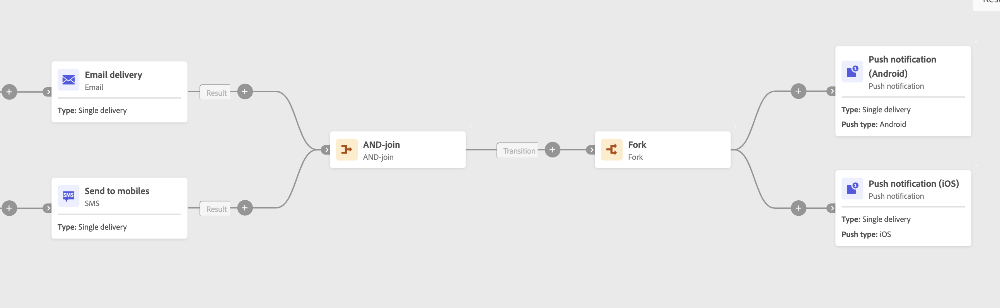

# AND-join {#join}

>[!CONTEXTUALHELP]
>id="ajo_orchestration_and-join"
>title="AND-join activity"
>abstract="The **And-join** activity allows you to synchronize multiple execution branches of an orchestrated campaign. It is triggered once all of the preceding activities have finished. This allows you to make sure that certain activities are finished before continuing to execute the orchestrated campaign."
  

+++ Table of Contents

| Welcome to orchestrated campaigns | Launch your first orchestrated campaign | Query the database | Ochestrated campaigns activities|
|---|---|---|---|
|[Get started with orchestrated campaigns](../gs-orchestrated-campaigns.md)  Create and manage relational Schemas and Datasets:  <ul><li>[Manual schema](../manual-schema.md)</li><li>[File upload schema](../file-upload-schema.md)</li><li>[Ingest data](../ingest-data.md)</li></ul>  [Access and manage orchestrated campaigns](../access-manage-orchestrated-campaigns.md)|[Key steps to create an orchestrated campaign](../gs-campaign-creation.md)  [Create and schedule the campaign](../create-orchestrated-campaign.md)  [Orchestrate activities](../orchestrate-activities.md)  [Start and monitor the campaign](../start-monitor-campaigns.md)  [Reporting](../reporting-campaigns.md)|[Work with the rule builder](../orchestrated-rule-builder.md)  [Build your first query](../build-query.md)  [Edit expressions](../edit-expressions.md)  [Retargeting](../retarget.md)|[Get started with activities](about-activities.md)  Activities: <b>[And-join](and-join.md)</b> - [Build audience](build-audience.md) - [Change dimension](change-dimension.md) - [Channel activities](channels.md) - [Combine](combine.md) - [Deduplication](deduplication.md) - [Enrichment](enrichment.md) - [Fork](fork.md) - [Reconciliation](reconciliation.md) - [Save audience](save-audience.md) - [Split](split.md) - [Wait](wait.md)|

{style="table-layout:fixed"}

+++

 

>[!BEGINSHADEBOX]

The content on this page is not final and may be subject to change.

>[!ENDSHADEBOX]

The **[!UICONTROL And-join]** activity is a **[!UICONTROL Flow control]** activity. It allows you to synchronize multiple execution branches of an orchestrated campaign.

This activity only triggers its outbound transition once all the inbound transitions are activated, in other words, once all of the preceding activities have finished. This allows you to make sure that certain activities have finished before continuing to execute the orchestrated campaign.

## Configure the And-join activity{#and-join-configuration}

>[!CONTEXTUALHELP]
>id="ajo_orchestration_and-join_merging"
>title="Merging options"
>abstract="Select which activities you want to join. In the **Primary set** drop-down, choose which inbound transition population you want to keep."

Follow these steps to configure the **[!UICONTROL AND-join]** activity:

1. Add multiple activities, such as channel activities, to create at least two distinct execution branches.

1. Insert an **[!UICONTROL AND-join]** activity into one of the branches.

1. Under the **[!UICONTROL Merging options]** section, select all preceding activities you want to join.
 
1. From the **[!UICONTROL Primary set]** drop-down, choose the inbound transition population you want to retain.

## Example{#and-join-example}

This example illustrates two coordinated campaign branches, each featuring an email delivery, one targeting gold members and the other silver. The **[!UICONTROL AND-join]** activates once both incoming transitions are triggered, and the SMS will be sent only after both email deliveries are completed, following a 7-day delay.

{zoomable="yes"}
