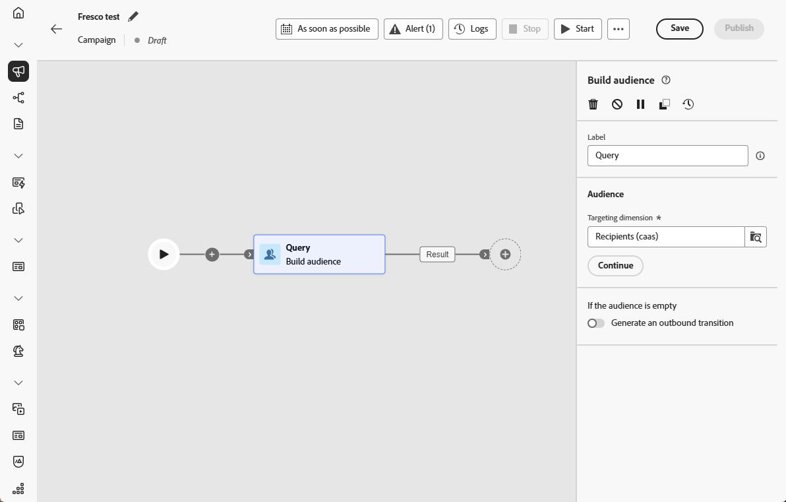
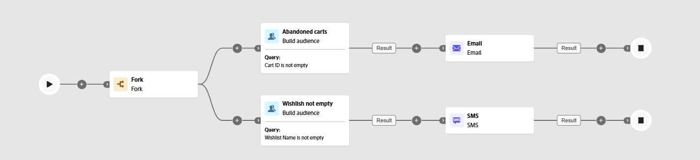

# Build audience {#build-audience}

>[!CONTEXTUALHELP]
>id="ajo_orchestration_build_audience"
>title="Build audience activity"
>abstract="The **Build audience** activity allows you to define the audience that will enter the orchestrated campaign. When sending messages in the context of an orchestrated campaign, the message audience is not defined in the channel activity, but in the **Build audience** activity."

+++ Table of Contents

| Welcome to orchestrated campaigns | Launch your first orchestrated campaign | Query the database | Ochestrated campaigns activities|
|---|---|---|---|
|[Get started with orchestrated campaigns](../gs-orchestrated-campaigns.md)  [Configuration steps](../configuration-steps.md)  [Key steps for orchestrated campaign creation](../gs-campaign-creation.md)|[Create an orchestrated campaign](../create-orchestrated-campaign.md)  [Orchestrate activities](../orchestrate-activities.md)  [Send messages with orchestrated campaigns](../send-messages.md)  [Start and monitor the campaign](../start-monitor-campaigns.md)  [Reporting](../reporting-campaigns.md)|[Work with the Query Modeler](../orchestrated-query-modeler.md)  [Build your first query](../build-query.md)  [Edit expressions](../edit-expressions.md)|[Get started with activities](about-activities.md)  Activities: [And-join](and-join.md) - [Build audience](build-audience.md) - [Change dimension](change-dimension.md) - [Combine](combine.md) - [Deduplication](deduplication.md) - [Enrichment](enrichment.md) - [Fork](fork.md) - [Reconciliation](reconciliation.md) - [Split](split.md) -  [Wait](wait.md)|

{style="table-layout:fixed"}

+++

 

As a marketer, you can create complex audience segments through an intuitive interface, allowing you to target users based on a wide range of criteria and behaviors to tailor your campaigns more effectively.

To do this, use the **Build audience** targeting activity. This activity defines the audience that enters the orchestrated campaign. When sending messages as part of an orchestrated campaign, the audience is defined in the **Build audience** activity, not within the orchestrated campaign.

## Configure the Build audience activity {#build-audience-configuration}

>[!CONTEXTUALHELP]
>id="ajo_orchestration_build_audience_audienceselector"
>title="Audience"
>abstract="Select your audience, the same way you use an audience when designing a new delivery."

Follow these steps to configure the **Build audience** activity:

1. Add a **Build audience** activity.

    

1. Define a label.

1. Configure your audience by following the steps detailed in the tabs below.

1. Choose the **Targeting dimension**. The targeting dimension lets you define the population targeted by the operation: recipients, contract beneficiaries, operator, subscribers, etc. By default, the target is selected from the recipients.

1. Click **Continue**.

1. Use the query modeler to define your query. [Learn more about the Query modeler in this section](../orchestrated-query-modeler.md) 

1. Specify whether an outbound transition should be generated when the audience is empty.

## Examples{#build-audience-examples}

Here is an example of an orchestrated campaign with two **Build audience** activities. The first targets profiles that have items in their cart, followed by an email delivery. The second targets profiles with a wishlist, followed by an SMS delivery.

