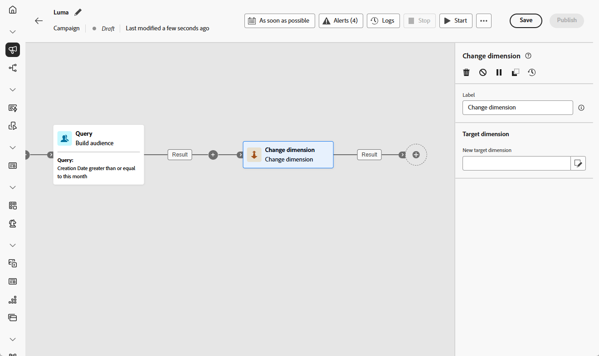

# Change dimension {#change-dimension}

>[!CONTEXTUALHELP]
>id="ajo_orchestration_dimension_complement"
>title="Generate a complement"
>abstract="You can generate an additional outbound transition with the remaining population, which was excluded as a duplicate. To do this, toggle on the **Generate complement** option"

>[!CONTEXTUALHELP]
>id="ajo_orchestration_change_dimension"
>title="Change dimension activity"
>abstract="This activity allows you to change the targeting dimension as you are building an audience. It shifts the axis depending on the data template and the input dimension. For example, you can switch from the "contracts" dimension to the "clients" dimension."

+++ Table of Contents

| Welcome to orchestrated campaigns | Launch your first orchestrated campaign | Query the database | Ochestrated campaigns activities|
|---|---|---|---|
|[Get started with orchestrated campaigns](../gs-orchestrated-campaigns.md)  [Configuration steps](../configuration-steps.md)  [Key steps for orchestrated campaign creation](../gs-campaign-creation.md)|[Create an orchestrated campaign](../create-orchestrated-campaign.md)  [Orchestrate activities](../orchestrate-activities.md)  [Start and monitor the campaign](../start-monitor-campaigns.md)  [Reporting](../reporting-campaigns.md)|[Work with the Query Modeler](../orchestrated-rule-builder.md)  [Build your first query](../build-query.md)  [Edit expressions](../edit-expressions.md)|[Get started with activities](about-activities.md)  Activities: [And-join](and-join.md) - [Build audience](build-audience.md) - **[Change dimension](change-dimension.md)** - [Channel activities](channels.md) - [Combine](combine.md) - [Deduplication](deduplication.md) - [Enrichment](enrichment.md) - [Fork](fork.md) - [Reconciliation](reconciliation.md) - [Split](split.md) -  [Wait](wait.md)|

{style="table-layout:fixed"}

+++

 

As a marketer, you can refine audience targeting by switching from one data entity to another linked entity within an orchestrated campaign. This allows you to move from targeting user profiles to focusing on specific actions, such as purchases, bookings, or other interactions.

To do this, use the **[!UICONTROL Change dimension]** activity. It lets you change the targeting dimension during the orchestrated campaign, based on the structure of your data model and the input dimension.

<!--
>[!IMPORTANT]
>
>Please note that the **[!UICONTROL Change Dimension]** and **[!UICONTROL Change Data source]** activities should not be added in one row. If you need to use both activities consecutively, make sure you include an **[!UICONTROL Enrichement]** activity in between them. This ensures proper execution and prevents potential conflicts or errors.-->

## Configure the Change dimension activity {#configure}

Follow these steps to configure the **[!UICONTROL Change dimension]** activity:

1. Add a **[!UICONTROL Change dimension]** activity to your orchestrated campaign.

   

1. Define the **[!UICONTROL New target dimension]**. During dimension change, all records are kept. 

1. Execute the orchestrated campaign to view the result. Compare the data in the tables before and after the change dimension activity, and compare the structure of the orchestrated campaign tables.

## Example {#example}

This use case involves sending an SMS to profiles who have created a wishlist in the past month.

Start with a **[!UICONTROL Build audience]** activity using the **[!UICONTROL Wishlist]** targeting dimension to select all relevant wishlists.

Next, insert a **[!UICONTROL Change dimension]** activity to switch the targeting dimension from **[!UICONTROL Wishlist]** to **[!UICONTROL Recipient]**. This enables the orchestrated campaign to send the SMS to the profiles associated with those wishlists.

