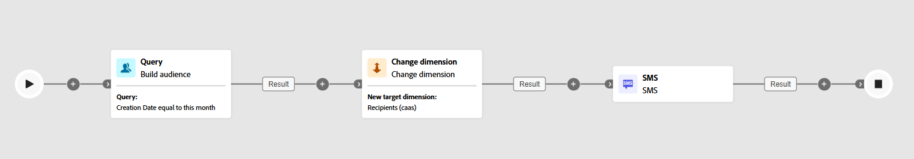

# Change dimension {#change-dimension}

>[!CONTEXTUALHELP]
>id="ajo_orchestration_dimension_complement"
>title="Generate a complement"
>abstract="You can generate an additional outbound transition with the remaining population, which was excluded as a duplicate. To do this, toggle on the **Generate complement** option"

>[!CONTEXTUALHELP]
>id="ajo_orchestration_change_dimension"
>title="Change dimension activity"
>abstract="This activity allows you to change the targeting dimension as you are building an audience. It shifts the axis depending on the data template and the input dimension. For example, you can switch from the "contracts" dimension to the "clients" dimension."

+++ Table of Contents

| Welcome to Orchestrated campaigns | Launch your first Orchestrated campaign | Query the database | Ochestrated campaigns activities|
|---|---|---|---|
|[Get started with Orchestrated campaigns](../gs-orchestrated-campaigns.md)  Create and manage relational Schemas and Datasets:  <ul><li>[Get started with Schemas and Datasets](../gs-schemas.md)</li><li>[Manual schema](../manual-schema.md)</li><li>[File upload schema](../file-upload-schema.md)</li><li>[Ingest data](../ingest-data.md)</li></ul>[Access and manage Orchestrated campaigns](../access-manage-orchestrated-campaigns.md)|[Key steps to create an Orchestrated campaign](../gs-campaign-creation.md)  [Create and schedule the campaign](../create-orchestrated-campaign.md)  [Orchestrate activities](../orchestrate-activities.md)  [Start and monitor the campaign](../start-monitor-campaigns.md)  [Reporting](../reporting-campaigns.md)|[Work with the rule builder](../orchestrated-rule-builder.md)  [Build your first query](../build-query.md)  [Edit expressions](../edit-expressions.md)  [Retargeting](../retarget.md)|[Get started with activities](about-activities.md)  Activities: [And-join](and-join.md) - [Build audience](build-audience.md) - <b>[Change dimension](change-dimension.md)</b> - [Channel activities](channels.md) - [Combine](combine.md) - [Deduplication](deduplication.md) - [Enrichment](enrichment.md) - [Fork](fork.md) - [Reconciliation](reconciliation.md) - [Save audience](save-audience.md) - [Split](split.md) - [Wait](wait.md)|

{style="table-layout:fixed"}

+++

 

>[!BEGINSHADEBOX]

 

The content on this page is not final and may be subject to change.

>[!ENDSHADEBOX]

As a marketer, you can enhance audience targeting by shifting from one data entity to a related one within an Orchestrated campaign. This enables you to move beyond user profiles and focus on specific behaviors, such as purchases, bookings, or other interactions.

To achieve this, use the **[!UICONTROL Change dimension]** activity. It allows you to adjust the targeting dimension during the Orchestrated campaign.

<!--
>[!IMPORTANT]
>
>Please note that the **[!UICONTROL Change Dimension]** and **[!UICONTROL Change Data source]** activities should not be added in one row. If you need to use both activities consecutively, make sure you include an **[!UICONTROL Enrichement]** activity in between them. This ensures proper execution and prevents potential conflicts or errors.-->

## Configure the Change dimension activity {#configure}

Follow these steps to configure the **[!UICONTROL Change dimension]** activity:

1. Add a **[!UICONTROL Change dimension]** activity to your Orchestrated campaign.

   

1. Define the **[!UICONTROL New target dimension]**. During dimension change, all records are kept. 

## Example {#example}

This use case focuses on sending an SMS to profiles who have created a wishlist within the past month.

Begin with a **[!UICONTROL Build audience]** activity, using the **[!UICONTROL Wishlist]** targeting dimension to identify all relevant wishlists.

Then, add a **[!UICONTROL Change dimension]** activity to switch the targeting dimension from **[!UICONTROL Wishlist]** to **[!UICONTROL Recipient].** This step ensures the Orchestrated campaign targets the correct profiles linked to those wishlists, allowing the SMS to be sent to the intended profiles.

