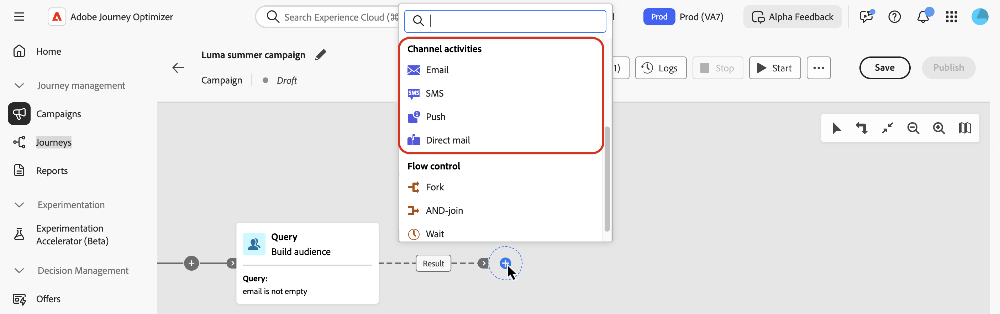
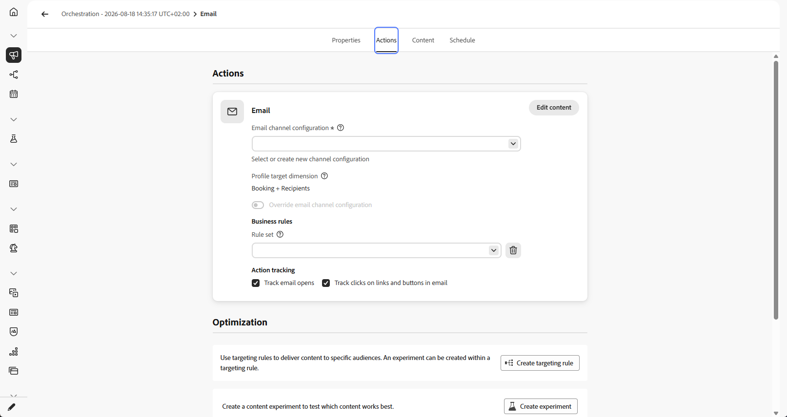
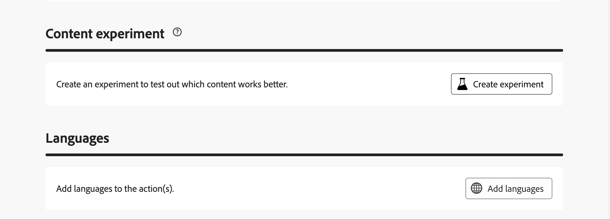
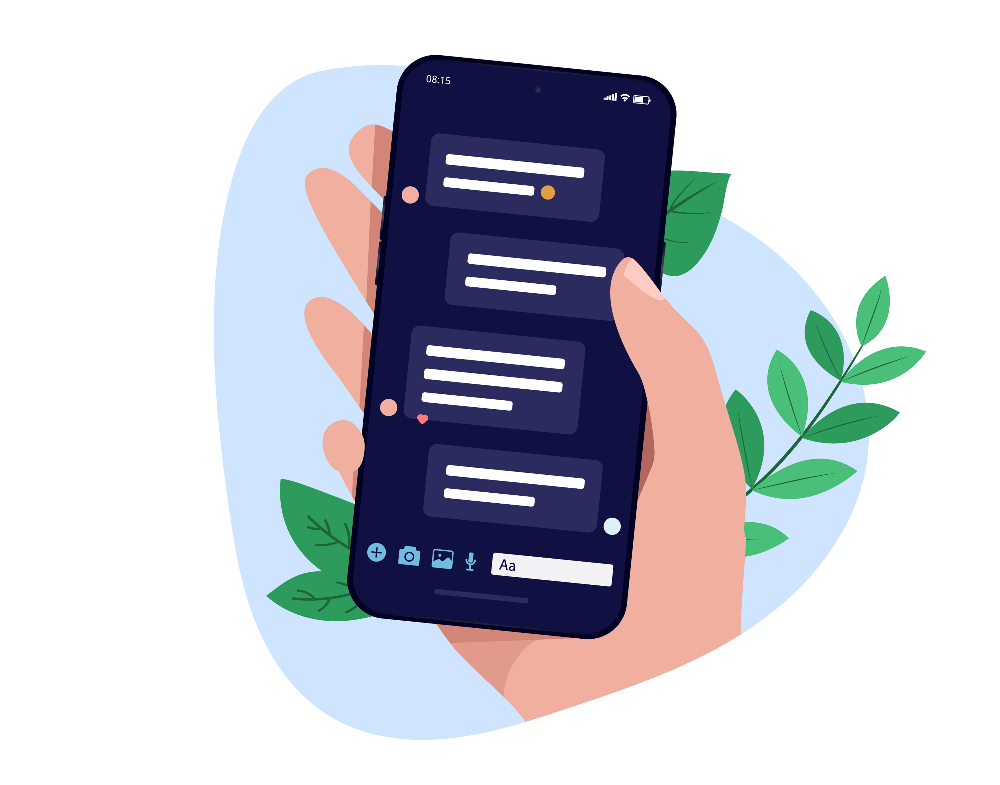
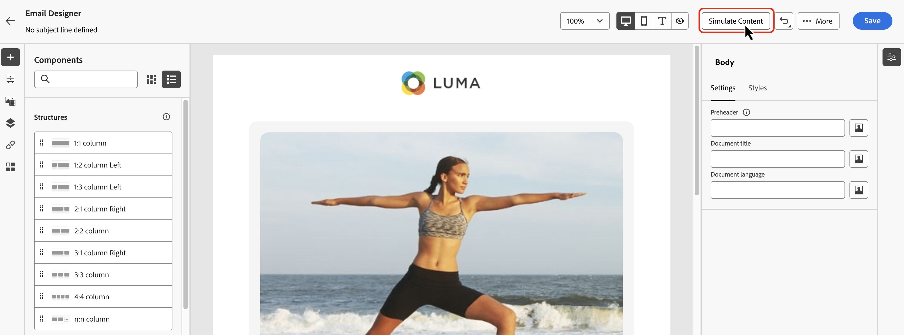
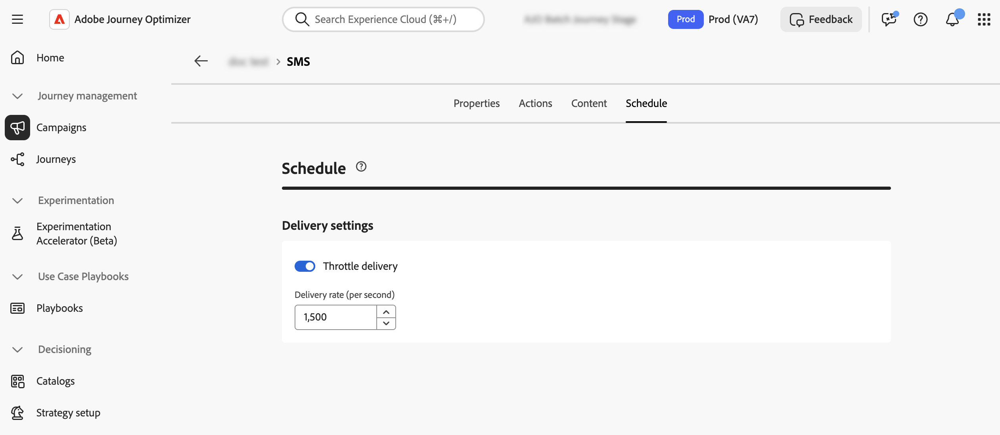
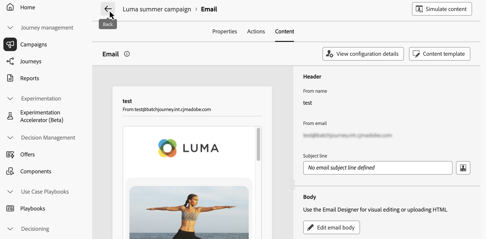
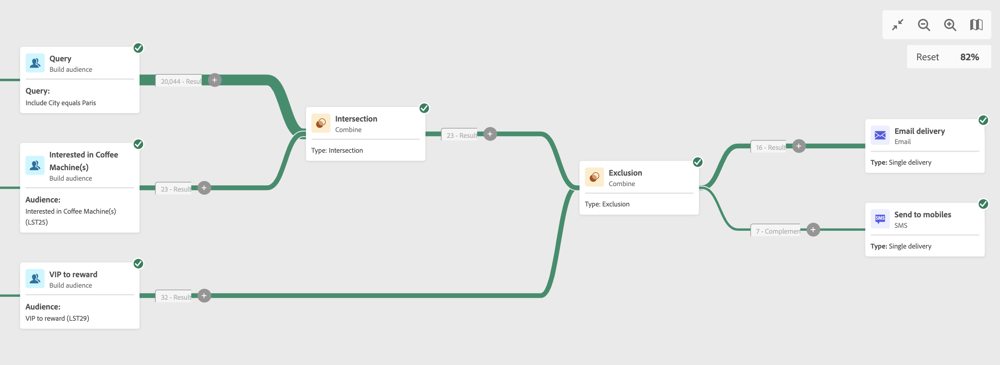
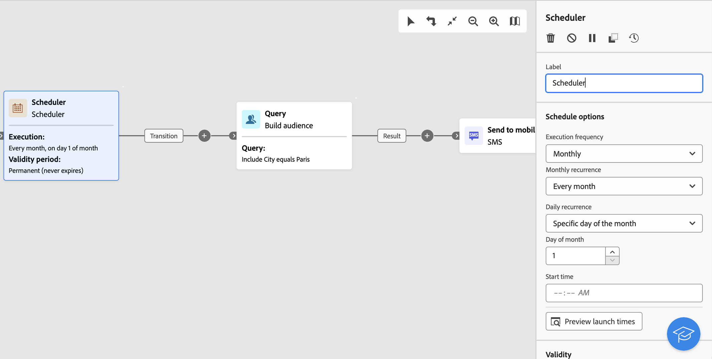

# Channel activities {#channel}

>[!CONTEXTUALHELP]
>id="ajo_orchestration_email"
>title="Email activity"
>abstract="The Email activity lets you send emails within your Orchestrated campaign, for both one-time and recurring messages. It serves to automate the process of sending emails to a target calculated within the same Orchestrated campaign. You can combine channel activities into a multistep campaign canvas to create cross-channel campaigns that can trigger actions based on customer behavior and data."

>[!CONTEXTUALHELP]
>id="ajo_orchestration_sms"
>title="SMS activity"
>abstract="The SMS activity lets you send SMS within your Orchestrated campaign for both one-time and recurring messages. It serves to automate the process of sending SMS to a target calculated within the same Orchestrated campaign. You can combine channel activities into the multistep campaign canvas to create cross-channel campaigns that can trigger actions based on customer behavior and data."

>[!CONTEXTUALHELP]
>id="ajo_orchestration_push"
>title="Push activity"
>abstract="The Push activity lets you send Push notifications as part of your Orchestrated campaign. It enables the delivery of both one-time and recurring Orchestrated campaigns, automating the sending of Push notifications to a predefined target within the same Orchestrated campaign. You can combine channel activities into the campaign canvas to create cross-channel campaigns that can trigger actions based on customer behavior and data."

<!--
UNUSED IDs in BJ

>[!CONTEXTUALHELP]
>id="ajo_orchestration_push_ios"
>title="Push iOS activity"
>abstract="The Push iOS activity lets you send iOS Push notifications as part of your Orchestrated campaign. It enables the delivery of both one-time and recurring Orchestrated campaigns, automating the sending of iOS Push notifications to a predefined target within the same workflow. You can combine channel activities into the campaign canvas to create cross-channel campaigns that can trigger actions based on customer behavior and data."

>[!CONTEXTUALHELP]
>id="ajo_orchestration_push_android"
>title="Push Android activity"
>abstract="The Push Android activity lets you send Android Push notifications as part of your Orchestrated campaign. It enables the delivery of both one-time and recurring messages, automating the sending of Android Push notifications to a predefined target within the same Orchestrated campaign. You can combine channel activities into the Orchestrated campaign canvas to create cross-channel campaigns that can trigger actions based on customer behavior and data."

-->

>[!CONTEXTUALHELP]
>id="ajo_orchestration_directmail"
>title="Direct mail activity"
>abstract="The Direct mail activity facilitates direct mail sending within your Orchestrated campaign, for both one-time and recurring messages. It serves to automate the process of generating the extraction file required by direct mail providers. You can combine channel activities into the Orchestrated campaign canvas to create cross-channel campaigns that can trigger actions based on customer behavior and data."

[!DNL Adobe Journey Optimizer] allows you to automate and execute marketing campaigns across channels - email, SMS, push notifications and direct mail. You can combine these channel activities into the campaign canvas to create cross-channel Orchestrated campaigns. These campaigns can trigger actions based on customer behavior and data.

For example:

* Send a welcome series through email, SMS, push and direct mail.
* Deliver a follow-up email post-purchase.
* Send personalized birthday greetings via SMS.

By using channel activities, you can create comprehensive and personalized campaigns that engage customers across multiple touchpoints and drive conversions.

>[!CAUTION]
>
>Only SMS, Push, Email and Direct mail channels are supported in Orchestrated campaigns.

## Add a channel activity and define its properties {#add}

>[!PREREQUISITES]
>
>Before adding a channel activity, define the target audience using a [Build audience](build-audience.md) or a [Read audience](read-audience.md) activity.

1. Add a channel activity into the canvas. Available channel activities are **[!UICONTROL Email]**, **[!UICONTROL SMS]**, **[!UICONTROL Push]** and **[!UICONTROL Direct mail]**.

    

1. Select the activity and click **[!UICONTROL Edit email]**, **[!UICONTROL Edit SMS]**, **[!UICONTROL Edit Push]**, or **[!UICONTROL Edit direct mail]** depending on the chosen channel.

    

1. In the **[!UICONTROL Properties]** tab, enter a description then switch to the **[!UICONTROL Actions]** tab to configure the activity.

## Set up the channel configuration and settings {#configuration}

Use the **[!UICONTROL Actions]** tab to select a channel configuration for your message and configure additional settings such as tracking, content experiment, or multilingual content.

1. **Select a channel configuration**

    A configuration is defined by a [System Administrator](../../start/path/administrator.md). It contains all the technical parameters for sending the message, such as header parameters, subdomain, mobile apps, etc. [Learn how to set up channel configurations](../../configuration/channel-surfaces.md)

    

1. **Apply capping rules**

    In the **[!UICONTROL Rule set]** drop-down list, select a channel rule set to apply capping rules to your campaign. Leveraging channel rule sets allows you to set frequency capping by communication type to prevent overloading customers with similar messages. [Learn how to work with rule sets](../../conflict-prioritization/rule-sets.md).

1. **Create a content experiment**

    Use the **[!UICONTROL Content experiment]** section to define multiple delivery treatments in order to measure which one performs best for your target audience. Click the **[!UICONTROL Create experiment]** button then follow the steps detailed in this section: [Create a content experiment](../../content-management/content-experiment.md).

1. **Add multilingual content**

    Use the **[!UICONTROL Languages]** section to create content in multiple languages within your campaign. To do so, click the **[!UICONTROL Add languages]** button and select the desired **[!UICONTROL Language settings]**. Detailed information on how to set up and use multilingual capabilities are available in this section: [Get started with multilingual content](../../content-management/multilingual-gs.md).

    

Additional settings are available depending on the selected communication channel. Expand the sections below for more information.

+++**Track engagement** (Email and SMS).

Use the **[!UICONTROL Action tracking]** section to track how your recipients react to your email or SMS deliveries. Tracking results are accessible from the campaign report once the campaign has been executed. [Learn more about campaign reports](../../reports/campaign-global-report-cja.md)

+++

+++**Enable Rapid delivery mode** (Push).

Rapid delivery mode is a [!DNL Journey Optimizer] add-on that allows very fast push message sending in large volumes through campaigns. Rapid delivery is used when delay in message delivery is business-critical. For instance, you want to send an urgent push alert on mobile phones, such as breaking news to users who have installed your news channel app. Learn how to enable Rapid delivery mode for Push notifications [on this page](../../push/create-push.md#rapid-delivery).

For more information on performance when using Rapid delivery mode, refer to [Adobe Journey Optimizer product description](https://helpx.adobe.com/legal/product-descriptions/adobe-journey-optimizer.html){target="_blank"}.

+++

When your channel activity has been configured, select the **[!UICONTROL Content]** tab to define its content.

## Define the content {#content}

### Create the message content

Switch to the **[!UICONTROL Content]** tab to create your message. The process steps vary based on the selected channel. Learn detailed steps to create your message content in the following pages.

<table style="table-layout:fixed"><tr style="border: 0; text-align: center;" >
<td> <a href="../../email/create-email.md"><strong>Create an email</strong></a></td>
<td> <a href="../../sms/create-sms.md"><strong>Create an SMS</strong></a></td>
<td><a href="../../push/create-push.md"><strong>Create a push notification</strong></a></td><td><a href="../../direct-mail/create-direct-mail.md"><strong>Create a direct mail</strong></a></td>
</tr></table>

### Add personalization

Personalization in Orchestrated campaigns works similarly to other [!DNL Journey Optimizer] campaigns or journeys, with a few key differences specific to the orchestrated canvas.

When you access the personalization editor from an Orchestrated campaign, two main folders contain attributes available for personalization detailed below.

* **[!UICONTROL Profile attributes]**

    This folder includes all profile-related data from [!DNL Adobe Experience Platform]. These are standard attributes such as name, email address, location, or any other traits captured in the user profile.

* **[!UICONTROL Target attributes]** (specific to Orchestrated campaigns)

    This folder is unique to Orchestrated campaigns. It contains attributes calculated directly within the campaign canvas. It contains two subfolders:

    * **`<Targeting dimension>`** (e.g., "Recipients", "Purchases"): Contains all attributes related to the dimension targeted by your campaign.
    
    * **`Enrichment`**: Includes data added via **[!UICONTROL Enrichment]** activities in your canvas. This allows you to personalize messages based on external datasets or additional logic incorporated during orchestration. [Learn how to use an Enrichment activity](../activities/enrichment.md)

For a detailed overview of how to use the personalization editor, refer to [Get started with personalization](../../personalization/personalize.md).

### Check and test your content

Once the content is created, use the **[!UICONTROL Simulate Content]** button to preview and test your content with test profiles or sample input data uploaded from a CSV / JSON file, or added manually. [Learn more](../../content-management/preview-test.md)

## Confirm message sending

By default, for non-recurring orchestrated campaigns, message delivery is paused until you explicitly approve the send. After publishing the campaign, confirm the send request from the channel activity's properties pane.

Sending confirmation can be disabled before publishing the orchestrated campaign. To do so, select the channel activity in the canvas to display its properties, and turn on **[!UICONTROL Send without confirmation]**.

## Set rate control {#rate-control}

[!DNL Journey Optimizer] allows you to enable rate control for outbound actions in Orchestrated campaigns.

This feature is particularly useful for preventing overload on downstream systems, such as landing pages or customer care platforms. For example, you can set a rate limit of 165 messages per second to ensure steady delivery without overwhelming downstream systems.

To set rate control, follow these steps:

1. Select an outbound channel activity in the canvas and click **[!UICONTROL Edit email]**, **[!UICONTROL Edit SMS]**, or **[!UICONTROL Edit Push]** depending on the chosen channel.

    

1. Navigate to the **[!UICONTROL Schedule]** tab, and enable the **[!UICONTROL Throttle delivery]** option in the **[!UICONTROL Delivery settings]** section.

    

1. Specify the desired **[!UICONTROL Delivery rate]** per second.

    * Minimum delivery rate supported: 1 per second.
    * Maximum delivery rate supported: 2000 per second when the "Throttle delivery" option is enabled.

>[!IMPORTANT]
>
>When setting a delivery rate, the maximum timeframe for which a campaign audience can execute is 12 hours. If the delivery rate is set to a value that does not allow all the audience to be sent the message in the 12-hour timeframe, then the remaining profiles will be excluded from the campaign. You can see the count of these excluded profiles in the campaign report.

## Next steps {#next}

When the message content is ready, navigate back to your Orchestrated campaign using the **[!UICONTROL Back]** arrow. You can then complete the activities orchestration in the canvas and publish the campaign to start sending messages. [Learn how to start and monitor Orchestrated campaigns](../start-monitor-campaigns.md)

<!--
## Examples {#cross-channel-workflow-sample}

Here is a cross-channel Orchestrated campaign example with a segmentation and two deliveries. The Orchestrated campaign targets all customers who live in Paris and who are interested in coffee machines. Among this population, an email is sent to the regular customers and an SMS is sent to the VIP clients.

<!--
description, which use case you can perform (common other activities that you can link before of after the activity)

how to add and configure the activity

example of a configured activity within a workflow
The Email delivery activity allows you to configure the sending an email in a workflow. 

-->

<!--You can also create a recurring Orchestrated campaign to send a personalized SMS every first day of the month at 8 PM to all customers living in Paris.

-->

<!-- Scheduled emails available?

This can be a single send email and sent just once, or it can be a recurring email.
* Single send emails are standard emails, sent once.
* Recurring emails allow you to send the same email multiple times to different targets over a defined period. You can aggregate the deliveries per period in order to get reports that correspond to your needs.

When linked to a scheduler, you can define recurring emails.
Email recipients are defined upstream of the activity in the same workflow, via an Audience targeting activity.

-->

<!--The message preparation is triggered according to the workflow execution parameters. From the message dashboard, you can select whether to request or not a manual confirmation to send the message (required by default). You can start the workflow manually or place a scheduler activity in the workflow to automate execution.-->

