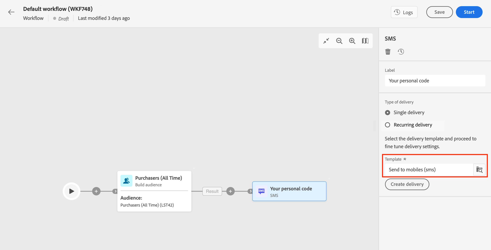

# Channel activities {#channel}

+++ Table of Contents

| Welcome to orchestrated campaigns | Launch your first orchestrated campaign | Query the database | Ochestrated campaigns activities|
|---|---|---|---|
|[Get started with orchestrated campaigns](../gs-orchestrated-campaigns.md)  [Configuration steps](../configuration-steps.md)  [Key steps for orchestrated campaign creation](../gs-campaign-creation.md)|[Create an orchestrated campaign](../create-orchestrated-campaign.md)  [Orchestrate activities](../orchestrate-activities.md)  [Send messages with orchestrated campaigns](../send-messages.md)  [Start and monitor the campaign](../start-monitor-campaigns.md)  [Reporting](../reporting-campaigns.md)|[Work with the Query Modeler](../orchestrated-rule-builder.md)  [Build your first query](../build-query.md)  [Edit expressions](../edit-expressions.md)|[Get started with activities](about-activities.md)  Activities: [And-join](and-join.md) - [Build audience](build-audience.md) - [Change dimension](change-dimension.md) - [Combine](combine.md) - [Deduplication](deduplication.md) - [Enrichment](enrichment.md) - [Fork](fork.md) - [Reconciliation](reconciliation.md) - [Split](split.md) -  [Wait](wait.md)|

{style="table-layout:fixed"}

+++

 

Adobe Journey Optimizer allows you to automate and execute marketing campaigns across inbound and outbound channels. You can combine channel activities into the orchestrated campaign canvas to create cross-channel orchestrated campaigns that can trigger actions based on customer behavior and data. Supported channels are listed on [this page](../../channels/gs-channels.md).

For example, you can create a welcome email campaign that includes a series of messages across different channels, such as email, SMS, push and direct mail. You can also send a follow-up email after a customer has completed a purchase, or send a personalized birthday message to a customer via SMS. 

By using channel activities, you can create comprehensive and personalized campaigns that engage customers across multiple touchpoints and drive conversions. 

## Prerequisites {#channel-activity-prereq}

Start building your orchestrated campaign with the relevant activities:

* Before inserting a channel activity, you must define the audience. The audience is the main target of your delivery: the profiles who receive the messages.

* To send a recurring delivery, start your orchestrated campaign with a **[!UICONTROL Scheduler]** activity. You can also use a **[!UICONTROL Scheduler]** activity for one-shot single deliveries to set the contact date for that delivery. That contact date can also be set in the delivery settings. 

## Configure a channel activity {#create-a-delivery-in-a-workflow}

>[!CONTEXTUALHELP]
>id="ajo_orchestration_email"
>title="Email activity"
>abstract="The Email activity lets you send emails within your orchestrated campaign, both for both one-time and recurring messages. It serves to automate the process of sending emails to a target calculated within the same orchestrated campaign. You can combine channel activities into a multistep campaign canvas to create cross-channel campaigns that can trigger actions based on customer behavior and data."

>[!CONTEXTUALHELP]
>id="ajo_orchestration_sms"
>title="SMS activity"
>abstract="The SMS activity lets you send SMS within your orchestrated campaign, for both one-time and recurring messages. It serves to automate the process of sending SMS to a target calculated within the same orchestrated campaign. You can combine channel activities into the multistep campaign canvas to create cross-channel campaigns that can trigger actions based on customer behavior and data."

>[!CONTEXTUALHELP]
>id="ajo_orchestration_push"
>title="Push activity"
>abstract="The Push activity let you send Push notifications as part of your orchestrated campaign. It enables the delivery of both one-time and recurring orchestrated campaigns, automating the sending Push notifications to a predefined target within the same orchestrated campaign. You can combine channel activities into the campaign canvas to create cross-channel campaigns that can trigger actions based on customer behavior and data."

<!--
UNUSED IDs in BJ

>[!CONTEXTUALHELP]
>id="ajo_orchestration_push_ios"
>title="Push iOS activity"
>abstract="The Push iOS activity let you send iOS Push notifications as part of your orchestrated campaign. It enables the delivery of both one-time and recurring orchestrated campaigns, automating the sending iOS Push notifications to a predefined target within the same workflow. You can combine channel activities into the campaign canvas to create cross-channel campaigns that can trigger actions based on customer behavior and data."

>[!CONTEXTUALHELP]
>id="ajo_orchestration_push_android"
>title="Push Android activity"
>abstract="The Push Android activity ket you send Android Push notifications as part of your orchestrated campaign. It enables the delivery of both one-time and recurring messages, automating the sending Android Push notifications to a predefined target within the same orchestrated campaign. You can combine channel activities into the orchestrated campaign canvas to create cross-channel campaigns that can trigger actions based on customer behavior and data."

-->

>[!CONTEXTUALHELP]
>id="ajo_orchestration_directmail"
>title="Direct mail activity"
>abstract="The Direct mail activity facilitates direct mail sending within your orchestrated campaign, for both one-time and recurring messages. It serves to automate the process of generating the extraction file required by direct mail providers. You can combine channel activities into the orchestrated campaign canvas to create cross-channel campaigns that can trigger actions based on customer behavior and data."

To set up a delivery in the context of an orchestrated campaign, follow the steps below:

1. Add a channel activity: **[!UICONTROL Email]**, **[!UICONTROL SMS]**, **[!UICONTROL Push notification (Android)]**, **[!UICONTROL Push notification (iOS)]** or **[!UICONTROL Direct mail]**.

1. Select the **Type of delivery**: single or recurring. 

   * A **Single delivery** is a one-shot delivery, sent only once, for example a Black Friday email.
   * A **Recurring delivery** is sent multiple times based on its execution frequency. Each time the orchestrated campaign runs, the audience is re-calculated and the delivery is sent to the updated audience, with the updated content. This can be a weekly newsletter or a recurring birthday email for example.

1. Select a delivery **[!UICONTROL Template]**. Templates are pre-configured delivery settings, specific to a channel. A built-in template is available for each channel, and pre-filled by default.

    
   
    You can select the template from the channel activity configuration left pane. If the previously selected audience is not compatible with the channel, then you cannot select a template. To solve this, update the **[!UICONTROL Build audience]** activity to select an audience with the correct target mapping. 

1. Click **[!UICONTROL Create delivery]**. You can then define your message settings and content the same way you create a standalone delivery. You can also test and simulate the content.

1. Navigate back to your orchestrated campaign. If you want to continue your orchestrated campaign, toggle the **[!UICONTROL Generate an outbound transition]** option to add a transition after the channel activity.

1. Click **[!UICONTROL Start]** to launch your orchestrated campaign.

    By default, starting an orchestrated campaign triggers the message preparation stage, without immediately sending the message.
    
1. Open your channel activity to confirm the sending from the **[!UICONTROL Review & send]** button.

1. From your delivery dashboard, click **[!UICONTROL Send]**.

## Examples {#cross-channel-workflow-sample}

Here is a cross-channel orchestrated campaign example with a segmentation and two deliveries. The orchestrated campaign targets all customers who live in Paris and who are interested in coffee machines. Among this population, an email is sent to the regular customers and an SMS is sent to the VIP clients.

<!--
description, which use case you can perform (common other activities that you can link before of after the activity)

how to add and configure the activity

example of a configured activity within a workflow
The Email delivery activity allows you to configure the sending an email in a workflow. 

-->

You can also create a recurring orchestrated campaign to send a personalized SMS every first day of the month at 8 PM to all customers living in Paris.

<!-- Scheduled emails available?

This can be a single send email and sent just once, or it can be a recurring email.
* Single send emails are standard emails, sent once.
* Recurring emails allow you to send the same email multiple times to different targets over a defined period. You can aggregate the deliveries per period in order to get reports that correspond to your needs.

When linked to a scheduler, you can define recurring emails.
Email recipients are defined upstream of the activity in the same workflow, via an Audience targeting activity.

-->

<!--The message preparation is triggered according to the workflow execution parameters. From the message dashboard, you can select whether to request or not a manual confirmation to send the message (required by default). You can start the workflow manually or place a scheduler activity in the workflow to automate execution.-->
