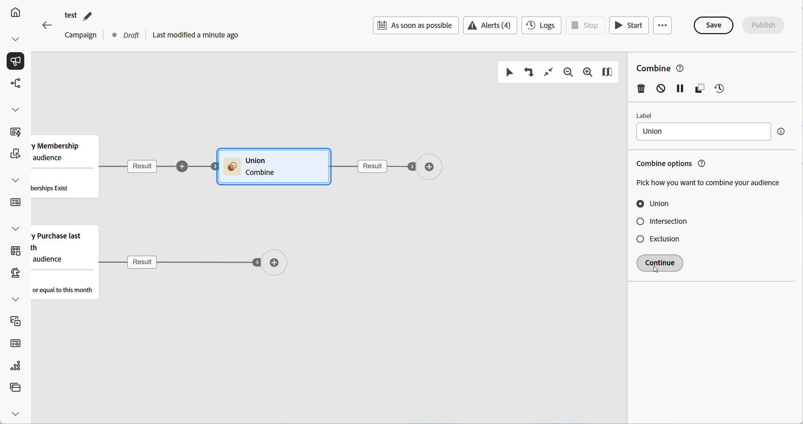
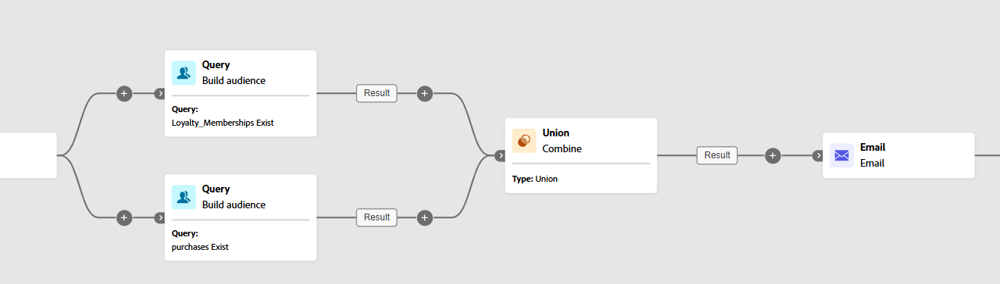
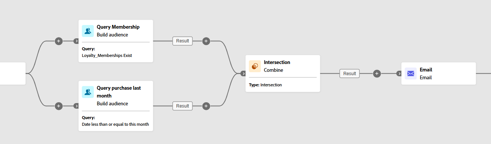
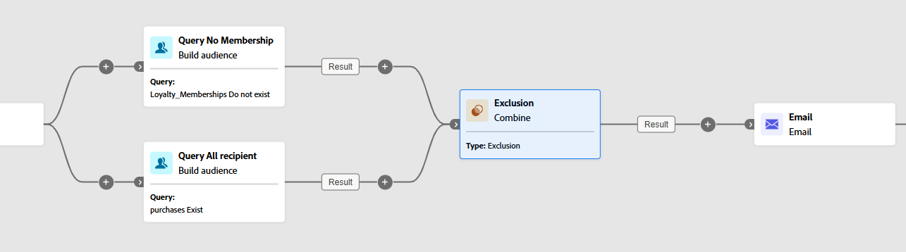

# Combine {#combine}

>[!CONTEXTUALHELP]
>id="ajo_orchestration_combine"
>title="Combine activity"
>abstract="The **Combine** activity allows you to perform segmentation on your inbound population. You can thus combine several populations, exclude part of it, or only keep data common to several targets."

+++ Table of Contents

| Welcome to orchestrated campaigns | Launch your first orchestrated campaign | Query the database | Ochestrated campaigns activities|
|---|---|---|---|
|[Get started with orchestrated campaigns](../gs-orchestrated-campaigns.md)  [Configuration steps](../configuration-steps.md)  [Access and manage orchestrated campaigns](../access-manage-orchestrated-campaigns.md)|[Key steps to create an orchestrated campaign](../gs-campaign-creation.md)  [Create and schedule the campaign](../create-orchestrated-campaign.md)  [Orchestrate activities](../orchestrate-activities.md)  [Start and monitor the campaign](../start-monitor-campaigns.md)  [Reporting](../reporting-campaigns.md)|[Work with the rule builder](../orchestrated-rule-builder.md)  [Build your first query](../build-query.md)  [Edit expressions](../edit-expressions.md)  [Retargeting](../retarget.md)|[Get started with activities](about-activities.md)  Activities: [And-join](and-join.md) - [Build audience](build-audience.md) - [Change dimension](change-dimension.md) - [Channel activities](channels.md) - <b>[Combine](combine.md)</b> - [Deduplication](deduplication.md) - [Enrichment](enrichment.md) - [Fork](fork.md) - [Reconciliation](reconciliation.md) - [Save audience](save-audience.md) - [Split](split.md) - [Wait](wait.md)|

{style="table-layout:fixed"}

+++

 

>[!BEGINSHADEBOX]

Documentation in progress

>[!ENDSHADEBOX]

The **[!UICONTROL Combine]** activity is a type of **[!UICONTROL Targeting]** activity that enables you to segment your inbound population effectively. It allows you to merge multiple populations, exclude specific segments, or retain only the data shared across several targets.

The following segmentation options are available:

* **[!UICONTROL Union]**: merges the results of multiple activities into a single unified target.

* **[!UICONTROL Intersection]**: retains only the elements that are common across all inbound populations.

* **[!UICONTROL Exclusion]**: removes elements from one population based on specified criteria.

## Configure the Combine activity {#combine-configuration}

>[!CONTEXTUALHELP]
>id="ajo_orchestration_intersection_merging_options"
>title="Intersection merging options"
>abstract="The intersection allows you to keep only the elements common to the different inbound populations in the activity. In the Sets to join section, check all the previous activities you wish you join."

>[!CONTEXTUALHELP]
>id="ajo_orchestration_exclusion_merging_options"
>title="Exclusion merging options"
>abstract="The exclusion allows you to exclude elements from one population according to certain criteria. In the Sets to join section, check all the previous activities you wish you join."

>[!CONTEXTUALHELP]
>id="ajo_orchestration_combine_options"
>title="Select the segmentation type"
>abstract="Select how to combine audiences. The **Union** allows you to regroup the result of multiple activities into a single target. The **Intersection** allows you to keep only the elements common to the different inbound populations in the activity. The **Exclusion** allows you to exclude elements from one population according to certain criteria. "

Follow these common steps to start configuring the **[!UICONTROL Combine]** activity:

1. Add multiple activities such as **[!UICONTROL Build audience]** activities to form at least two different execution branches.
1. Add a **[!UICONTROL Combine]** activity to any of the previous branches.
1. Select the segmentation type: [union](#union), [intersection](#intersection) or [exclusion](#exclusion).
1. Click **[!UICONTROL Continue]**.
1. In the **[!UICONTROL Sets to join]** section, check all the previous activities you wish you join. 

## Union {#combine-union}

>[!CONTEXTUALHELP]
>id="ajo_orchestration_combine_reconciliation"
>title="Reconciliation options"
>abstract="Select the **Reconciliation type** to define how to handle duplicates. By default, the **Keys** option is activated, meaning that the activity only keeps one element when elements from the different inbound transitions have the same key. Use the **A selection of columns** option to define the list of columns on which the data reconciliation is applied."

Within the **[!UICONTROL Combine]** activity, you can configure a **[!UICONTROL Union]** by selecting a **[!UICONTROL Reconciliation type]** to determine how duplicate records are managed:

* **[!UICONTROL Keys only]** (default): retains a single record when multiple inbound transitions share the same key. This option is only applicable when the inbound populations are homogeneous.

* **[!UICONTROL A selection of columns]**: allows you to specify which columns are used for data reconciliation. Select **[!UICONTROL Add attribute]**.

In the following example, a **[!UICONTROL Combine]** activity is used with a **[!UICONTROL Union]** to merge the results of two queries, **Loyalty Members** and **Purchasers**, into a single, larger audience that includes all profiles from both segments.

## Intersection {#combine-intersection}

>[!CONTEXTUALHELP]
>id="ajo_orchestration_intersection_reconciliation_options"
>title="Intersection reconciliation options"
>abstract="Select the **Reconciliation type** to define how to handle duplicates. By default, the **Keys** option is activated, meaning that the activity only keeps one element when elements from the different inbound transitions have the same key. Use the **A selection of columns** option to define the list of columns on which the data reconciliation is applied."

In the **[!UICONTROL Combine]** activity, you can configure an **[!UICONTROL Intersection]**. For this, you need to follow the extra steps below:

1. Select the **[!UICONTROL Reconciliation type]** to define how duplicates are handled:

    * **[!UICONTROL Keys only]** (default): retains a single record when multiple inbound transitions share the same key. This option is only applicable when the inbound populations are homogeneous.

    * **[!UICONTROL A selection of columns]**: allows you to specify which columns are used for data reconciliation. Select **[!UICONTROL Add attribute]**.

1. Enable **[!UICONTROL Generate completement]** if you wish to process the remaining population. The complement contains the union of all inbound activity results, excluding the intersection. An additional outbound transition is added to the activity.

The following example illustrates the use of the **[!UICONTROL Intersection]** between two query activities. It is used to identify profiles who are **Loyalty Members** and have made a purchase within the last month.

## Exclusion {#combine-exclusion}

>[!CONTEXTUALHELP]
>id="ajo_orchestration_exclusion_options"
>title="Exclusion rules"
>abstract="When necessary, you can manipulate inbound tables. Indeed, to exclude a target from another dimension, this target has to be returned to the same targeting dimension as the main target. To do this, click Add a rule in the Exclusion rules section and specify the dimension change conditions. Data reconciliation is carried out either via an attribute or a join."

>[!CONTEXTUALHELP]
>id="ajo_orchestration_combine_sets"
>title="Select sets to combine"
>abstract="In the **Sets to join** section, select the **Primary set** from the inbound transitions. This is the set from which elements are excluded. The other sets match elements before being excluded from the primary set."

>[!CONTEXTUALHELP]
>id="ajo_orchestration_combine_exclusion"
>title="Exclusion rules"
>abstract="When necessary, you can manipulate inbound tables. Indeed, to exclude a target from another dimension, this target has to be returned to the same targeting dimension as the main target. To do this, click Add a rule in the Exclusion rules section and specify the dimension change conditions. Data reconciliation is carried out either via an attribute or a join."

>[!CONTEXTUALHELP]
>id="ajo_orchestration_combine_complement"
>title="Combine generate complement"
>abstract="Toggle on the Generate complement option to process the remaining population in an additional transition." 

In the **[!UICONTROL Combine]** activity, you can configure an **[!UICONTROL Exclusion]**. For this, you need to follow the extra steps below:

1. In the **[!UICONTROL Sets to join]** section, choose the **[!UICONTROL Primary set]**, which represents the main population. Records found in the other sets are excluded from this primary set.

1. When needed, you can adjust inbound tables to align targets from different dimensions. To exclude a target from another dimension, it must first be brought into the same targeting dimension as the main population. To do this, click **[!UICONTROL Add a rule]** and define the conditions for changing the dimension. Reconciliation is then done using either an attribute or a join.

1. Enable **[!UICONTROL Generate completement]** if you wish to process the remaining population. The complement contains the union of all inbound activity results, excluding the intersection. An additional outbound transition is added to the activity.

The following **[!UICONTROL Exclusion]** example shows two queries configured to filter profiles who purchased a product. The profiles who do not have a loyalty membership are then excluded from the first set. 

