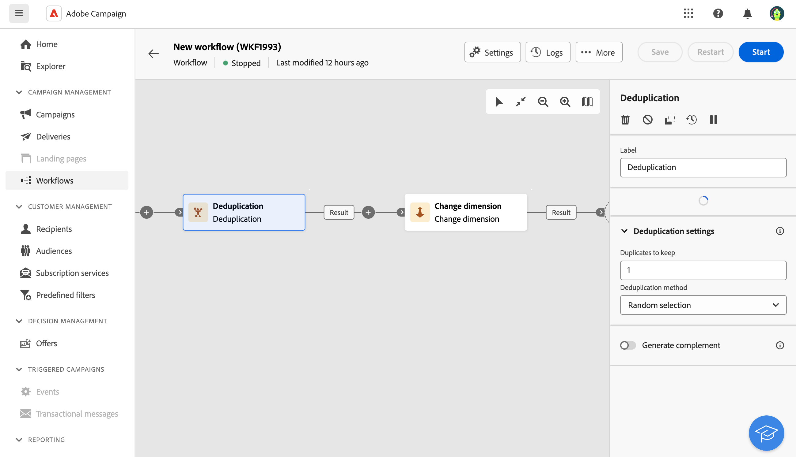

# Deduplication {#deduplication}

>[!CONTEXTUALHELP]
>id="ajo_orchestration_deduplication_fields"
>title="Fields to identify duplicates"
>abstract="In the **Fields to identify duplicates** section, click the **Add attribute** button to specify the fields for which the identical values allow the duplicates to be identified, such as: email address, first name, last name, etc. The order of the fields allows you to specify those to process first."

>[!CONTEXTUALHELP]
>id="ajo_orchestration_deduplication"
>title="Deduplication activity"
>abstract="The **Deduplication** activity allows you to delete duplicates in the results of the inbound activities. It is mostly used following targeting activities, and before activities that allow the use of targeted data."

>[!CONTEXTUALHELP]
>id="ajo_orchestration_deduplication_complement"
>title="Generate a complement"
>abstract="You can generate an additional outbound transition with the remaining population, which was excluded as a duplicate. To do this, toggle on the **Generate complement** option"

>[!CONTEXTUALHELP]
>id="ajo_orchestration_deduplication_settings"
>title="Deduplication settings"
>abstract="To delete duplicates in the incoming data, define the deduplication method in the fields below. By default, only one record is kept. You should also select the deduplication mode based on an expression or an attribute. By default, the record to keep out of the duplicates is randomly selected."

+++ Table of Contents

| Welcome to orchestrated campaigns | Launch your first orchestrated campaign | Query the database | Ochestrated campaigns activities|
|---|---|---|---|
|[Get started with orchestrated campaigns](gs-orchestrated-campaigns.md)  [Configuration steps](configuration-steps.md)  [Key steps for orchestrated campaign creation](gs-campaign-creation.md)|[Create an orchestrated campaign](create-orchestrated-campaign.md)  [Orchestrate activities](orchestrate-activities.md)  [Send messages with orchestrated campaigns](send-messages.md)  [Start and monitor the campaign](start-monitor-campaigns.md)  [Reporting](reporting-campaigns.md)|[Work with the Query Modeler](orchestrated-query-modeler.md)  [Build your first query](build-query.md)  [Edit expressions](edit-expressions.md)|[Get started with activities](activities/about-activities.md)  Activities: [And-join](activities/and-join.md) - [Build audience](activities/build-audience.md) - [Change dimension](activities/change-dimension.md) - [Combine](activities/combine.md) - [Deduplication](activities/deduplication.md) - [Enrichment](activities/enrichment.md) - [Fork](activities/fork.md) - [Reconciliation](activities/reconciliation.md) - [Split](activities/split.md) -  [Wait](activities/wait.md)|

{style="table-layout:fixed"}

+++

  

The **Deduplication** activity is a **Targeting** activity. This activity allows you to delete duplicates in the result(s) of the inbound activities, for example duplicated profiles in the recipient list. The **Deduplication** activity is generally used following targeting activities, and before activities that allow the use of targeted data.

## Configure the Deduplication activity{#deduplication-configuration}

Follow these steps to configure the **Deduplication** activity:

1. Add a **Deduplication** activity to your orchestrated campaign.

1. In the **Fields to identify duplicates** section, click the **Add attribute** button to specify the fields for which the identical values allow the duplicates to be identified, such as: email address, first name, last name, etc. The order of the fields allows you to specify those to process first. 

1. In the **Deduplication settings** section, select the number of unique **Duplicates to keep**. The default value for this field is 1. The value 0 allows you to keep all the duplicates.

    For example, if records A and B are considered duplicates of record Y, and a record C is considered as a duplicate of record Z:

    * If the value of the field is 1: only the Y and Z records are kept.
    * If the value of the field is 0: all the records are kept.
    * If the value of the field is 2: records C and Z are kept and two records from A, B, and Y are kept, by chance or depending on the deduplication method selected thereafter.

1. Select the **Deduplication method** to use:

    * **Random selection**: Randomly selects the record to be kept out of the duplicates.
    * **Using an expression**: Keep the records in which the value of the expression entered is the smallest or the biggest.
    * **Non-empty values**: Keep the records for which the expression is not empty.
    * **Following a list of values**: Define a value priority for one or more fields. To define the values, click **Attribute** to select a field or create an expression, then add the value(s) into the appropriate table. To define a new field, click the **Add button** located above the list of values. 

1. Check the **Generate complement** option if you wish to exploit the remaining population. The complement consists of all the duplicates. An additional transition will then be added to the activity.

## Example{#deduplication-example}

In the following example, use a deduplication activity to exclude duplicates from the target before sending a delivery. The identified duplicated profiles are added to a dedicated audience that can be reused if necessary. Choose the **Email** address to identify the duplicates. Keep 1 entry and select the **Random** deduplication method.

