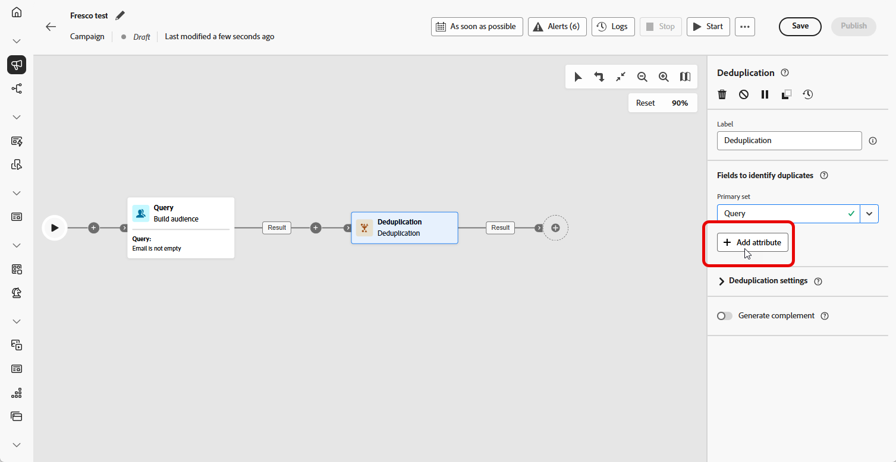
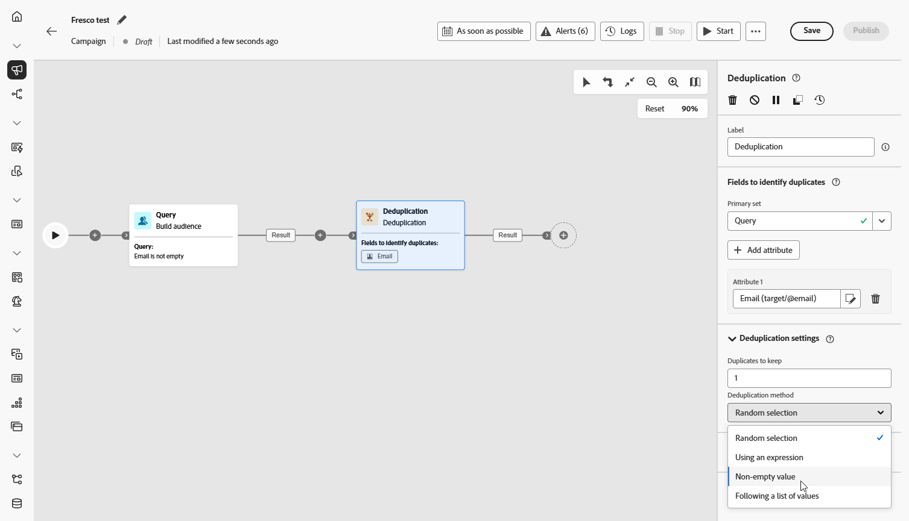
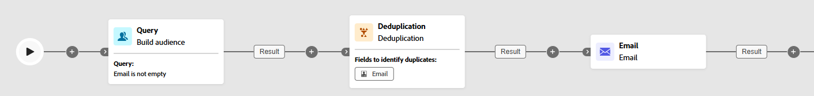

# Deduplication {#deduplication}

>[!CONTEXTUALHELP]
>id="ajo_orchestration_deduplication_fields"
>title="Fields to identify duplicates"
>abstract="In the **Fields to identify duplicates** section, click the **Add attribute** button to specify the fields for which the identical values allow the duplicates to be identified, such as: email address, first name, last name, etc. The order of the fields allows you to specify those to process first."

>[!CONTEXTUALHELP]
>id="ajo_orchestration_deduplication"
>title="Deduplication activity"
>abstract="The **Deduplication** activity allows you to delete duplicates in the results of the inbound activities. It is mostly used following targeting activities, and before activities that allow the use of targeted data."

>[!CONTEXTUALHELP]
>id="ajo_orchestration_deduplication_complement"
>title="Generate a complement"
>abstract="You can generate an additional outbound transition with the remaining population, which was excluded as a duplicate. To do this, toggle on the **Generate complement** option"

>[!CONTEXTUALHELP]
>id="ajo_orchestration_deduplication_settings"
>title="Deduplication settings"
>abstract="To delete duplicates in the incoming data, define the deduplication method in the fields below. By default, only one record is kept. You should also select the deduplication mode based on an expression or an attribute. By default, the record to keep out of the duplicates is randomly selected."

+++ Table of Contents

| Welcome to orchestrated campaigns | Launch your first orchestrated campaign | Query the database | Ochestrated campaigns activities|
|---|---|---|---|
|[Get started with orchestrated campaigns](../gs-orchestrated-campaigns.md)  [Configuration steps](../configuration-steps.md)  [Key steps for orchestrated campaign creation](../gs-campaign-creation.md)|[Create an orchestrated campaign](../create-orchestrated-campaign.md)  [Orchestrate activities](../orchestrate-activities.md)  [Start and monitor the campaign](../start-monitor-campaigns.md)  [Reporting](../reporting-campaigns.md)|[Work with the Query Modeler](../orchestrated-rule-builder.md)  [Build your first query](../build-query.md)  [Edit expressions](../edit-expressions.md)|[Get started with activities](about-activities.md)  Activities: [And-join](and-join.md) - [Build audience](build-audience.md) - [Change dimension](change-dimension.md) - [Channel activities](channels.md) - [Combine](combine.md) - [Deduplication](deduplication.md) - [Enrichment](enrichment.md) - [Fork](fork.md) - [Reconciliation](reconciliation.md) - [Split](split.md) -  [Wait](wait.md)|

{style="table-layout:fixed"}

+++

 

The **[!UICONTROL Deduplication]** activity is a **[!UICONTROL Targeting]** activity. This activity allows you to delete duplicates in the result(s) of the inbound activities, for example duplicated profiles in the recipient list. The **[!UICONTROL Deduplication]** activity is generally used following targeting activities, and before activities that allow the use of targeted data.

## Configure the Deduplication activity{#deduplication-configuration}

Follow these steps to configure the **[!UICONTROL Deduplication]** activity:

1. Add a **[!UICONTROL Deduplication]** activity to your orchestrated campaign.

1. In the **[!UICONTROL Fields to identify duplicates]** section, click the **[!UICONTROL Add attribute]** button to specify the fields for which the identical values allow the duplicates to be identified, such as: email address, first name, last name, etc. The order of the fields allows you to specify those to process first. 

    

1. In the **[!UICONTROL Deduplication settings]** section, choose how many unique records to keep using the Duplicates to keep field. The default is 1, which keeps one record per duplicate group. Set it to 0 to keep all duplicates.

    For example, if records A and B are duplicates of Y and record C is a duplicate of Z:

    * **If the value of the field is 1**: Only the Y and Z records are kept.
    * **If the value of the field is 0**: All records (A, B, C, Y, Z) are kept.
    * **If the value of the field is 2**: C and Z are kept, plus two values from A, B, and Y, randomly or based on your deduplication method.    

1. Choose a **[!UICONTROL Deduplication Method]**, this defines how the system decides which records to keep from each group of duplicates:

    * **[!UICONTROL Random selection]**: Randomly selects the record to be kept out of the duplicates.
    * **[!UICONTROL Using an expression]**: Keeps records with the highest or lowest value based on an expression you define.
    * **[!UICONTROL Non-empty values]**: Keeps records where the selected field is not empty, e.g. keep only profiles with a phone number.
    * **[!UICONTROL Following a list of values]**: Allows you to prioritize specific values for one or more fields, e.g. you can give priority to records with "Country" set to France. Click **[!UICONTROL Attribute]** to choose a field or create a custom expression. Use the **[!UICONTROL Add button]** to enter preferred values in the priority order.

    

1. Check the **[!UICONTROL Generate complement]** option if you wish to exploit the remaining population. The complement consists of all the duplicates. An additional transition will then be added to the activity.

## Example{#deduplication-example}

In the following example, a **[!UICONTROL Deduplication]** activity is used to remove duplicate records from the target audience before sending a delivery. The audience is first filtered to include only profiles with a non-empty Email field. Then, the **[!UICONTROL Deduplication]** activity uses the Email address to identify and exclude duplicates.

