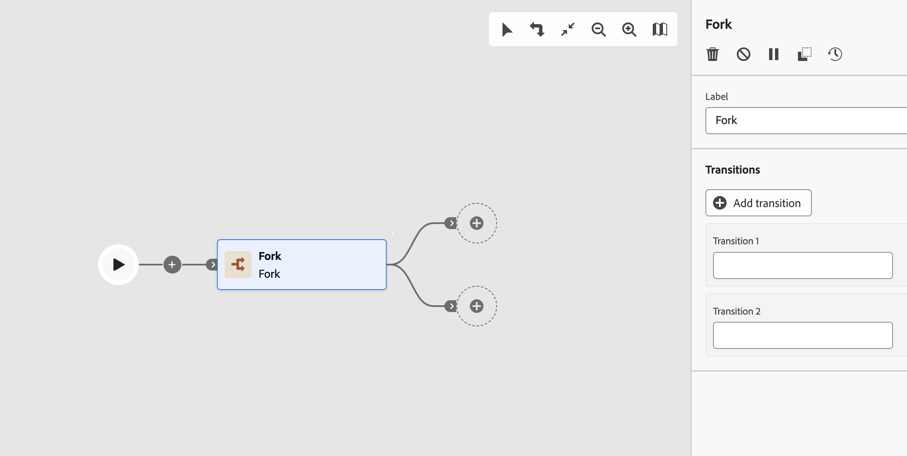
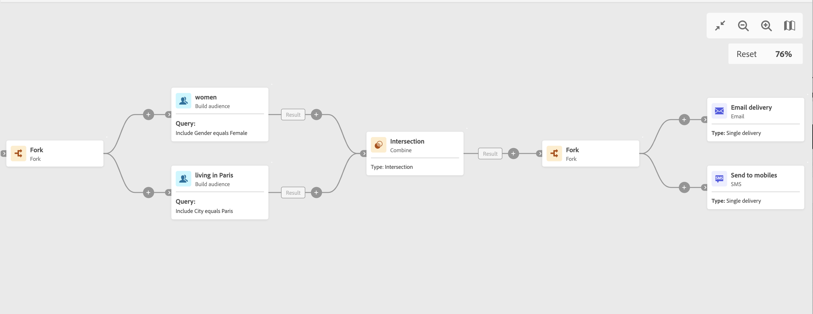

# Fork {#fork}

>[!CONTEXTUALHELP]
>id="ajo_orchestration_fork"
>title="Fork activity"
>abstract="The **Fork** activity allows you to create outbound transitions to start several activities at the same time."

>[!CONTEXTUALHELP]
>id="ajo_orchestration_fork_transitions"
>title="Fork activity transitions"
>abstract="By default, two transitions are created with a **Fork** activity. Click the **Add transition** button to define an additional outbound transition, and enter its label."

+++ Table of Contents

| Welcome to orchestrated campaigns | Launch your first orchestrated campaign | Query the database | Ochestrated campaigns activities|
|---|---|---|---|
|[Get started with orchestrated campaigns](../gs-orchestrated-campaigns.md)  [Configuration steps](../configuration-steps.md)  [Key steps for orchestrated campaign creation](../gs-campaign-creation.md)|[Create an orchestrated campaign](../create-orchestrated-campaign.md)  [Orchestrate activities](../orchestrate-activities.md)  [Send messages with orchestrated campaigns](../send-messages.md)  [Start and monitor the campaign](../start-monitor-campaigns.md)  [Reporting](../reporting-campaigns.md)|[Work with the Query Modeler](../orchestrated-query-modeler.md)  [Build your first query](../build-query.md)  [Edit expressions](../edit-expressions.md)|[Get started with activities](about-activities.md)  Activities: [And-join](and-join.md) - [Build audience](build-audience.md) - [Change dimension](change-dimension.md) - [Combine](combine.md) - [Deduplication](/deduplication.md) - [Enrichment](enrichment.md) - [Fork](fork.md) - [Reconciliation](reconciliation.md) - [Split](split.md) -  [Wait](wait.md)|

{style="table-layout:fixed"}

+++

  

The **Fork** activity is a **Flow control** activity. It allows you to create outbound transitions to start several activities at the same time.

## Configure the Fork activity{#fork-configuration}

Follow these steps to configure the **Fork** activity:

1. Add a **Fork** activity to your orchestrated campaign.
1. Click **Add transition** to add a new outbound transition. By default two transitions are defined.
1. Add a label to each of your transitions. 

## Example{#fork-example}

In the following example, we're using two **Fork** activities:

* One before the two queries, to execute them at the same time.
* One after the intersection, to send an email and an SMS simultaneously to the targeted population.

