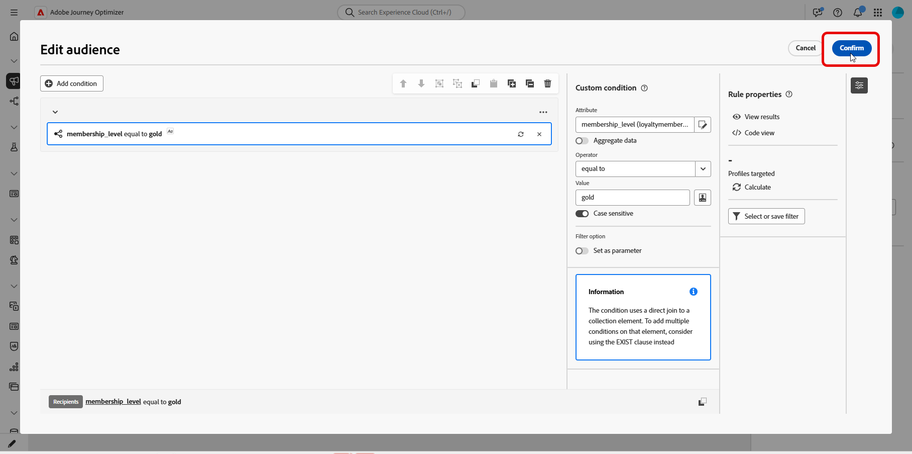
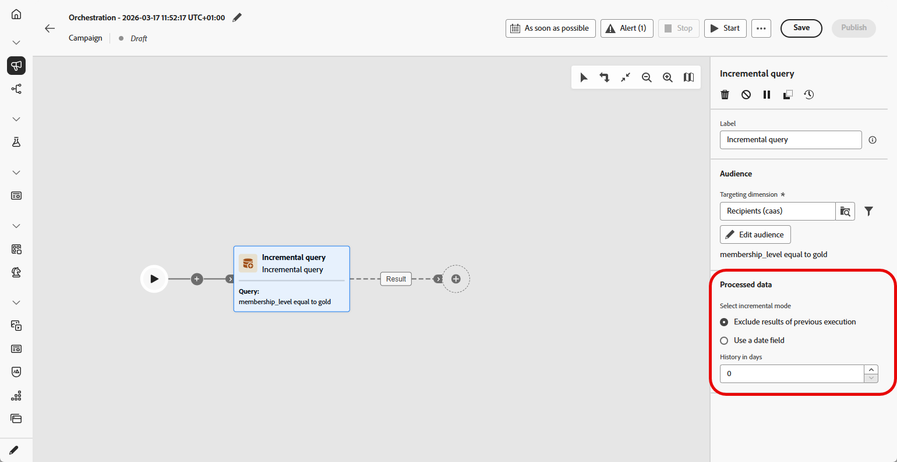

# Incremental query {#incremental-query}

>[!CONTEXTUALHELP]
>id="ajo_orchestration_incremental_query"
>title="Incremental query activity"
>abstract="The **Incremental query** activity is a **Targeting** activity that outputs only new records each time the campaign runs, excluding anyone targeted in a previous run."

The **[!UICONTROL Incremental query]** activity is a **[!UICONTROL Targeting]** activity that runs a database query each time the Orchestrated campaign runs. The important part is that it only ever outputs **new** records. Anyone already picked up in a prior run is excluded, so you avoid re-targeting the same people or re-exporting the same rows.

Use it when the campaign can run multiple times, or example, when you schedule the campaign, e.g. weekly or when it is triggered by an external signal or API. Each run targets only records that were not returned in a previous run, so you avoid duplicates.

Typical uses:

* **Messaging and audiences**: Pull only new sign-ups, new purchasers, or other "new since last run" segments into the next step (e.g. email, SMS).
* **Ongoing exports**: Send only new or updated rows to files for reporting or BI tools, without duplicating what you already exported.

When a run returns no rows, the Orchestrated campaign stops at the **Incremental query**. Activities after the Incremental query are not executed until there is data, when the campaign runs again.

## Configure the Incremental query activity {#incremental-query-configuration}

Set the targeting dimension, build your query, and choose how the activity decides which records to exclude from future runs.

1. Drop an **[!UICONTROL Incremental query]** activity into your Orchestrated campaign.

1. In **[!UICONTROL Audience]**, pick the **[!UICONTROL Targeting dimension]**, e.g. recipients, subscribers, and click **[!UICONTROL Continue]**. Learn more on [Targeting dimensions](../target-dimension.md).

     

1. Click **[!UICONTROL Add condition]** to define the query. [Learn how to use the rule builder](../orchestrated-rule-builder.md).

     

1. Under **[!UICONTROL Processed data]**, choose how to exclude records from earlier runs:

   * **[!UICONTROL Exclude results of previous execution]**: The activity maintains a list of records returned in prior runs. Each run excludes those records and returns only new ones. **[!UICONTROL History in days]** controls the retention period for that list. 0 indicates indefinite retention, no records are removed.

      >[!IMPORTANT]
      >
      >This mode stores the primary key of each processed record. Personally identifiable information (PII) must not be used as the primary key.

   * **[!UICONTROL Use a date field]**: The activity uses a selected date field instead of tracking individual IDs. Each run returns only rows whose date is after the last execution. 

      

## Example {#incremental-query-example}

The following example sends a welcome email to profiles who have just become gold members. The campaign can be scheduled to run weekly, every Monday. Each run targets only profiles that qualified for gold membership since the previous run, so each recipient receives the welcome email once.

* **[!UICONTROL Incremental query]**: Selects gold members. First run: all current gold members. Later runs: only profiles that became gold members since the previous execution.
* **[!UICONTROL Email delivery]**: Sends the welcome email to the profiles output by the query.

