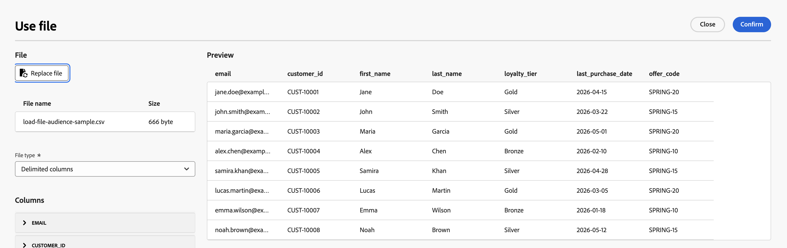
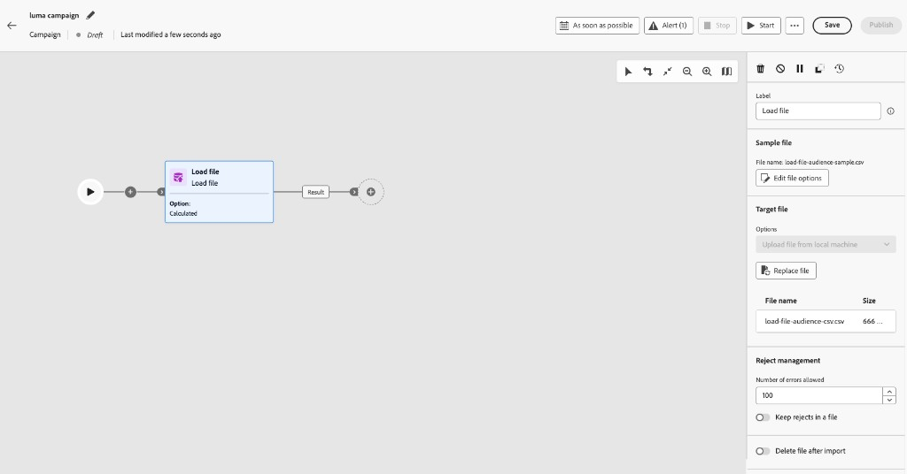

# Load file {#load-file}

>[!CONTEXTUALHELP]
>id="ajo_orchestration_load_file"
>title="Load file activity"
>abstract="The **Load file** activity is a **Data Management** activity. Use it to work with profiles and data stored in an external file on the Orchestrated campaign canvas and define the campaign audience. File data is consumed at execution time and is not persisted as an Adobe Experience Platform dataset."

The **[!UICONTROL Load file]** activity is a **[!UICONTROL Data Management]** activity. Use it to work with profiles and data stored in an external file. It supports **file-based targeting** in Orchestrated campaigns when your recipient list comes from an external system (for example, a CRM export or a partner file) and you want to run a campaign without building a full Adobe Experience Platform ingestion pipeline first.

>[!AVAILABILITY]
>
>The **Load file** activity is available in **Limited Availability** for a set of organizations. To request access, contact your Adobe representative. For availability phases, see [Journey Optimizer release cycle](../../rn/releases.md).
>
>The activity is currently not available for use with **Healthcare Shield**.

## Guardrails and limitations {#limitations}

The following limitations apply to the Load file activity:

* You can upload up to 50 MB per file.
* Only flat-structure CSV and TXT files are supported.
* Uploaded data is used when the campaign runs and is not stored as an Adobe Experience Platform dataset.

For limits on channel and canvas activities, see [Guardrails and limitations](../guardrails.md#activities-limitations).

## Configure the Load file activity {#load-file-configuration}

Configure the activity in two parts: define the expected file structure with a sample file, then specify the file to load when the campaign runs.

1. Add a **[!UICONTROL Load file]** activity to your Orchestrated campaign canvas.

    

1. Enter a **[!UICONTROL Label]** for the activity.

### Define the sample file {#sample-file}

Use a sample file to configure **[!UICONTROL Columns]** and **[!UICONTROL Formatting]**. The sample data is not imported as the campaign audience.

1. In the **[!UICONTROL Sample file]** section, select the local file that defines the expected structure.

    >[!NOTE]
    >
    > The sample file is used to configure columns and formatting only, its data is not imported as the campaign audience. The format must match the files you will load when the campaign runs.

1. In the **[!UICONTROL File type]** drop-down, specify whether the file uses **delimited columns** or **fixed-width columns**.

    

1. In the **[!UICONTROL Columns]** section, expand each column and configure its properties.

    

    After you select a **[!UICONTROL Data type]**, additional options appear for that type. Expand the sections below for parameters common to all columns and for type-specific options.

    +++Common column parameters

    * **[!UICONTROL Ignore column]** — Exclude the column from the import when selected.
    * **[!UICONTROL Label]** — Display name for the column (for example, `email`).
    * **[!UICONTROL Internal name]** — System name for the column, derived from the file header (read-only).
    * **[!UICONTROL Data type]** — Type of data in the column.
    * **[!UICONTROL Allow NULLs]** — Specifies how to manage empty values in the column:

        * **[!UICONTROL Adobe Campaign default]** — Generates an error for numerical fields only. Otherwise inserts a NULL value.
        * **[!UICONTROL Empty value allowed]** — Authorizes empty values. The value NULL is therefore inserted.
        * **[!UICONTROL Always populated]** — Generates an error if a value is empty.

    * **[!UICONTROL Error processing]** — Defines the behavior if an error is encountered in the column:

        * **[!UICONTROL Ignore the value]** — The value is ignored.
        * **[!UICONTROL Reject the line]** — The entire line is not processed.
        * **[!UICONTROL Use a default value in case of error]** — Replaces the value causing the error with a default value, defined in the **[!UICONTROL Default value]** field.
        * **[!UICONTROL Use a default value in case the value is not remapped]** — Replaces the value causing the error with a default value, defined in the **[!UICONTROL Default value]** field, unless a mapping had been defined for the erroneous value.
        * **[!UICONTROL Reject the line when there is no remapping value]** — The whole line is not processed unless a mapping had been defined for the erroneous value.

    * **[!UICONTROL Default value]** — Default value to use when **[!UICONTROL Error processing]** is set to use a default value.
    * **[!UICONTROL Value remapping]** — Map specific values to new ones. Click **[!UICONTROL Add mapping]** to define each mapping (for example, replace `True`/`False` with `1`/`0`).

    +++

    +++String columns parameters

    * **[!UICONTROL Width]** — Maximum number of characters.
    * **[!UICONTROL Data transformation]** — Case transformation applied to string values (for example, none or upper/lower case).
    * **[!UICONTROL White space management]** — How to handle leading or trailing spaces in string values.

    +++

    +++Integer and floating number columns parameters

    * **[!UICONTROL Format]** — Defines how numerical values in the file are read:

        * **[!UICONTROL Other]** — Define the **[!UICONTROL Thousand separator]** and **[!UICONTROL Decimal separator]** in the **[!UICONTROL Separators]** section.
        * **[!UICONTROL 1,000.00]** — Comma as thousands separator and period as decimal separator.
        * **[!UICONTROL 1 000,00]** — Space as thousands separator and comma as decimal separator.

    * **[!UICONTROL Separators]** (when **[!UICONTROL Format]** is **[!UICONTROL Other]**):

        * **[!UICONTROL Thousand separator]** — Character that groups thousands in numeric values (leave empty if not used).
        * **[!UICONTROL Decimal separator]** — Character used for the decimal portion of numeric values (for example, `,` or `.`).

    +++

    +++Date and time columns parameters

    Options depend on whether **[!UICONTROL Data type]** is **Date**, **Time**, or **Date and time**.

    **Date**

    * **[!UICONTROL Date format]** — Pattern that matches how dates appear in the file (for example, `yyyy/mm/dd`).
    * **[!UICONTROL Separators]**:

        * **[!UICONTROL Year, month, day]** — Character between the year, month, and day components (for example, `/`).

    **Time**

    * **[!UICONTROL Time format]** — Pattern that matches how times appear in the file (for example, `13:30` for 24-hour hours and minutes).
    * **[!UICONTROL Separators]**:

        * **[!UICONTROL Hour, minute, second]** — Character between the hour, minute, and second components (for example, `:`).

    **Date and time**

    * **[!UICONTROL Date format]** — Pattern that matches how the date portion appears in the file.
    * **[!UICONTROL Time format]** — Pattern that matches how the time portion appears in the file.
    * **[!UICONTROL Separators]** — Characters between date and time components.

    +++

1. In the **[!UICONTROL Formatting]** section, specify how the file is structured so rows and columns are read correctly when the campaign runs. The target file must use the same formatting as the sample file.

    

    * **[!UICONTROL Use first line as column header]** — When selected, the first line of the file is treated as column names. This option is typically enabled when you configure the sample from a file that includes a header row.
    * **[!UICONTROL Use a line number as identifier]** — When selected, each row is identified by its line number in the file.
    * **[!UICONTROL Records span multiple lines]** — When selected, a single record can span several lines in the file (for example, when fields contain line breaks).
    * **[!UICONTROL Lines to ignore]** — Number of lines to skip at the beginning of the file before data is read (for example, comment or metadata lines).
    * **[!UICONTROL Time zone]** — Time zone applied when date and time values are imported.
    * **[!UICONTROL Encoding]** — Character encoding of the file. Select the encoding that matches your source file.
    * **[!UICONTROL String delimiter]** — Character used to enclose string values in the file.
    * **[!UICONTROL Column separator]** — Character that separates columns in a delimited file.

1. Click **[!UICONTROL Confirm]** to validate the sample file configuration.

### Define the target file {#target-file}

Specify the file to load at campaign execution and how each row is matched to existing recipients.

1. In the **[!UICONTROL Target file]** section, select the CSV or TXT file containing to target.

    

    >[!CAUTION]
    >
    > Ensure the target file follows the same format, column structure, and number of columns as the sample file.

1. In the **[!UICONTROL Reject management]** section, define how the activity behaves when errors occur during file processing:

    * **[!UICONTROL Number of errors allowed]** — Maximum number of errors permitted before the activity fails.
    * **[!UICONTROL Keep rejects in a file]** — When enabled, rows that could not be loaded are written to a reject file on the server for review after execution.

1. Optionally, enable **[!UICONTROL Delete file after import]** to remove the uploaded file from the server after the campaign runs.

After **[!UICONTROL Load file]** resolves the audience,n connect the outbound transition to downstream activities. [Learn how to orchestrate campaign activities](../orchestrate-activities.md)
