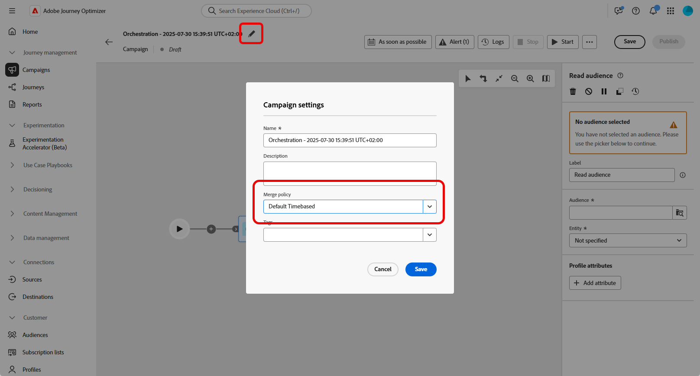
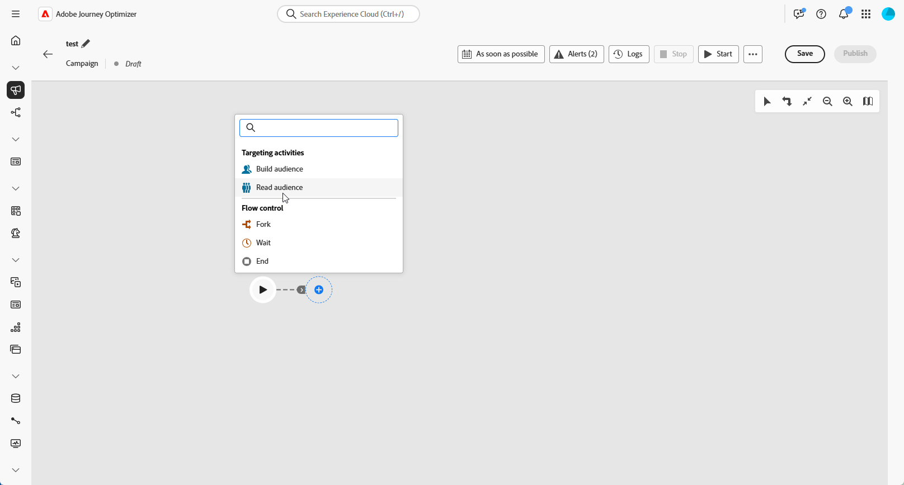
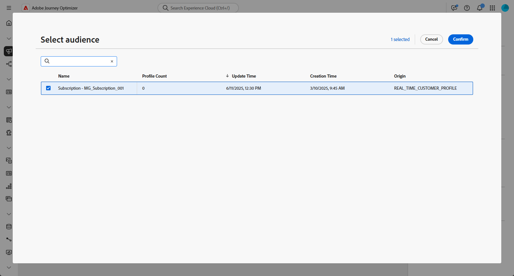
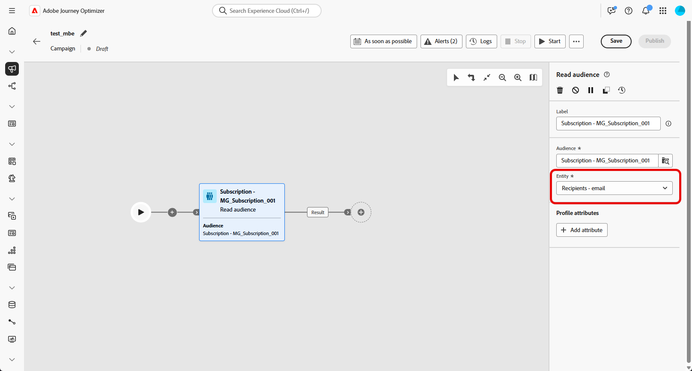
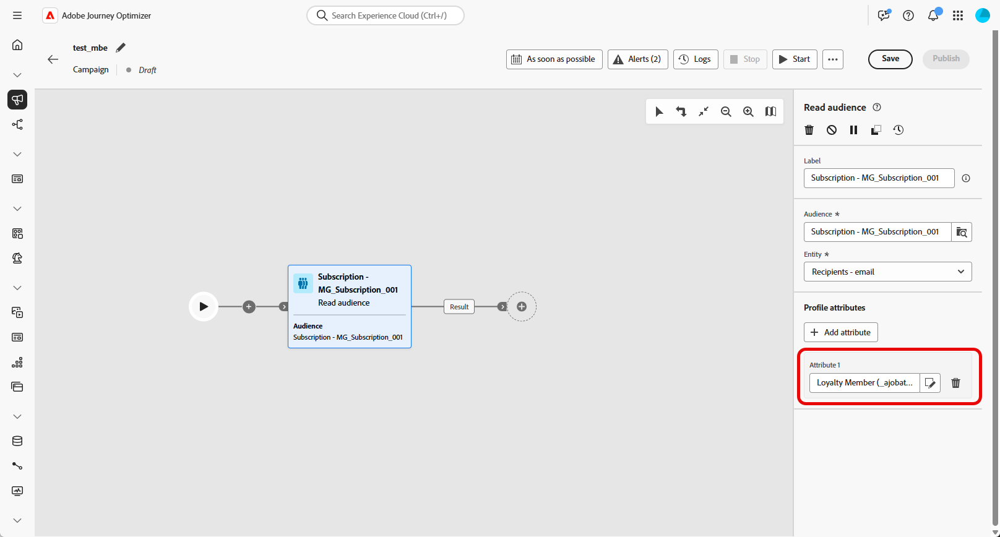
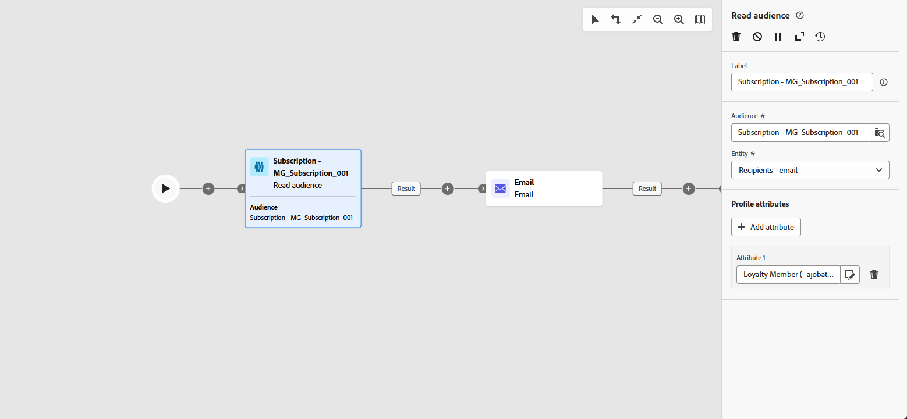

# Read audience {#read-audience}

>[!CONTEXTUALHELP]
>id="ajo_orchestration_read_audience"
>title="Build audience activity"
>abstract="The **Read audience** activity allows you to select the audience that will enter the the Orchestrated campaign. This audience can be an existing Adobe Experience Platform audience or an audience pulled from a CSV file. When sending messages in the context of an Orchestrated campaign, the message audience is not defined in the channel activity, but in a **Read audience** or a **Build audience** activity."

The **[!UICONTROL Read audience]** activity allows you to retrieve an existing audience—previously saved or imported—and reuse it within an Orchestrated campaign. This activity is especially useful for targeting a predefined set of profiles without the need to execute a new segmentation process.

Once the audience is loaded, you can optionally refine it by selecting a unique identity field and enriching the audience with additional profile attributes for targeting, personalization, or reporting purposes.

## Read audience cache {#cache}

When testing an Orchestrated campaign, the **[!UICONTROL Read Audience]** activity typically takes some time to fetch data, which can make test runs longer. To speed this up, a **[!UICONTROL Read Audience]** cache is available.

The cache stores the audience along with the selected attributes for **up to two hours**. During this time, any subsequent test runs can use the cached results, avoiding the need to fetch the data again. Once the **two-hour period** has passed, the data must be retrieved anew.

The cache is saved for each orchestrated campaign, not for the audience itself. If the same audience is used in a **[!UICONTROL Read Audience]** activity inside another Orchestrated campaign, the system will still need to fetch the data again.

The cache is not retained in the following cases:

* When the **[!UICONTROL Read Audience]** activity is updated with new attributes, the cache is refreshed with the new attributes data. Consequently, the first test run after the update will take longer, as the data needs to be retrieved again.

* When the Orchestrated campaign is published, as the latest data is fetched when executing the live Orchestrated campaign.

## Configure the Read audience activity {#read-audience-configuration}

Follow these steps to configure the **[!UICONTROL Read audience]** activity:

1. Before adding your **[!UICONTROL Read audience]** activity, make sure to select a **[!UICONTROL Merge policy]** in your Campaign settings.

    

1. Add a **[!UICONTROL Read audience]** activity to your Orchestrated campaign.
    
    

1. Enter a **[!UICONTROL Label]** to your activity. This label will serve as the name of your audience.

1. Click  to select the audience you wish to target for your Orchestrated campaign.

    

1. Choose an **[!UICONTROL Entity​]** from your Campaign Targeting dimension. This setting defines the target entity and the attribute used to reconcile the audience with the target dimension.

    ➡️ [Follow the steps detailed in this page to create your Campaign Targeting dimension](../target-dimension.md)

    

1. Select **[!UICONTROL Add attribute]** to enrich your selected audience with additional data. This step lets you add profile attributes to the audience, resulting in a list of recipients enhanced with those attributes.

1. Choose the **[!UICONTROL Attributes]** you want to add to your audience. The attribute picker displays fields from the **Union Profile Schema**: 

    * For CSV-based audiences, this includes both **Profile** attributes and custom audience-level attributes. These attributes can be found under the following schema path: 
        
        `<audienceid> > _ajobatchjourneystage > audienceEnrichment > CustomerAudienceUpload > <audienceid>`

    * For standard AEP audiences, only **Profile** attributes are available, as they don't carry embedded audience-specific fields.

    >[!NOTE]
    >
    > While some attributes may appear in the picker, their availability at runtime depends on whether the audience data has been successfully reconciled and merged with the **Adobe Experience Platform Profile**.

    

Once an audience is created, it is available in read-only and can no longer be edited. It can only be used after the creation process is fully completed.

## Example

In the example below, the **[!UICONTROL Read audience]** activity is used to retrieve a previously created and saved audience of profiles who subscribed to the newsletter. The audience is then enriched with the **Loyalty membership** attribute to enable targeting of users who are registered members of the loyalty program.

