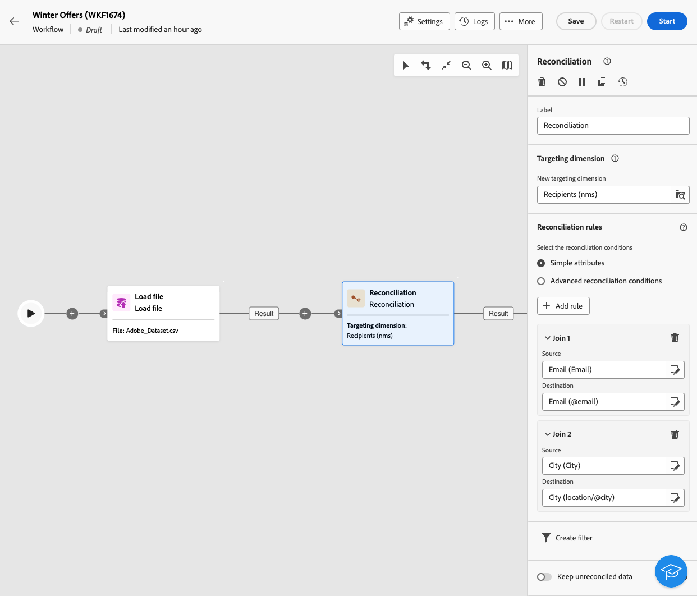

# Reconciliation {#reconciliation}

>[!CONTEXTUALHELP]
>id="ajo_orchestration_reconciliation"
>title="Reconciliation activity"
>abstract="The **Reconciliation** activity is a **Targeting** activity which allows you to define the link between Adobe Journey Optimizer and the data in a work table." 

>[!CONTEXTUALHELP]
>id="ajo_orchestration_reconciliation_field"
>title="Reconciliation select field"
>abstract="Reconciliation select field" 

>[!CONTEXTUALHELP]
>id="ajo_orchestration_reconciliation_condition"
>title="Reconciliation create condition"
>abstract="Reconciliation create condition" 

>[!CONTEXTUALHELP]
>id="ajo_orchestration_reconciliation_complement"
>title="Reconciliation generate complement"
>abstract="Reconciliation generate complement" 

+++ Table of Contents

| Welcome to orchestrated campaigns | Launch your first orchestrated campaign | Query the database | Ochestrated campaigns activities|
|---|---|---|---|
|[Get started with orchestrated campaigns](../gs-orchestrated-campaigns.md)  [Configuration steps](../configuration-steps.md)  [Key steps for orchestrated campaign creation](../gs-campaign-creation.md)|[Create an orchestrated campaign](../create-orchestrated-campaign.md)  [Orchestrate activities](../orchestrate-activities.md)  [Send messages with orchestrated campaigns](../send-messages.md)  [Start and monitor the campaign](../start-monitor-campaigns.md)  [Reporting](../reporting-campaigns.md)|[Work with the Query Modeler](../orchestrated-query-modeler.md)  [Build your first query](../build-query.md)  [Edit expressions](../edit-expressions.md)|[Get started with activities](about-activities.md)  Activities: [And-join](and-join.md) - [Build audience](build-audience.md) - [Change dimension](change-dimension.md) - [Combine](combine.md) - [Deduplication](deduplication.md) - [Enrichment](enrichment.md) - [Fork](fork.md) - [Reconciliation](reconciliation.md) - [Split](split.md) -  [Wait](wait.md)|

{style="table-layout:fixed"}

+++

 

The **Reconciliation** activity is a **Targeting** activity which allows you to define the link between the data in Adobe Journey Optimizer and the data in a work table, for example data loaded from an external file.

The Enrichment activity lets you add additional data to your orchestrated campaign—for example, by combining data from multiple sources or linking to a temporary resource. In contrast, the Reconciliation activity is used to match unidentified or external data with existing resources in the database.

Reconciliation requires that the related records already exist in the system. For instance, if you import a purchase file listing products, timestamps, and customer information, both the products and customers must already be present in the database to establish the link.

## Configure the Reconciliation activity {#reconciliation-configuration}

>[!CONTEXTUALHELP]
>id="ajo_orchestration_reconciliation_targeting"
>title="Targeting dimension"
>abstract="Select the new targeting dimension. A dimension lets you define the targeted population: recipients, app subscribers, operators, subscribers, etc. By default, the current targeting dimension is selected." 

>[!CONTEXTUALHELP]
>id="ajo_orchestration_reconciliation_rules"
>title="Reconciliation rules"
>abstract="Select reconciliation rules to use for the deduplication. To use attributes, select the **Simple attributes** option and choose the source and destination fields. To create your own reconciliation condition using the query modeler, select the **Advanced reconciliation conditions** option."
>additional-url="https://experienceleague.adobe.com/en/docs/campaign-web/v8/query-database/query-modeler-overview" text="Work with the query modeler"

>[!CONTEXTUALHELP]
>id="ajo_orchestration_reconciliation_targeting_selection"
>title="Select the targeting dimension"
>abstract="Select the targeting dimension for your inbound data to reconcile with." 
>additional-url="https://experienceleague.adobe.com/docs/campaign-web/v8/audiences/gs-audiences-recipients.html#targeting-dimensions" text="Targeting dimensions"

>[!CONTEXTUALHELP]
>id="ajo_orchestration_keep_unreconciled_data"
>title="Keep unreconciled data"
>abstract="By default, non reconciled data are kept in the outbound transition and available in the worktable for future use. To remove unreconciled data, desactivate the **Keep unreconciled data** option." 

>[!CONTEXTUALHELP]
>id="ajo_orchestration_reconciliation_attribute"
>title="Reconciliation attribute"
>abstract="Select the attribute to use to reconciliate data, and click Confirm." 

Follow these steps to configure the **Reconciliation** activity:

1. Add a **Reconciliation** activity into your orchestrated campaign.

1. Select the new targeting dimension. A dimension lets you define the targeted population: recipients, app subscribers, operators, subscribers, etc.

1. Select the field(s) to use for the reconciliation. You can use one or more reconciliation criteria.

    1. To use attributes to reconcile data, select the **Simple attributes** option. The **Source** field lists the fields available in the input transition, which are to be reconcilied. The **Destination** field corresponds to the fields of the selected targeting dimension. Data are reconcilied when source and destination are equal. For example, select the **Email** fields to deduplicate profiles based on their email address. 
        
        To add another reconciliation criteria, click the **Add rule** button. If several join conditions are specified, they must ALL be verified so that the data can be linked together.    

        

    1. To use other attributes to reconcile data, select the **Advanced reconciliation conditions** option. You can then create your own reconciliation condition using the query modeler. 

1. You can filter data to reconciliate using the **Create filter** button. This lets you create a custom condition using the query modeler.

By default, non reconcilied data are kept in the outbound transition and available in the worktable for future use. To remove unreconciled data, desactivate the **Keep unreconciled data** option.
