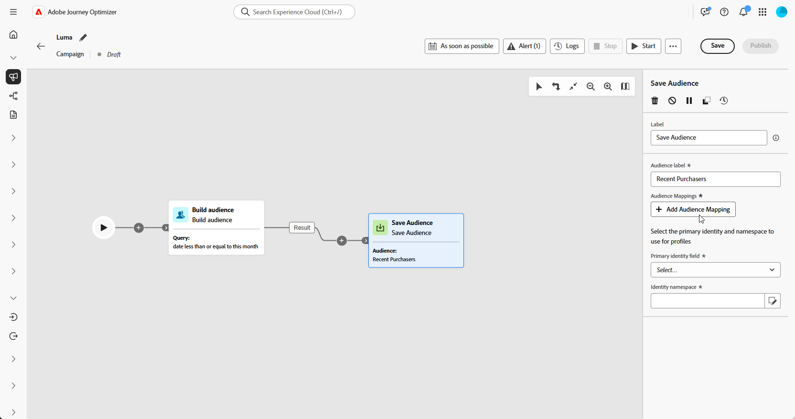
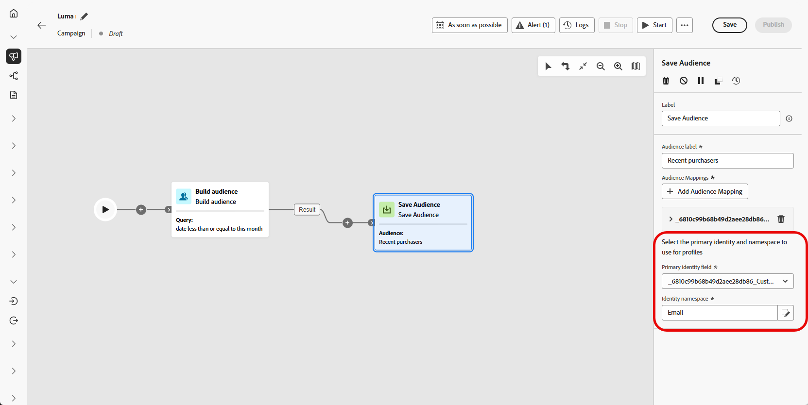
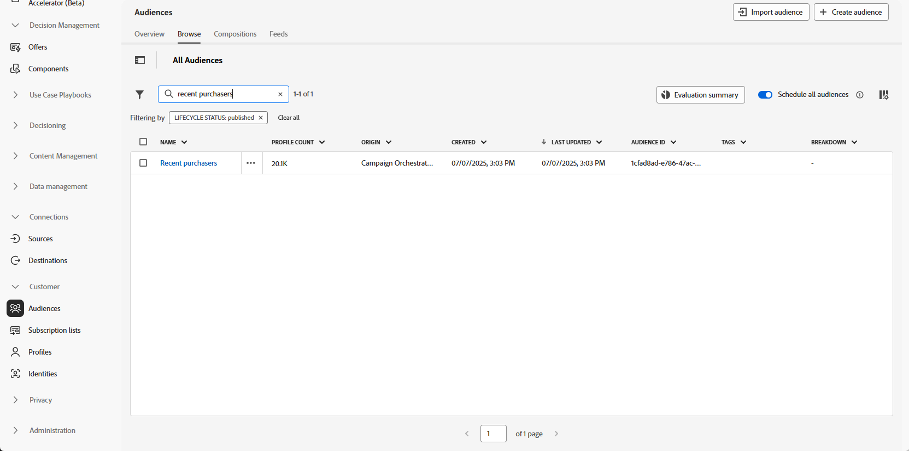
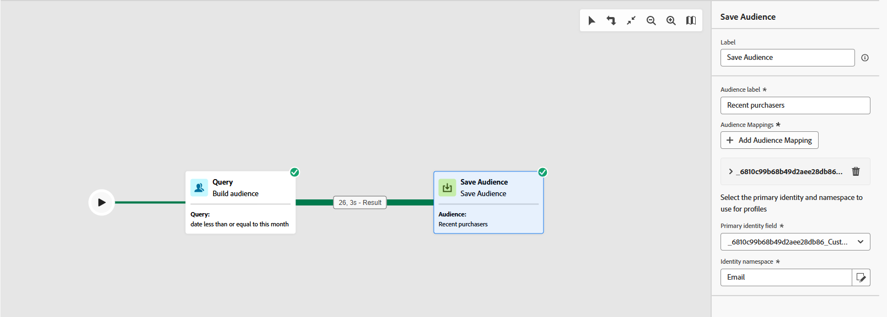

# Save audience {#save-audience}

+++ Table of Contents

| Welcome to orchestrated campaigns | Launch your first orchestrated campaign | Query the database | Ochestrated campaigns activities|
|---|---|---|---|
|[Get started with orchestrated campaigns](../gs-orchestrated-campaigns.md)  [Configuration steps](../configuration-steps.md)  [Access and manage orchestrated campaigns](../access-manage-orchestrated-campaigns.md)|[Key steps to create an orchestrated campaign](../gs-campaign-creation.md)  [Create and schedule the campaign](../create-orchestrated-campaign.md)  [Orchestrate activities](../orchestrate-activities.md)  [Start and monitor the campaign](../start-monitor-campaigns.md)  [Reporting](../reporting-campaigns.md)|[Work with the rule builder](../orchestrated-rule-builder.md)  [Build your first query](../build-query.md)  [Edit expressions](../edit-expressions.md)  [Retargeting](../retarget.md)|[Get started with activities](about-activities.md)  Activities: [And-join](and-join.md) - [Build audience](build-audience.md) - [Change dimension](change-dimension.md) - [Channel activities](channels.md) - [Combine](combine.md) - [Deduplication](deduplication.md) - [Enrichment](enrichment.md) - [Fork](fork.md) - [Reconciliation](reconciliation.md) - <b>[Save audience](save-audience.md)</b> - [Split](split.md) - [Wait](wait.md)|

{style="table-layout:fixed"}

+++

The **[!UICONTROL Save audience]** activity is a **[!UICONTROL Targeting]** activity that allows you to update an existing audience or create a new one from the population generated earlier in the orchestrated campaign. Once created, these audiences are added to the list of application audiences and can be accessed from the **[!UICONTROL Audiences]** menu.

This activity is particularly useful for preserving audience segments calculated within the same orchestrated campaign, making them available for reuse in future campaigns. It is typically connected to other targeting activities, such as **[!UICONTROL Build audience]** or **[!UICONTROL Combine]**, to capture and save the resulting population.

## Configure the Save audience activity {#save-audience-configuration}

Follow these steps to configure the **[!UICONTROL Save audience]** activity:

1. Add a **[!UICONTROL Save audience]** activity to your orchestrated campaign.

1. Enter a **[!UICONTROL Audience label]** that will identify the saved audience.

1. Click **[!UICONTROL Add audience attribute]** to define how the audience data is structured and stored for future reuse.

    

1. Then, select the appropriate **[!UICONTROL Primary identity field]** ​and **[!UICONTROL Identity namespace]** to ensure accurate profile resolution.

    

1. Finalize your setup by saving and publishing the orchestrated campaign. This will generate and store your audience.

The content of the saved audience is then available in the detail view of the audience, which can be accessed from the **[!UICONTROL Audiences]** menu.

## Example {#save-audience-example}

The following example demonstrates how to create a simple audience using targeting. A query identifies all profiles who made a purchase within the past 30 days. The **[!UICONTROL Save audience]** activity then captures these profiles to create a reusable audience of recent purchasers.

