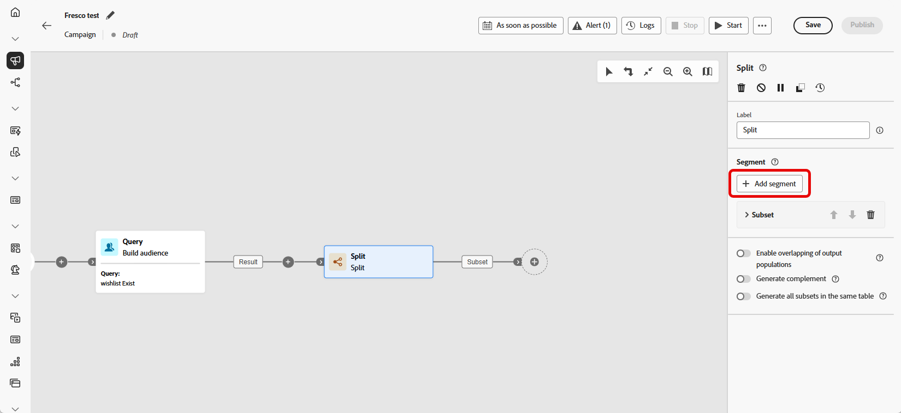
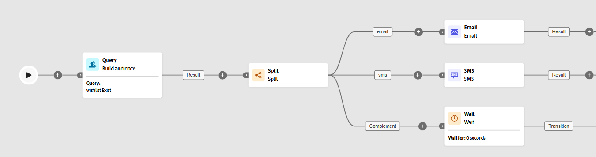

# Split {#split}

>[!CONTEXTUALHELP]
>id="ajo_orchestration_split"
>title="Split activity"
>abstract="The **Split** activity allows you to segment incoming populations into multiple subsets based on different selection criteria, such as filtering rules or population size."

+++ Table of Contents

| Welcome to orchestrated campaigns | Launch your first orchestrated campaign | Query the database | Ochestrated campaigns activities|
|---|---|---|---|
|[Get started with orchestrated campaigns](../gs-orchestrated-campaigns.md)  Create and manage relational Schemas and Datasets:  <ul><li>[Manual schema](../manual-schema.md)</li><li>[File upload schema](../file-upload-schema.md)</li><li>[Ingest data](../ingest-data.md)</li></ul>[Access and manage orchestrated campaigns](../access-manage-orchestrated-campaigns.md)|[Key steps to create an orchestrated campaign](../gs-campaign-creation.md)  [Create and schedule the campaign](../create-orchestrated-campaign.md)  [Orchestrate activities](../orchestrate-activities.md)  [Start and monitor the campaign](../start-monitor-campaigns.md)  [Reporting](../reporting-campaigns.md)|[Work with the rule builder](../orchestrated-rule-builder.md)  [Build your first query](../build-query.md)  [Edit expressions](../edit-expressions.md)  [Retargeting](../retarget.md)|[Get started with activities](about-activities.md)  Activities: [And-join](and-join.md) - [Build audience](build-audience.md) - [Change dimension](change-dimension.md) - [Channel activities](channels.md) - [Combine](combine.md) - [Deduplication](deduplication.md) - [Enrichment](enrichment.md) - [Fork](fork.md) - [Reconciliation](reconciliation.md) - [Save audience](save-audience.md) - <b>[Split](split.md)</b> - [Wait](wait.md)|

{style="table-layout:fixed"}

+++

 

>[!BEGINSHADEBOX]

The content on this page is not final and may be subject to change.

>[!ENDSHADEBOX]

The **[!UICONTROL Split]** activity is a **[!UICONTROL Targeting]** activity that segments the incoming population into multiple subsets based on defined selection criteria such as filtering rules or population size.

## Configure the Split activity {#split-configuration}

>[!CONTEXTUALHELP]
>id="ajo_orchestration_split_segments"
>title="Segments for split activity"
>abstract="Add as many subsets as desired to segment the incoming population.  When the **Split** activity is executed, the population is segmented across the different subsets in the order they are added to the activity. Before starting your orchestrated campaign, ensure that you have ordered the subsets in the order that suits your needs using the arrow buttons." 

>[!CONTEXTUALHELP]
>id="ajo_orchestration_split_filter"
>title="Split activity filter"
>abstract="To apply a filtering condition to the subset, click **[!UICONTROL Create filter]** and configure the desired filtering rule using the query modeler. For example, include profiles from the incoming population whose email address exist in the database."

>[!CONTEXTUALHELP]
>id="ajo_orchestration_split_limit"
>title="Split activity limit"
>abstract="To limit the number of profiles selected by the subset, toggle on the **[!UICONTROL Enable limit]** option, and specify the number or percentages of the population to include."

>[!CONTEXTUALHELP]
>id="ajo_orchestration_split_sorting"
>title="Split activity sorting"
>abstract="When setting a population limit for a subset, you can rank the selected profiles based on a specific profile attribute, in ascending or descending order. To do this, toggle on the **Enable sorting** option. For instance, you can restrict a subset to include only the top 50 profiles with the highest purchase amount."

>[!CONTEXTUALHELP]
>id="ajo_orchestration_split_complement"
>title="Split generate complement"
>abstract="Once that you have configured all the subsets, you can select the remaining population that did not match any of the subsets and include them into an additional outbound transition. To do this, toggle on the **Generate complement** option." 

>[!CONTEXTUALHELP]
>id="ajo_orchestration_split_generatesubsets"
>title="Generate all subsets in the same table"
>abstract="Toggle on this option to group all the subsets into a single output transition."

>[!CONTEXTUALHELP]
>id="ajo_orchestration_split_emptytransition"
>title="Skip empty transition"
>abstract="Toggle the **[!UICONTROL Skip empty transition]** option on to disable the output transition for this subset if the incoming population is empty."

>[!CONTEXTUALHELP]
>id="ajo_orchestration_split_enable_overlapping"
>title="Enable overlapping of output populations"
>abstract=" The **[!UICONTROL Enable overlapping of output populations]** option lets you manage populations belonging to several subsets. When the box isn't checked, the split activity makes sure a recipient cannot be present in several output transitions, even if it meets the criteria of several subsets. They will be in the target of the first tab with matching criteria. When the box is checked, the recipients can be found in several subsets if they meet their filter criteria."

Follow these steps to configure the **[!UICONTROL Split]** activity:

1. Add a **[!UICONTROL Split]** activity to your orchestrated campaign.

1. The activity configuration pane opens with a default subset. Click the **[!UICONTROL Add segment]** button to add as many subsets as desired to segment the incoming population.

    

    >[!IMPORTANT]
    >
    >The **Split** activity processes subsets in the order they are added. For example, if the first subset captures 70% of the population, the next applies its criteria to the remaining 30%.
    >
    >Before running your orchestrated campaign, make sure the subsets are ordered as intended. Use the arrow buttons to adjust their position.

1. Once subsets have been added, the activity shows as many output transitions as there are subsets. We strongly recommend changing the label of each subset to identify them easily in the orchestrated campaign canvas. 

1. Configure filters for each subset:

    1. Click a subset to open its settings.

    1. Click **[!UICONTROL Create filter]** to define filtering rules using the query modeler, for example, select profiles with a valid email address.

        

    1. To limit the number of selected profiles, enable **[!UICONTROL Enable limit]** and specify a number or percentage.

    1. To skip a transition when the subset is empty, enable **[!UICONTROL Skip empty transition].**

1. To include profiles not matched by any subset, enable **[!UICONTROL Generate complement]**. This creates an additional outbound transition for the remaining population.

    >[!NOTE]
    >
    >Enable **[!UICONTROL Generate all subsets in the same table]** to group all subsets into a single transition.

1. Use **[!UICONTROL Enable overlapping of output populations]** to allow profiles to appear in multiple subsets:

    * **If unchecked**, each profile is assigned to only one subset, the first one whose criteria it matches even if it qualifies for other subsets.

    * **If checked**, profiles can be included in multiple subsets if they meet the criteria for each. 

The activity is now configured. At orchestrated campaign execution, the population will be segmented into the different subsets, in the order they have been added to the activity.

## Example{#split-example}

In the following example, the **[!UICONTROL Split]** activity is used to segment an audience into distinct subsets based on the communication channel that we want to use :

* **Subset 1 "email"**: includes profiles who have provided a phone number.

* **Subset 2 "sms"**: targets profiles with a mobile phone number stored in the database.

* **Complement transition**: captures any remaining profiles who do not meet the criteria for either subset.

