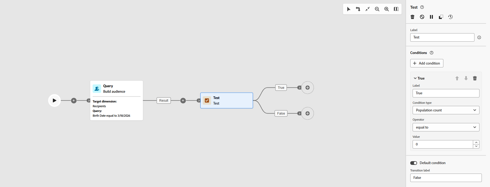

# Test {#test}

>[!CONTEXTUALHELP]
>id="ajo_orchestration_test"
>title="Test activity"
>abstract="The **Test** activity is a **Flow control** activity. It allows you to enable transitions based on specified conditions."

>[!CONTEXTUALHELP]
>id="ajo_orchestration_test_conditions"
>title="Conditions"
>abstract="The **Test** activity can have multiple output transitions. During Orchestrated campaign execution, each condition is tested sequentially until one of them is met. If none of the conditions are met, the Orchestrated campaign continues along the path of the **[!UICONTROL Default condition]**. If no default condition is activated, the Orchestrated campaign stops at this point."

The **[!UICONTROL Test]** activity is a **[!UICONTROL Flow control]** activity. Use it to branch your campaign flow by activating different transitions depending on conditions you define. Each condition can evaluate data from the inbound transition and you can choose which transition runs first by the order in which conditions are evaluated.

## Configure the Test activity {#test-configuration}

To set up the **[!UICONTROL Test]** activity:

1. Drop a **[!UICONTROL Test]** activity into your Orchestrated campaign canvas.

1. By default, the activity provides a single boolean test: when the "True" condition is met, that transition is activated; otherwise the "False" (default) transition is activated.

   

1. Define the condition for a transition by completing these fields:

   * **Label**: A name for the transition so you can identify it on the canvas.

   * **Condition type**: The data to evaluate, by default, population count. 

   * **Operator**: The comparison to apply, e.g. equal to, greater than, less than. The list of operators depends on the condition type's data type.

   * **Value**: The value to compare the condition type against.

    

1. To branch on more than two outcomes, click **[!UICONTROL Add condition]** and define a label and condition for each additional transition.

1. At run time, the campaign evaluates conditions in order and follows the first one that matches. When no condition matches, execution follows **[!UICONTROL Default condition]** if one is set; otherwise the campaign stops at the **[!UICONTROL Test]** activity.

## Example {#example}

In this example, different transitions are activated based on the number of profiles targeted by a **[!UICONTROL Build audience]** activity. Conditions are evaluated in order; the last transition is the default and is used when no previous condition matches.

* If more than 10,000 profiles are targeted, an email message is sent.
* Default (no condition matched): when the count is 10,000 or fewer, the population is directed to a "do not contact" transition.

