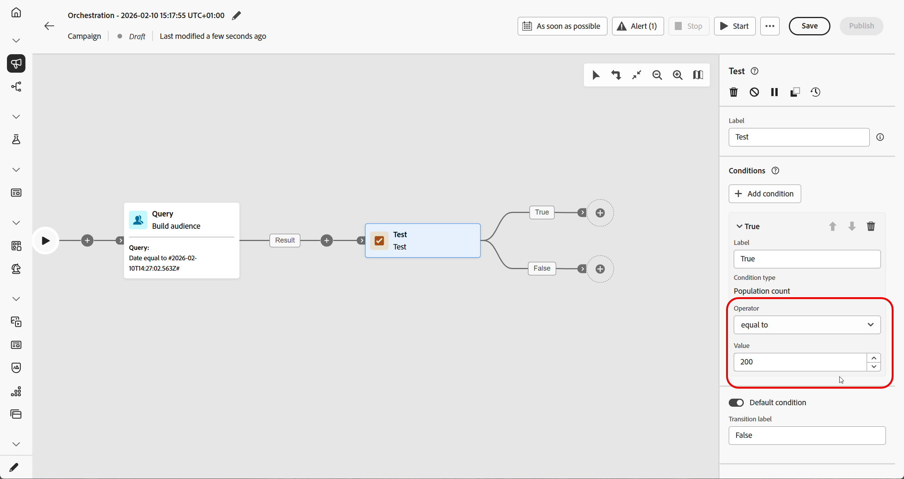
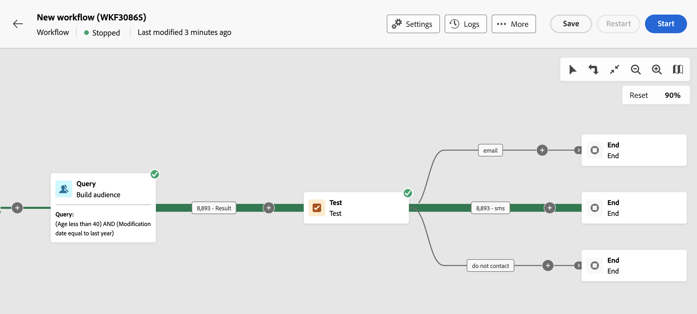
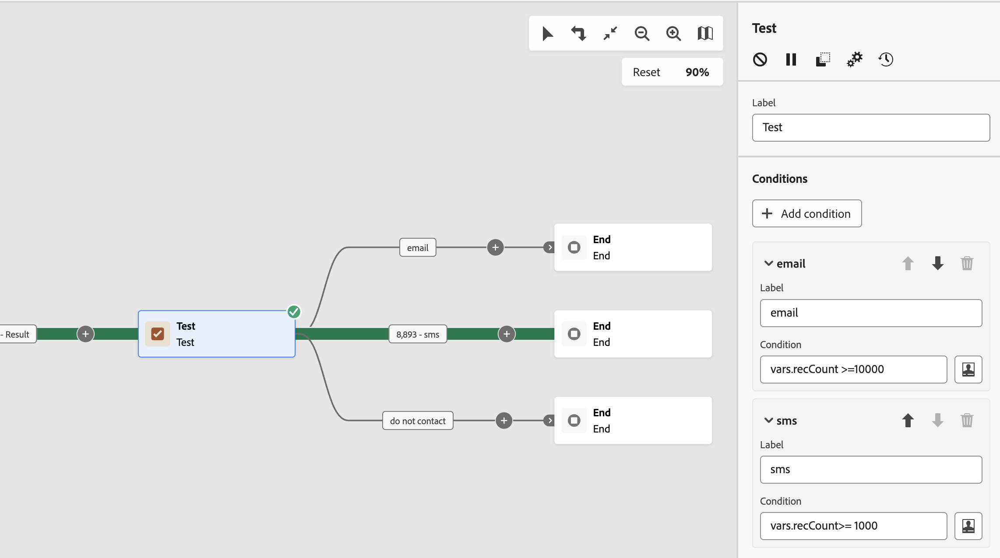

# Test {#test}

>[!CONTEXTUALHELP]
>id="ajo_orchestration_test"
>title="Test activity"
>abstract="The **Test** activity is a **Flow control** activity. It allows you to enable transitions based on specified conditions."

>[!CONTEXTUALHELP]
>id="ajo_orchestration_test_conditions"
>title="Conditions"
>abstract="The **Test** activity can have multiple output transitions. During orchestrated campaign execution, each condition is tested sequentially until one of them is met. If none of the conditions are met, the orchestrated campaign continues along the path of the **[!UICONTROL Default condition]**. If no default condition is activated, the orchestrated campaign stops at this point."

+++ Table of Contents

| Welcome to orchestrated campaigns | Launch your first orchestrated campaign | Query the database | Ochestrated campaigns activities|
|---|---|---|---|
|[Get started with orchestrated campaigns](../gs-orchestrated-campaigns.md)  Create and manage relational Schemas and Datasets:  <ul><li>[Get started with Schemas and Datasets](../gs-schemas.md)</li><li>[Manual schema](../manual-schema.md)</li><li>[File upload schema](../file-upload-schema.md)</li><li>[Ingest data](../ingest-data.md)</li></ul>[Access and manage orchestrated campaigns](../access-manage-orchestrated-campaigns.md)|[Key steps to create an orchestrated campaign](../gs-campaign-creation.md)  [Create and schedule the campaign](../create-orchestrated-campaign.md)  [Orchestrate activities](../orchestrate-activities.md)  [Start and monitor the campaign](../start-monitor-campaigns.md)  [Reporting](../reporting-campaigns.md)|[Work with the rule builder](../orchestrated-rule-builder.md)  [Build your first query](../build-query.md)  [Edit expressions](../edit-expressions.md)  [Retargeting](../retarget.md)|[Get started with activities](about-activities.md)  Activities: [And-join](and-join.md) - [Build audience](build-audience.md) - [Change dimension](change-dimension.md) - [Channel activities](channels.md) - [Combine](combine.md) - [Deduplication](deduplication.md) - [Enrichment](enrichment.md) - [Fork](fork.md) - [Reconciliation](reconciliation.md) - [Save audience](save-audience.md) - [Split](split.md) - [Wait](wait.md)|

{style="table-layout:fixed"}

+++

 

>[!BEGINSHADEBOX]

 

The content on this page is not final and may be subject to change.

>[!ENDSHADEBOX]

The **[!UICONTROL Test]** activity is a **[!UICONTROL Flow control]** activity. It allows you to enable transitions based on specified conditions.

## Configure the Test activity {#test-configuration}

Follow these steps to configure the **[!UICONTROL Test]** activity:

1. Add a **[!UICONTROL Test]** activity to your orchestrated campaign.

1. By default, the **[!UICONTROL Test]** activity presents a simple boolean test. If the condition defined in the "True" transition is met, this transition will be activated. Otherwise, a default "False" transition will be activated.

1. To configure the condition associated to a transition, click the **[!UICONTROL Open personalization dialog]** icon. Use the expression editor to define the rules required to activate this transition. You can also leverage event variables, conditions, and date/time functions.

    Additionally, you can modify the **[!UICONTROL Label]** field to personalize the transition's name on the orchestrated campaign canvas.

    

1. You can add multiple output transitions to a **[!UICONTROL Test]** activity. To do this, click the **[!UICONTROL Add condition]** button and configure the label and associated condition for each transition.
v
1. During orchestrated campaign execution, each condition is tested sequentially until one of them is met. If none of the conditions are met, the orchestrated campaigns continues along the path of the **[!UICONTROL Default condition]**. If no default condition is activated, the workflows stops at this point.

## Example {#example}

In this example, different transitions are activated based on the number of profiles targeted by a **[!UICONTROL Build audience]** activity:

* If more than 10,000 profiles are targeted, an email message is sent.
* For 1,000 to 10,000 profiles, an SMS is sent.
* If the targeted profiles fall below 1,000, they are directed to a "do not contact" transition.

To do this, the `vars.recCount` event variable has been leveraged in the "email" and "sms" conditions to count the number of targeted profiles and activate the appropriate transition.

