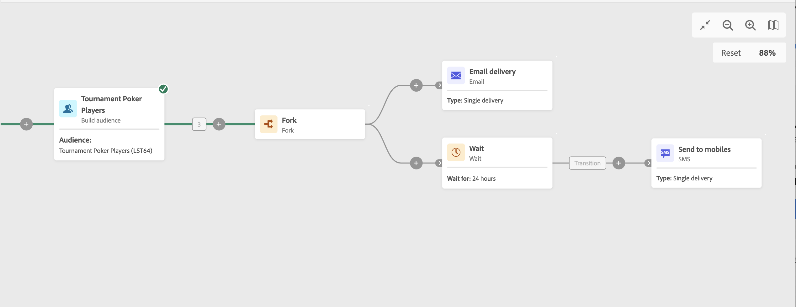

# Wait {#wait}

>[!CONTEXTUALHELP]
>id="ajo_orchestration_wait"
>title="Wait activity"
>abstract="The **Wait** activity is used to delay the transition from an activity to another."

+++ Table of Contents

| Welcome to orchestrated campaigns | Launch your first orchestrated campaign | Query the database | Ochestrated campaigns activities|
|---|---|---|---|
|[Get started with orchestrated campaigns](gs-orchestrated-campaigns.md)  [Configuration steps](configuration-steps.md)  [Key steps for orchestrated campaign creation](gs-campaign-creation.md)|[Create an orchestrated campaign](create-orchestrated-campaign.md)  [Orchestrate activities](orchestrate-activities.md)  [Send messages with orchestrated campaigns](send-messages.md)  [Start and monitor the campaign](start-monitor-campaigns.md)  [Reporting](reporting-campaigns.md)|[Work with the Query Modeler](orchestrated-query-modeler.md)  [Build your first query](build-query.md)  [Edit expressions](edit-expressions.md)|[Get started with activities](activities/about-activities.md)  Activities: [And-join](activities/and-join.md) - [Build audience](activities/build-audience.md) - [Change dimension](activities/change-dimension.md) - [Combine](activities/combine.md) - [Deduplication](activities/deduplication.md) - [Enrichment](activities/enrichment.md) - [Fork](activities/fork.md) - [Reconciliation](activities/reconciliation.md) - [Split](activities/split.md) -  [Wait](activities/wait.md)|

{style="table-layout:fixed"}

+++

  

The **Wait** activity is a **Flow control** activity. It is used to allow a certain amount of time to pass between two activities being executed. For example, to wait several days after an email delivery activity then analyze the opens and clicks generated during this period before performing any follow-up operations (reminder email, creating an audience, etc.).

## Configuration{#wait-configuration}

Follow these steps to configure the **Wait** activity:

1. Add a **Wait** activity into your orchestrated campaign.

1. Specify the **Duration** of the wait between the inbound and outbound transitions.

1. Select the time unit in the **Periods** field: seconds, minutes, hours, days.

## Example{#wait-example}

The following example illustrates the **Wait** activity in a typical use case. An email invitation to an event is sent. 24 hours after it was sent, an SMS delivery is sent to the same population.

