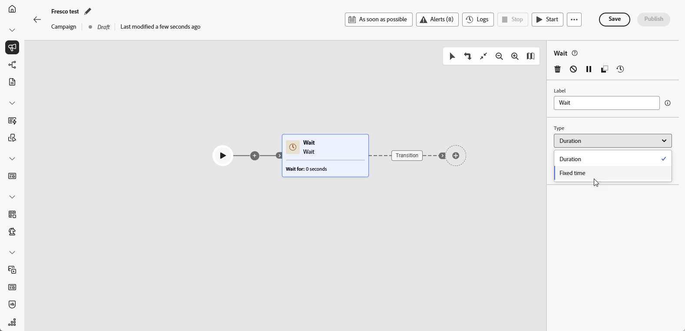

# Wait {#wait}

>[!CONTEXTUALHELP]
>id="ajo_orchestration_wait"
>title="Wait activity"
>abstract="The **Wait** activity is used to delay the transition from an activity to another."

The **[!UICONTROL Wait]** activity is a **[!UICONTROL Flow control]** component used to introduce a delay between two activities in an Orchestrated campaign. This helps ensure your follow-up activities are better timed and more relevant to user engagement.

For example, you can wait a few days after an email delivery to track opens and clicks before sending a follow-up message. 

## Configuration{#wait-configuration}

Follow these steps to configure the **[!UICONTROL Wait]** activity:

1. Add a **[!UICONTROL Wait]** activity into your Orchestrated campaign.

1. Select the Wait type that best fits your needs:

    * **[!UICONTROL Duration]**: Specify a delay in seconds, minutes, hours, or days before proceeding to the next activity.

    * **[!UICONTROL Fixed time]**: Set a specific date and time after which the next activity starts.

    

## Example{#wait-example}

The following example illustrates the **[!UICONTROL Wait]** activity in a typical use case.  An email with a promo code is sent to profiles celebrating their birthdays. After 29 days, an SMS is sent to the same group as a reminder that their birthday promo code is about to expire.

