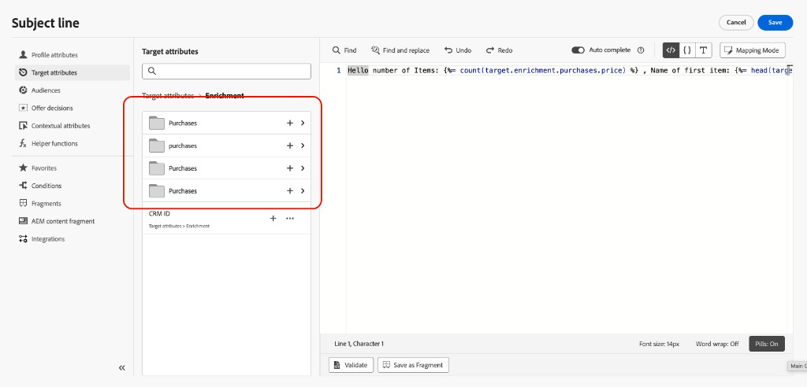

# Add personalization in Orchestrated campaigns {#add-personalization}

After you [orchestrate activities](orchestrate-activities.md) on the canvas and add a channel activity, you personalize message content in the email, SMS, or other channel editor.

Personalization in Orchestrated campaigns works similarly to other [!DNL Journey Optimizer] campaigns or journeys, with differences tied to the **worktable**: attributes calculated by targeting and enrichment activities on the canvas, not only data from the profile store.

## Access the personalization editor {#access}

1. Open your Orchestrated campaign and add a channel activity. [Learn how to add a channel activity](activities/channels.md#add)

1. Configure the channel activity, then open the **[!UICONTROL Content]** tab and edit the message.

1. In the message editor, use the personalization editor to insert attributes into the content.

To preview and test personalized content from the channel activity, see [Check and test your content](activities/channels.md#simulate-content-test-profiles).

## Profile and target attributes {#attributes}

When you open the personalization editor, two main folders contain attributes available for personalization:

* **[!UICONTROL Profile attributes]**

    Profile-related data from [!DNL Adobe Experience Platform]: name, email address, location, and other traits captured in the user profile.

* **[!UICONTROL Target attributes]** (Orchestrated campaigns only)

    Attributes calculated on the campaign canvas from the worktable. This folder has two subfolders:

    * **`<Targeting dimension>`** (for example, Recipients or Purchases) — Attributes related to the dimension you target in the campaign.

    * **`Enrichment`** — Data added through **[!UICONTROL Enrichment]** activities (relational links, collected lines, aggregates). After a 1:N **[!UICONTROL Collect data]** enrichment, you get both numbered lines and a collection array. [Learn how to work with enrichment collection data](#enrichment-collections)

For a detailed overview of the personalization editor across [!DNL Journey Optimizer], see [Get started with personalization](../personalization/personalize.md).

## Work with enrichment collection data {#enrichment-collections}

When you configure an **[!UICONTROL Enrichment]** activity with a 1:N link and **[!UICONTROL Collect data]**, enrichment attributes are available under **[!UICONTROL Target attributes] > [!UICONTROL Enrichment]** in two forms:

* **Flattened lines** — One field per retrieved line (for example, **Purchase 1**, **Purchase 2**, **Purchase 3**), each with the attributes you selected on the link (such as price or product). Use these when you need separate, fixed slots—for example `target.enrichment.purchase1.price`.

* **Collection array** — One array for all collected lines, named from the link label (for example, **purchases**). Use this when you need to work on the full set of records—with [array functions](#array-functions) or [iterate over the collection](#iterate-enrichment-collections) with `{{#each}}` in the message body.



To identify the flattend lines from the collection array, insert the attribute in the expression editor and read the path that is generated. The collection array is the entry whose path is **plural** (for example `purchases`) and has **no line number** (`purchase1`, `purchase2`, and so on).

| What you need | Path in the expression editor |
| --- | --- |
| **One collected line** | **Numbered** — for example `target.enrichment.purchase1.price` |
| **The full collection** | **Plural and unnumbered** — for example `target.enrichment.purchases.price` |


You can apply the same [array and list functions](../personalization/functions/arrays-list.md) used elsewhere in [!DNL Journey Optimizer] to an enrichment collection, referencing `target.enrichment.<label>`.

For example, in a subject line you might show how many collected purchases exist and the first item's price:

```sql
Hello number of Items:  , Name of first item: 
```

➡️ [Learn how to configure collection enrichment on the canvas](activities/enrichment.md#collection-personalization)
