# Build your first rule {#build-query}

+++ Table of Contents

| Welcome to orchestrated campaigns | Launch your first orchestrated campaign | Query the database | Ochestrated campaigns activities|
|---|---|---|---|
|[Get started with orchestrated campaigns](gs-orchestrated-campaigns.md)  [Configuration steps](configuration-steps.md)  [Access and manage orchestrated camapaigns](access-manage-orchestrated-campaigns.md)|[Key steps for orchestrated campaign creation](gs-campaign-creation.md)  [Create and configure the campaign](create-orchestrated-campaign.md)  [Orchestrate activities](orchestrate-activities.md)  [Send messages with orchestrated campaigns](send-messages.md)  [Start and monitor the campaign](start-monitor-campaigns.md)  [Reporting](reporting-campaigns.md)|[Work with the rule builder](orchestrated-rule-builder.md)  <b>[Build your first query](build-query.md)</b>  [Edit expressions](edit-expressions.md)|[Get started with activities](activities/about-activities.md)  Activities: [And-join](activities/and-join.md) - [Build audience](activities/build-audience.md) - [Change dimension](activities/change-dimension.md) - [Combine](activities/combine.md) - [Deduplication](activities/deduplication.md) - [Enrichment](activities/enrichment.md) - [Fork](activities/fork.md) - [Reconciliation](activities/reconciliation.md) - [Split](activities/split.md) -  [Wait](activities/wait.md)|

{style="table-layout:fixed"}

+++

 

The main steps to build rules for your orchestrated campaigns are as follows:

1. **Add conditions** - Create custom conditions to filter your query by building your own condition with attributes from the database and advanced expressions.
1. **Combine conditions** - Arrange the conditions in the canvas using groups and logical operators.
1. **Check and validate the rule** - Check the resulting data of your rule before saving it.

## Add a condition {#conditions}

To add conditions in your query, follow these steps:

1. Access the rule builder from a **[!UICONTROL Build audience]** activity.

1. Click the **Add condition** button to create a first condition for your query.

    You can also start your query using a predefined filter. To do so, click the **[!UICONTROL Select or save filter]** button and choose **[!UICONTROL Select predefined filter]**. 

    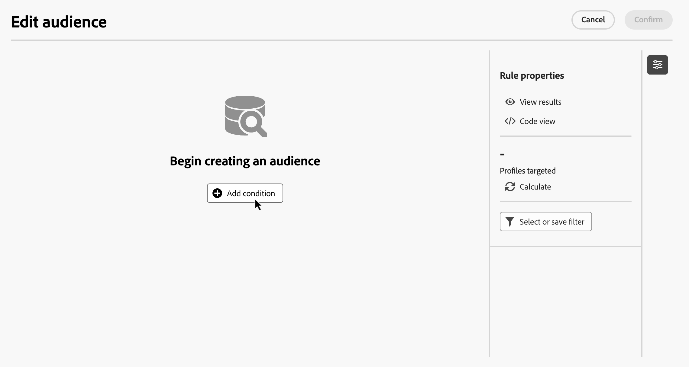

1. Identify the attribute from the dabatase to use as criteria for your condition. The "i" icon next to an attribute provides information on the table where it is store and its data type.

    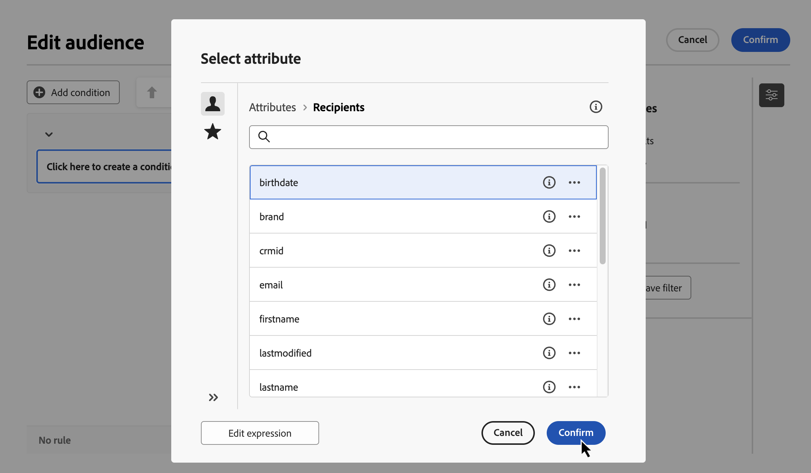

    >[!NOTE]
    >
    >The **Edit expression** button allows you to use the expression editor to manually define an expression using fields from the database and helper functions. [Learn how to edit expressions](../orchestrated/edit-expressions.md)

1. Click the  button next to an attribute to access these addititional options:

    +++ Distribution of values

    Analyze the distribution of values for a given attribute within the table. This feature is helpful for understanding the available values, their counts, and percentages. It also helps avoid issues such as inconsistent capitalization or spelling when building queries or creating expressions.

    For attributes with a large number of values, the tool displays only the first twenty. In such cases, a **[!UICONTROL Partial load]** notification appears to indicate this limitation. You can apply advanced filters to refine the displayed results and focus on specific values or subsets of data.

    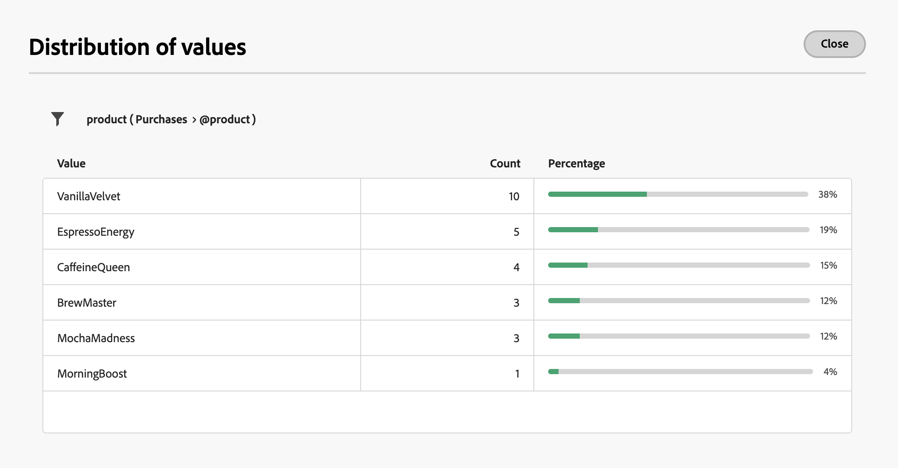

    +++

    +++ Add to favorites
    
    Adding attributes to your favorites menu provides quick access to your most frequency used attributes. You can add up to 20 attributes to favorites. Favorite and recent attributes are associated with each user within an organization, ensuring accessibility across different machines and providing a seamless experience across devices.
    
    To access attributes you have favorited, use the **[!UICONTROL Favorites and recents]** menu. Favorite attributes appear first, followed by recently used ones, making it easy to locate the required attributes. To remove an attribute from favorites, select the star icon again.

    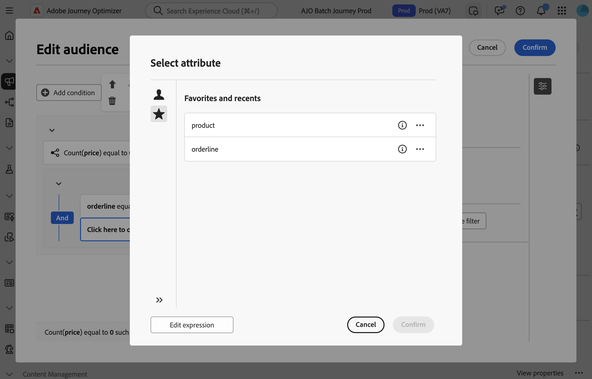

    +++

1. Click **[!UICONTROL Confirm]** to add the selected attribute to your condition.

1. A properties pane displays, where you can configure the desired value for the attribute.

    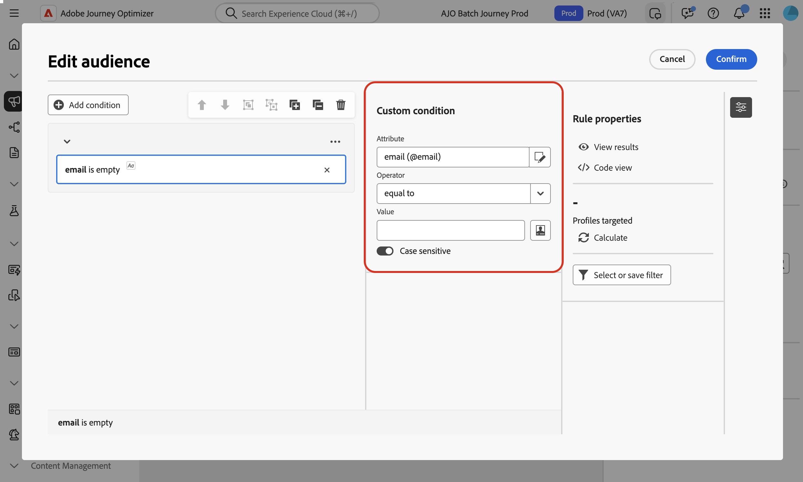

1. Select the **[!UICONTROL Operator]** to apply from the drop-down list. Various operators are available for use. Operators available in the drop-down list depend on the attribute's data type.

   +++List of available operators

    |Operator|Purpose|Example|
    |---|---|---|
    |Equal to|Returns a result identical to the data entered in the second Value column.|Last name (@lastName) equal to 'Jones' will return only recipients whose last name is Jones.|
    |Not equal to|Returns all values not identical to the value entered.|Language (@language) not equal to 'English'.|
    |Greater than|Returns a value greater than the value entered.|Age (@age) greater than 50 will return all values greater than '50', such as '51', '52'.|
    |Less than|Returns a value smaller than the value entered.|Creation date (@created) before 'DaysAgo(100)' will return all recipients created less than 100 days ago.|
    |Greater than or equal to|Returns all values equal to or greater than the value entered.|Age (@age) greater than or equal to '30' will return all recipients aged 30 or more.|
    |Less than or equal to|Returns all values equal to or lower than the value entered.|Age (@age) less than or equal to '60' will return all recipients aged 60 or less.|
    |Included in|Returns results included in the values indicated. These values must be separated by a comma.|Birth date (@birthDate) is included in '12/10/1979,12/10/1984' will return the recipients born between these dates.|
    |Not in|Works like the Is included in operator. Here, recipients are excluded based on the values entered.|Birth date (@birthDate) is not included in '12/10/1979,12/10/1984'. Recipients born within these dates will not be returned.|
    |Is empty|Returns results matching an empty value in the second Value column.|Mobile (@mobilePhone) is empty returns all recipients who do not have a mobile number.|
    |Is not empty|Works in reverse to the Is empty operator. It is not necessary to enter data in the second Value column.|Email (@email) is not empty.|
    |Starts with|Returns results starting with the value entered.|Account # (@account) starts with '32010'.|
    |Does not start with|Returns results not starting with the value entered.|Account # (@account) does not start with '20'.|
    |Contains|Returns results containing at least the value entered.|Email domain (@domain) contains 'mail' will return all domain names that contain 'mail', such as 'gmail.com'.|
    |Does not contain|Returns results not containing the value entered.|Email domain (@domain) does not contain 'vo'. Domain names containing 'vo', such as 'voila.fr', will not appear in the results.|
    |Like|Similar to the Contains operator, it lets you insert a % wildcard character in the value.|Last name (@lastName) like 'Jon%s'. The wildcard character acts as a "joker" to find names like "Jones".|
    |Not like|Similar to the Contains operator, it lets you insert a % wildcard character in the value.|Last name (@lastName) not like 'Smi%h'. Recipients whose last name is 'Smith' will not be returned.|

    +++

1. In the **Value** field, define the expected value. You can also use the expression editor to manually define an expression using fields from the database and helper functions. To do this, click the  icon. [Learn how to edit expressions](../orchestrated/edit-expressions.md)

    For date-type attributes, predefined values are available using the **[!UICONTROL Presets]** option.

    +++See example
    
    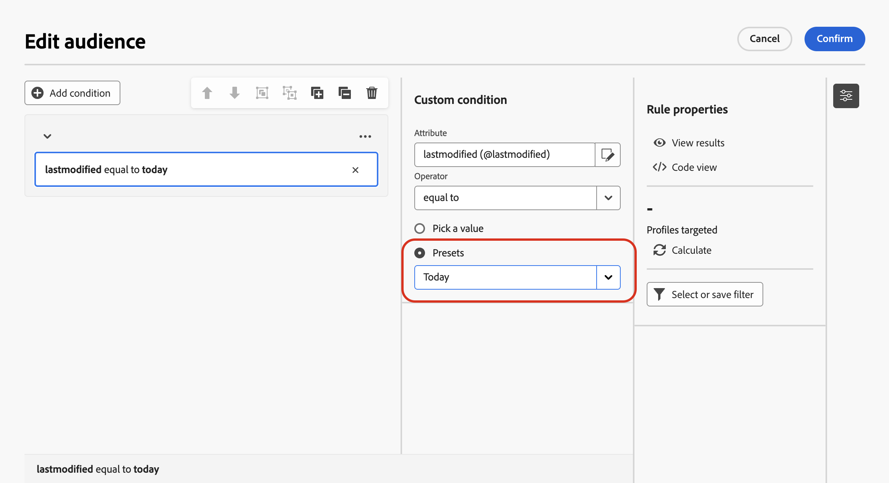 

    +++

### Custom conditions on linked tables (1-1 and 1-N links){#links}

Custom conditions allows you to query tables linked to the table currently used by your rule. This includes tables with a 1-1 cardinality link, or collection tables (1-N link).

For a **1-1 link**, navigate to the linked table, select the desired attribute and define the expected value.

You can also directly select a table link in the **Value** picker and confirm. In that case, values available for the selected table need to be selected using a dedicated picker, as shown in the example below.

+++Query example

Here, the query is targeting brands whose label is "running". 

1. Navigate inside the **Brand** table and select the **Label** attribute.

    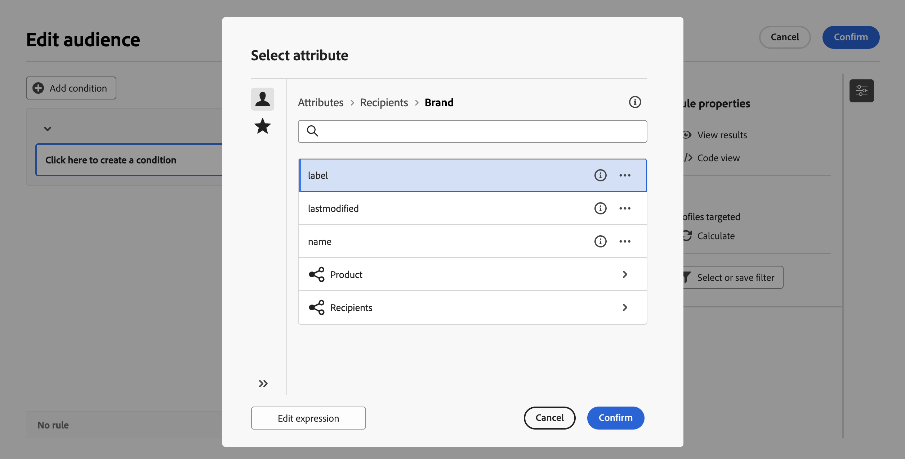

1. Define the expected value for the attribute.

    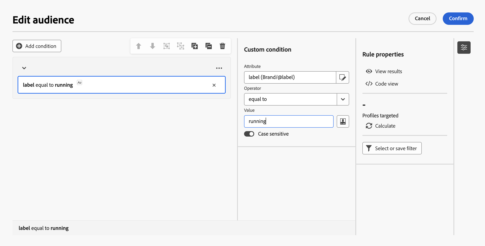

Here is a query sample where a table link has been selected directly. Available values for this table must be selected from a dedicated picker.

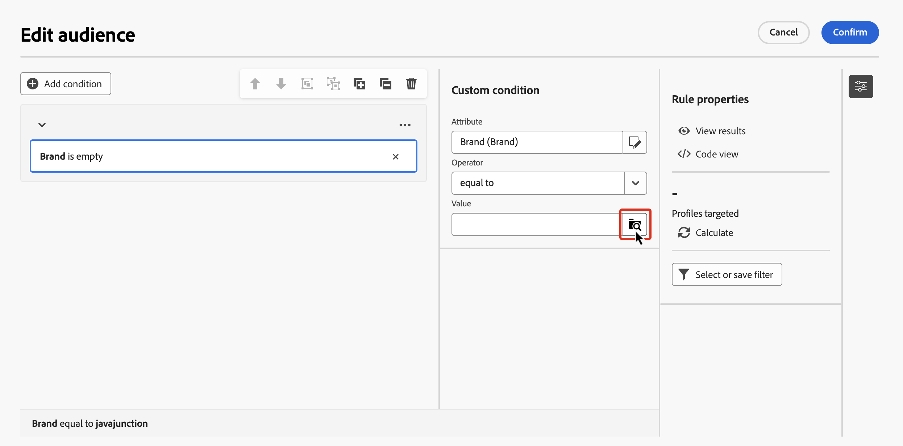

+++ 

For a **1-N link**, you can define sub-conditions to refine your query, as shown in the example below.

+++Query example

Here, the query is targeting recipients who made purchases related to the Brewmsaster product, for more than 100$.

1. Select the **Purchases** table and confirm.

1. Clic **[!UICONTROL Add condition]** to define the sub-conditions to apply to the selected table.

    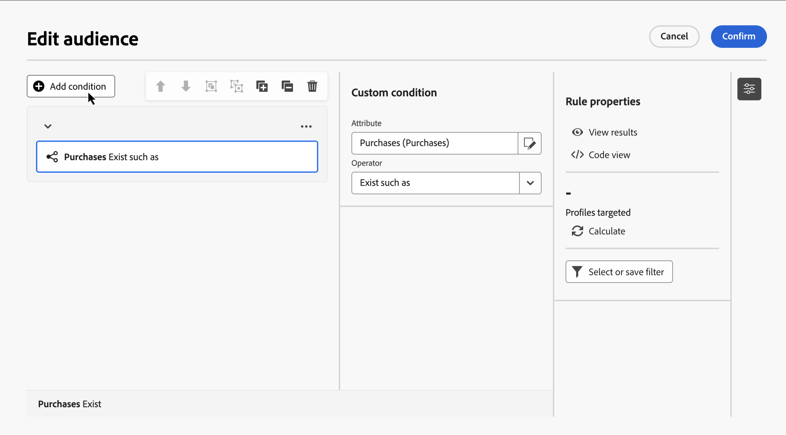

1. Add sub-conditions to suit your needs.

    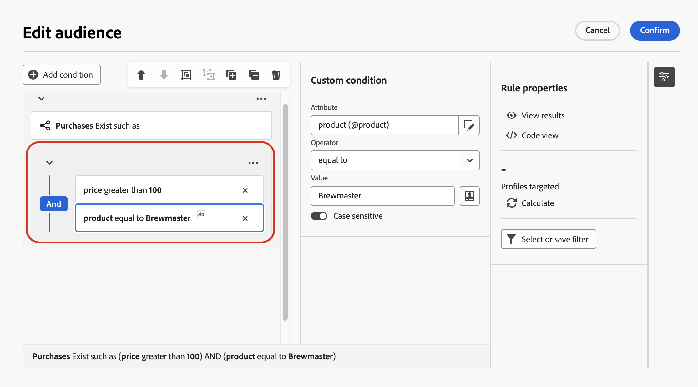

+++ 

### Custom conditions with aggregate data {#aggregate}

Custom conditions allow you to perform aggregate operations. To do this, you need to directly select an attribute from a collection table:

1. Navigate inside the desired collection table and select the attribute on which you want to perform an aggregate operation.

1. In the properties pane, toggle on the **Aggregate data** option and select the desired aggregate function.

    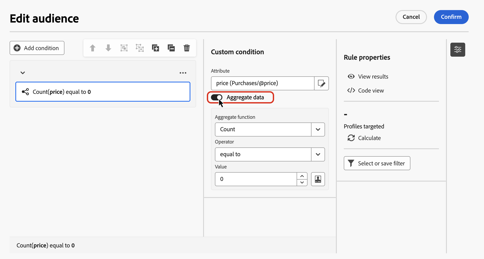

## Combine conditions using operators {#operators}

Each time you add a new condition in your rule, it is automatically linked to the existing condition by an **AND** operator. This means that results from the two conditions are combined.

To change the operator between conditions, click on it, and select the desired operator.

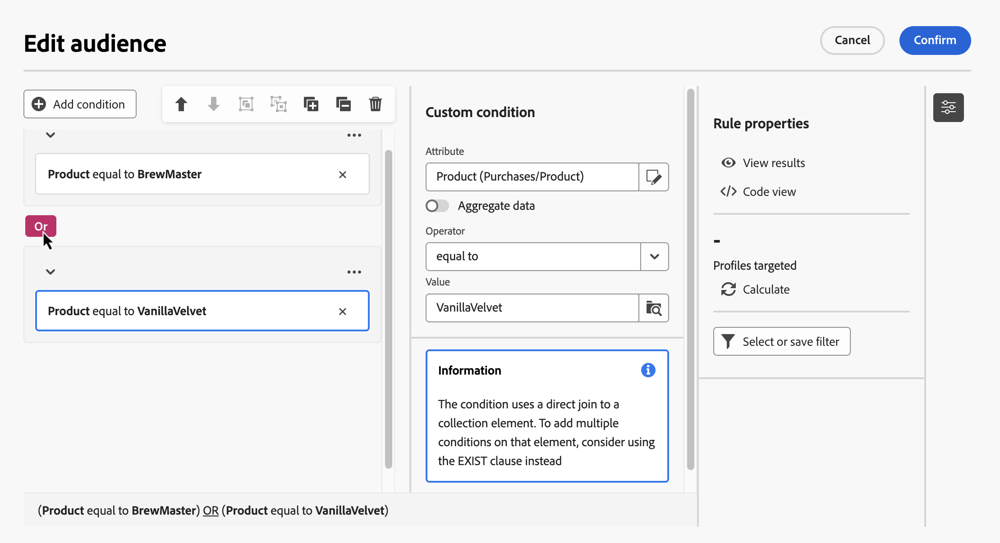

Available operators are:

* **AND (Intersection)**: Combines results matching all the filtering components in the outbound transitions. 
* **OR (Union)**: Includes results matching at least one of the filtering components in the outbound transitions.
* **EXCEPT (Exclusion)**: Excludes results matching all the filtering components in the outbound transition. 

## Manipulate conditions {#manipulate}

The rule buidler canvas toolbar provides options to easily manipulate the conditions within your rule:

| Toolbar icon | Description |
|--- |--- |
| | Move the component up a row. |
| | Move the component down a row. |
| | Put two components in a group. |
| | Separate the components of a single group. |
| | Expand all the groups. |
| | Collapse all the groups. |
| | Remove all groups and components. |

Depending on your needs, you may need to create intermediate groups of components by grouping components into a same group and linking them together. 

* To group two existing conditions, select one of the two conditions and click the  or  button to group it with the condition above or below.

* To group an existing condition with a new one, select the condition, click the  button and select **[!UICONTROL Add group]**. Select the new attribute to add to the group then confirm.

    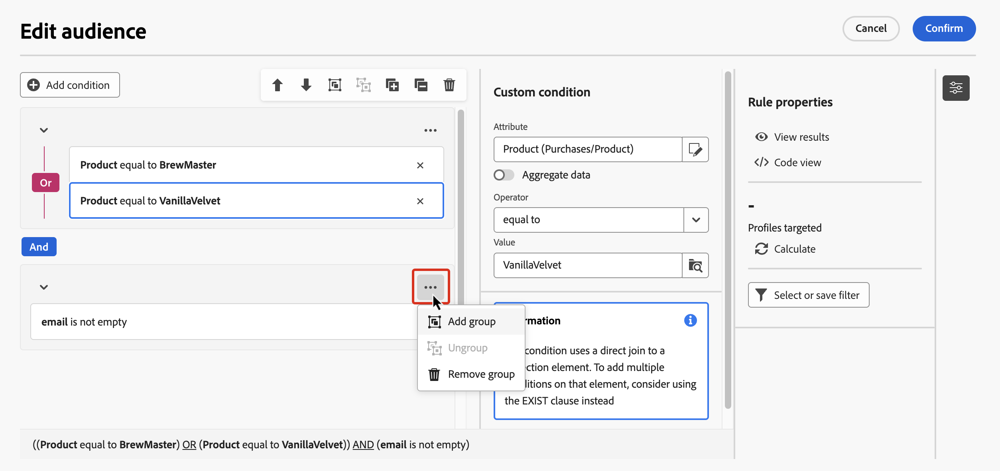

In the example below, we have created an intermediate group to target customers who purchased either the BrewMaster or VanillaVelvet product.

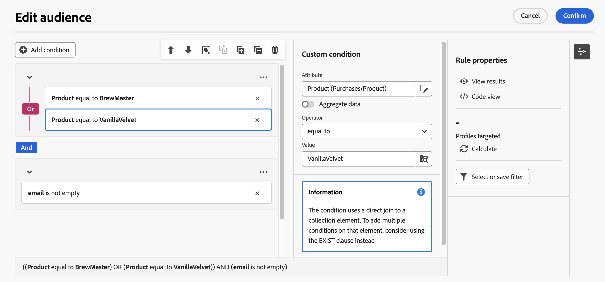

## Check and validate your query

Once you've built your query in the canvas, you can check it using the **Rule properties** pane. Available operations are:

* **View results:** Displays the data resulting from your query.
* **Code view**: Displays a code-based version of the query in SQL.
* **Calculate**: Updates and displays the number of records targeted by your rule.
* **Select or save filter**: Choose an existing predefined filter to use in the canvas, or save your query as a predefined filter for future reuse.

 

    >[!IMPORTANT]
    >
    >Select a predefined filter from the Rule properties pane replaces the rule that has been built in the canvas with the selected filter.

When your rule is ready, click the **[!UICONTROL Confirm]** button in the to save it.
