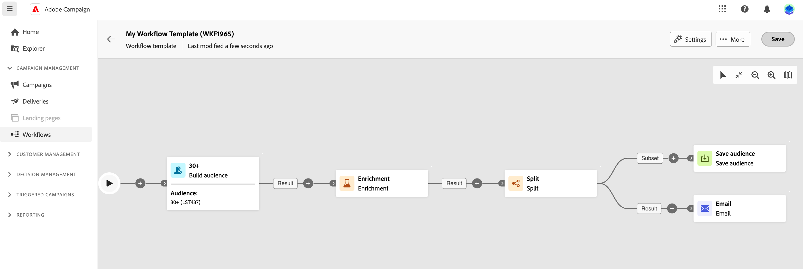

# Create an orchestrated campaign {#create-first-campaign}

>[!CONTEXTUALHELP]
>id="ajo_campaign_creation_workflow"
>title="List of orchestrated campaigns"
>abstract="The **multi-step** tab lists all orchestrated campaign. Click the name of an orchestrated campaign to edit it. Use the **Create orchestrated campaign** button to add a new orchestrated campaign."

+++ Table of Contents

| Welcome to orchestrated campaigns | Launch your first orchestrated campaign | Query the database | Ochestrated campaigns activities|
|---|---|---|---|
|[Get started with orchestrated campaigns](gs-orchestrated-campaigns.md)  [Configuration steps](configuration-steps.md)  [Key steps for orchestrated campaign creation](gs-campaign-creation.md)|<b>[Create an orchestrated campaign](create-orchestrated-campaign.md)</b>  [Orchestrated campaigns settings](orchestrated-campaign-settings.md)  [Orchestrate activities](orchestrate-activities.md)  [Send messages with orchestrated campaigns](send-messages.md)  [Start and monitor the campaign](start-monitor-campaigns.md)  [Reporting](reporting-campaigns.md)|[Work with the rule builder](orchestrated-rule-builder.md)  [Build your first query](build-query.md)  [Edit expressions](edit-expressions.md)|[Get started with activities](activities/about-activities.md)  Activities: [And-join](activities/and-join.md) - [Build audience](activities/build-audience.md) - [Change dimension](activities/change-dimension.md) - [Combine](activities/combine.md) - [Deduplication](activities/deduplication.md) - [Enrichment](activities/enrichment.md) - [Fork](activities/fork.md) - [Reconciliation](activities/reconciliation.md) - [Split](activities/split.md) -  [Wait](activities/wait.md)|

{style="table-layout:fixed"}

+++

 

## Create the campaign

To create an orchestrated campaign, follow these steps:

1. To create a **orchestrated campaign**, browse to the **Campaigns** menu.  

1. Click the **[!UICONTROL Create orchestrated campaign]** button in the upper-right corner of the screen.

1. In orchestrated campaign **Properties** dialog, select the template to use to create the orchestrated campaign (you can also use the default built-in template). [Learn more about orchestrated campaign templates](#campaign-templates).

1. Enter a label for the orchestrated campaign. In addition, we strongly recommend you to add a description to your orchestrated campaign, in the dedicated field of the **[!UICONTROL Additional options]** section of the screen.

1. Expand the **[!UICONTROL Additional options]** section to configure more settings for the orchestrated campaign. 

1. Click the **[!UICONTROL Create orchestrated campaign]** button to confirm the creation of your orchestrated campaign.

Your orchestrated campaign is now created and available in the list of worklows. You can now access its visual canvas and start adding, configuring, and orchestrating the tasks it will perform. [Learn how to orchestrate orchestrated campaign activities](orchestrate-activities.md).

## Configure the campaign settings

Overview of new admin settings> schemas, execution fields, merge policy. [Learn more](configuration-steps.md)

## Work with orchestrated campaign templates {#campaign-templates}

>[!CONTEXTUALHELP]
>id="ajo_workflow_template_for_campaign"
>title="Orchestrated campaign templates"
>abstract="Orchestrated campaign templates contain pre-configured settings and activities which can be reused for creating new orchestrated campaign."

>[!CONTEXTUALHELP]
>id="ajo_workflow_template_creation_properties"
>title="Orchestrated campaign properties"
>abstract="Orchestrated campaign templates contain pre-configured settings and activities which can be reused for creating new orchestrated campaigns. In this screen, enter the label of the orchestrated campaign template and configure its settings such as its internal name, folder and execution folders, timezone, and supervisor group."

Orchestrated campaign templates contain pre-configured settings and activities which can be reused for creating new orchestrated campaigns. You can select the template of your orchestrated campaign from the orchestrated campaign properties, when creating an orchestrated campaign. An empty template is provided by default.

You can create a template from an existing orchestrated campaign, or create a new template from scratch. Both methods are detailed below.

>[!BEGINTABS]

>[!TAB Create a template from an existing orchestrated campaign]

To create an orchestrated campaign template from an existing orchestrated campaign, follow these steps:

1. Open to the **Campaign** menu and browse to the orchestrated campaign to save as a template.
1. Click the three dots on the right of the name of the orchestrated campaign, and choose **Copy as template**.
1. In the popup window, confirm the template creation.
1. In the orchestrated campaign template canvas, check, add, and configure the activities as needed.
1. Browse to the settings, from the **Settings** button, to change the name of the orchestrated campaign template, and enter a description.
1. Select the **folder** and **execution folder** of the template. The folder is the location where the orchestrated campaign template is saved. The execution folder is the folder where orchestrated campaigns created based on this template are saved.
1. Save your changes. 

The orchestrated campaign template is now available in the template list. You can create an orchestrated campaign based on this template. This orchestrated campaign will be pre-configured with the settings and activities defined in the template.

>[!TAB Create a template from scratch]

To create an orchestrated campaign template from scratch, follow these steps:

1. Open to the **Campaign** menu and browse to the **Templates** tab. You can see the list of available orchestrated campaign templates.
1. Click the **[!UICONTROL Create template]** button in the upper-right corner of the screen.
1. Enter the label and open the additional options to enter a description of your orchestrated campaign template.
1. Select the folder and execution folder of the template. The folder is the location where the orchestrated campaign template is saved. The execution folder is the folder where orchestrated campaigns created based on this template are saved.
1. Click the **Create** button to confirm your settings.
1. In the orchestrated campaign template canvas, add and configure the activities as needed.

     {zoomable="yes"}

1. Save your changes. 

The orchestrated campaign template is now available in the template list. You can create an orchestrated campaign based on this template. This orchestrated campaign will be pre-configured with the settings and activities defined in the template.

>[!ENDTABS]
