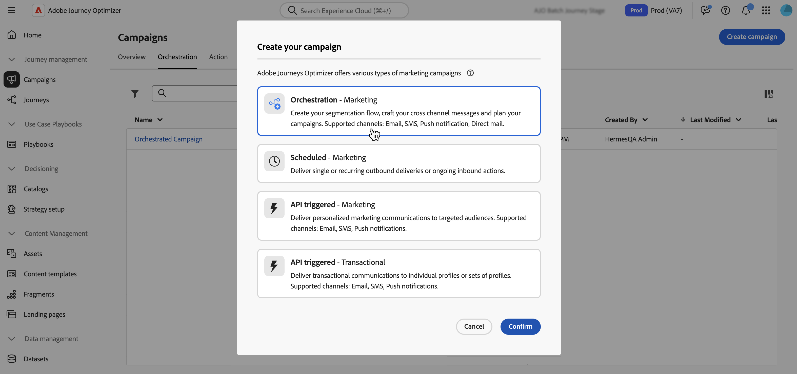
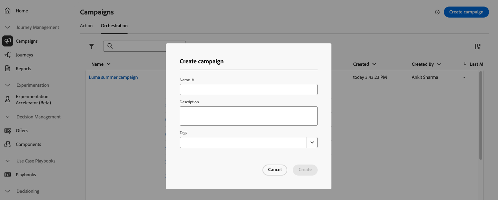
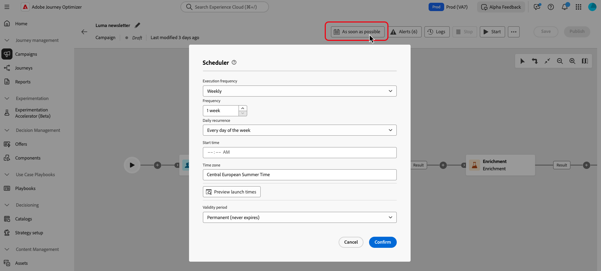

# Create and schedule an Orchestrated campaign {#create-first-campaign}

Create an Orchestrated campaign in [!DNL Adobe Journey Optimizer] and configure its execution schedule to control when it starts and how often it runs. Choose to launch the campaign immediately, at a specific date and time, or on a recurring basis using flexible scheduling options such as daily, weekly, or monthly frequencies.

## Create the campaign {#create}

>[!CONTEXTUALHELP]
>id="ajo_campaign_creation_workflow"
>title="List of Orchestrated campaigns"
>abstract="The **Orchestration** tab lists all Orchestrated campaign. Click the name of an Orchestrated campaign to edit it. Use the **Create Orchestrated campaign** button to add a new Orchestrated campaign."

To create an Orchestrated campaign, follow these steps:

1. Browse to the **[!UICONTROL Campaigns]** menu and select the **[!UICONTROL Orchestration]** tab.

1. Click the **[!UICONTROL Create campaign]** button and select the **[!UICONTROL Orchestration - Marketing and transactional]** campaign type.

    You will choose whether each message is marketing or transactional when you add a [channel activity](../orchestrated/activities/channels.md).

     

1. Define the campaign properties.

     1. Enter a **[!UICONTROL Name]** and **[!UICONTROL Description]** for the campaign.

     1. Select a **[!UICONTROL Merge policy]** for your campaign.
     
          In [!DNL Adobe Experience Platform], each audience is tied to a specific merge policy, which defines how profile information are combined to form a merged profile. When you select a merge policy in the Read audience activity, only audiences based on that same merge policy are available. By default, the system uses the default merge policy, but you can change it if needed. For more information on merge policies, refer to the [Adobe Experience Platform documentation](https://experienceleague.adobe.com/en/docs/experience-platform/profile/merge-policies/overview){target="_blank"}.

     1. Use the **[!UICONTROL Tags]** field to assign Adobe Experience Platform Unified Tags to your campaign. This allows you to easily classify them and improve search from the Orchestrated campaigns list. [Learn how to work with tags](../start/search-filter-categorize.md#tags).
     
     1. Click **[!UICONTROL Save]**.

     You can access the campaign properties at any time using the  button next to the campaign's name.

     

## Schedule the campaign {#schedule}

>[!CONTEXTUALHELP]
>id="ajo_orchestration_scheduler"
>title="Scheduler"
>abstract="As a campaign manager, you can schedule campaigns to automatically launch at specific times, enabling precise timing and accurate targeting data for marketing communications."

>[!CONTEXTUALHELP]
>id="ajo_orchestration_schedule_validity"
>title="Scheduler validity"
>abstract="You can define a validity period for the scheduler. It can be permanent (default), or can be valid until a specific date."

>[!CONTEXTUALHELP]
>id="ajo_orchestration_schedule_options"
>title="Scheduler options"
>abstract="Define the frequency of the scheduler. It can be executed at a specific moment, once or several times a day, week or month."

By default, Orchestrated campaigns start when activated manually and end once their associated activites have been executed. If you prefer to delay execution or run the campaign on a recurring basis, you can define a schedule for the campaign.

Consider the following best practices when scheduling Orchestrated campaigns to ensure optimal performance and expected behavior:

* Do not schedule an Orchestrated campaign to run more than every 15 minutes as it may impede overall system performance and create blocks in the database.
* If you want to send a one-shot message in your Orchestrated campaign, you can set it to run **Once**. 
* If you want to send a recurring message in your Orchestrated campaign, you need to use a **Scheduling** options and set the execution frequency. The recurring delivery activity does not allow you to define a schedule.

To configure the campaign schedule, follow these steps:

1. Open the campaign and click the **[!UICONTROL As soon as possible]** button.

     

1. Select an execution frequency for the campaign, then configure the available options. The settings vary depending on the selected frequency:

     +++Once

     Run the campaign a single time at a specified date and time.

     * **[!UICONTROL Date]**: Select the date the campaign should be executed.
     * **[!UICONTROL Time]**: Select the specific time the campaign should be executed.

     +++

     +++Daily

     Run the campaign every day or on selected days.

     * **[!UICONTROL Daily recurrence]**: Choose how often the campaign should run:
          * **[!UICONTROL Every day]**: Executes the campaign every day of the week, including weekends.
          * **[!UICONTROL On weekdays]**: Executes the campaign only from Monday to Friday.
          * **[!UICONTROL Through a specific period]**: Executes the campaign daily within a defined date range (e.g., from July 1 to July 15). The campaign will not run outside this range.
          * **[!UICONTROL On selected days of the week]**: Executes the campaign only on the specified days of the week (e.g., Monday, Wednesday, Friday).

     * **[!UICONTROL Start time]**: Define the time the campaign should execute each day.

     +++

     +++Several times a day

     Run the campaign multiple times within the same day. You can choose specific times or set a periodic frequency.

     * **[!UICONTROL Selected hours]**: Select the specific times the campaign should run and configure its daily recurrence (execute every day of the week or on certains days).
     * **[!UICONTROL Periodic]**: Choose to run the campaign every n minutes or hours. You can also define the time range within the day when executions are allowed.

     +++

     +++Weekly

     Run the campaign on a weekly basis, with options for specific days.

     * **[!UICONTROL Frequency]**: Choose how often the campaign should run (e.g., every week, every 2 weeks).
     * **[!UICONTROL Starting from date]**: Select the date the recurrence should begin.
     * **[!UICONTROL Daily recurrence]**: Choose specific days of the week for execution (e.g., every Monday and Thursday).
     * **[!UICONTROL Start time]**: Set the time the campaign should execute on selected days.

     +++

     +++Monthly

     Run the campaign on a monthly basis, with options for specific days.

     * **[!UICONTROL Monthly recurrence]**: Select whether the campaign runs every month or only during specific months.
     * **[!UICONTROL Daily recurrence]**: 
          * **[!UICONTROL Every day]**: Executes the campaign on every calendar day of the month, including weekends.
          * **[!UICONTROL Last day of the month]**: Executes the campaign only on the final calendar day of each month (e.g., Jan 31, Feb 28/29).
          * **[!UICONTROL Specific day of the month (e.g., 15th)]**: Executes the campaign on a specified day (e.g., the 15th of each month). 
          * **[!UICONTROL First/last, or nth day of the week]** (e.g., first Monday):      Executes the campaign on a specified weekday (e.g., the 15th of each week).
          * **[!UICONTROL Selected days of the week]**: Executes the campaign on a specified day.

     * **[!UICONTROL Start time]**: Set the time the campaign should execute.

     +++

1. Use the **[!UICONTROL Validity period]** setting to define a specific start and end date, restricting the campaign's execution to a limited time window.

1. For recurring schedules, click the **[!UICONTROL Preview launch times]** button to preview the exact upcoming execution dates and times based on the current configuration. This helps validate the schedule before activation and ensures the campaign will run as expected.

>[!NOTE]
>
>When scheduling campaigns in [!DNL Adobe Journey Optimizer], ensure your start date/time aligns with the desired first delivery. For recurring campaigns, if the initial scheduled time has already passed, the campaigns will roll over to the next available time slot according to their recurrence rules.

In the following example, the activity is configured so that the Orchestrated campaign runs twice a day at 9 and 12 AM, every day of the week from October 1st, 2025 to January 1st, 2026.

{width="50%" align="left"}

## Next steps {#next}

Once your campaign settings and schedule are configured, you are ready to start orchestrating the differents tasks it will perform. [Learn how to orchestrate campaign activities](../orchestrated/orchestrate-activities.md)
