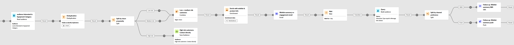
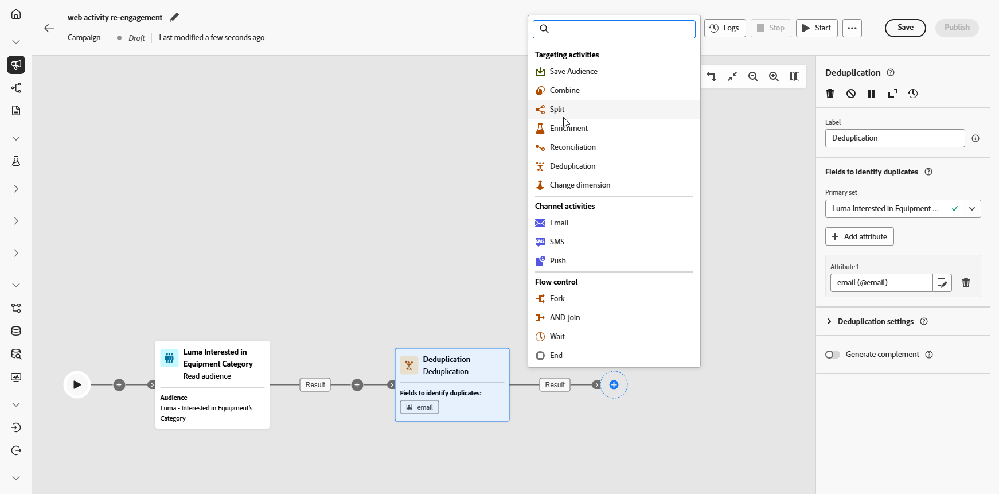
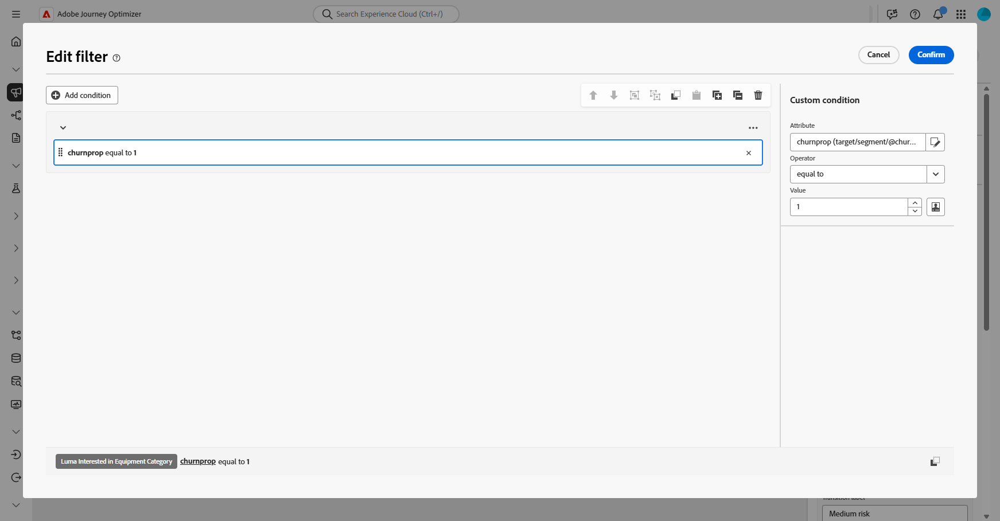
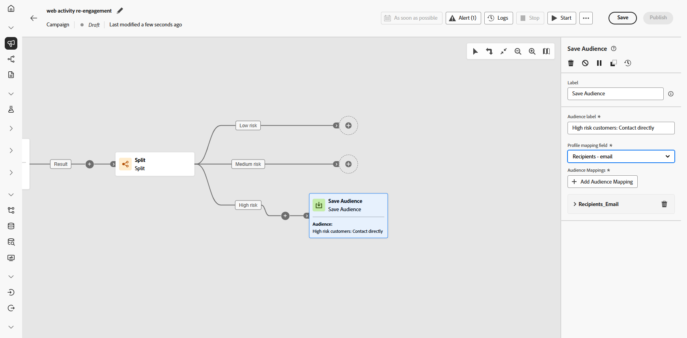
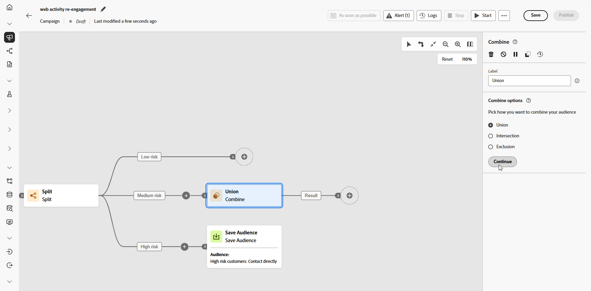
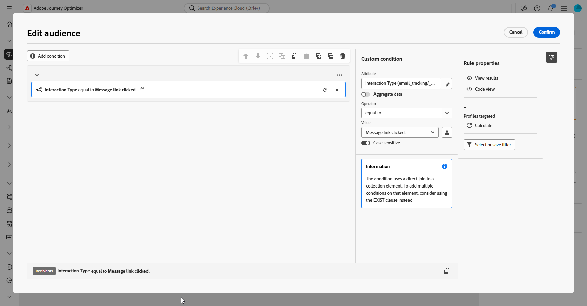

# Engage customers by browsing activity {#engage-customers-uc}

>[!BEGINSHADEBOX]

Note that this use case starts with an audience that already exists in Experience Platform, specifically, a real-time web behavior audience that collects browsing activity as it occurs. [Learn more in Adobe Experience Platform](https://experienceleague.adobe.com/en/docs/experience-platform/rtcdp/intro/rtcdp-intro/get-started#audiences)

**Schemas needed for this use case:**

* **Recipients**: used as the targeting dimension, with fields: `email`, `churnprop`
* **Wishlist**: with fields: `description`, `priceref`, `imageurl`

➡️ [Learn how to configure model-based schemas](gs-schemas.md)

>[!ENDSHADEBOX]

{zoomable="yes"}

This campaign targets customers who have browsed the exercise equipment category. The audience is deduplicated and segmented by churn risk, how likely someone is to stop engaging or buying.

High-risk customers are gathered into a separate new audience which will later be used for a specific communication, while low and mediumrisk customers go through a multi-step journey with personalized emails and follow-ups.

1. Start by setting up a new campaign specifically aimed at **Wishlist re-engagement**. This ensures your messaging focuses on customers who have already shown purchase intent by saving products to their wishlist.

    {zoomable="yes"}

1. Fill in your **[!UICONTROL Campaign Settings]** such as the Campaign name, description, start and end dates, and relevant tags.

1. Add a **[!UICONTROL Read audience]** activity to select a pre-defined audience from Adobe Experience Platform, here, customers who have browsed the exercise equipment category on your website.

    Recipients are identified with their email addresses selected from the **[!UICONTROL Entity]** field.

    {zoomable="yes"}

1. Add a **[!UICONTROL Deduplication]** activity to remove duplicate email addresses from your audience, ensuring that each customer receives only one message.

1. Click **[!UICONTROL Add attribute]** and select email as the attribute for deduplication.

    {zoomable="yes"}

1. Next, add a **[!UICONTROL Split]** activity to segment customers by their likelihood of churn, allowing you to deliver personalized experiences tailored to each customer group.

    {zoomable="yes"}

1. Click **[!UICONTROL Add segment]** to create three groups:

    * Low risk

    * Medium risk

    * High risk

    {zoomable="yes"}

1. Click **[!UICONTROL Create filter]** to define the churn probability for each group.

    Use the **Condition editor** to set the specific values that determine each customer's churn risk.

    {zoomable="yes"}

1. Each segment are handled differently:

    * [Low/medium risk](#low-medium-risk)
    * [High risk](#high-risk)

1. Once your campaign is tested and ready, click **[!UICONTROL Publish]** to make it live.

After the campaign has run, explore the reporting dashboard to review performance metrics and key insights.

➡️ [Learn more on reporting](../reports/campaign-global-report-cja.md)

## High risk segments {#high-risk}

For customers identified as having a high risk of churn, create a dedicated audience segment. This audience is later used for separate, targeted communication.

1. Add a **[!UICONTROL Save Audience]**.

    {zoomable="yes"}

1. Add a **[!UICONTROL Label]** to your audience and choose the **[!UICONTROL Profile mapping field]**, here **recipients-email**.

    {zoomable="yes"}

This audience is then saved to Experience Cloud, where it can later be used for a specific targeted campaign.

## Low/medium risk segments {#low-medium-risk}

For customers at low and medium risk of churn, set up a multi-step campaign aimed at strengthening engagement:

1. Combine both Low and Medium risks with a **[!UICONTROL Union]** activity.

    {zoomable="yes"}

1. Add an **[!UICONTROL Enrichment]** activity to personalize the campaign with Wishlist and product information.  

1. Click **[!UICONTROL Add attribute]** to create following three attributes:

    * `Wishlist > description`
    * `Wishlist > priceref`
    * `Wishlist > imageurl`

    This enriches the message with detailed wishlist information.

    {zoomable="yes"}

1. Create a new audience for retargeting based on engagement with emails.

    Here we create an audience based on email click events, to retarget all of the people who interacted with a previously sent email, and more specifically, clicked on a link within that message.

    {zoomable="yes"}

1. Divide engagement evenly to send a follow-up through SMS or push notifications to encourage conversions.

    {zoomable="yes"}

1. Create the message content for each channel including profile attributes, such as the recipient's name, along with enrichment data like Wishlist items, to personalize each message.

    {zoomable="yes"}
