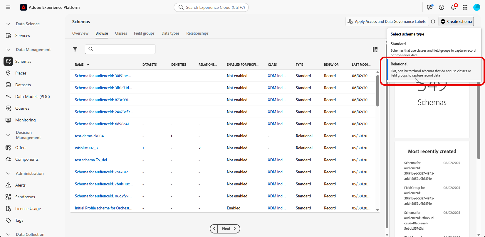
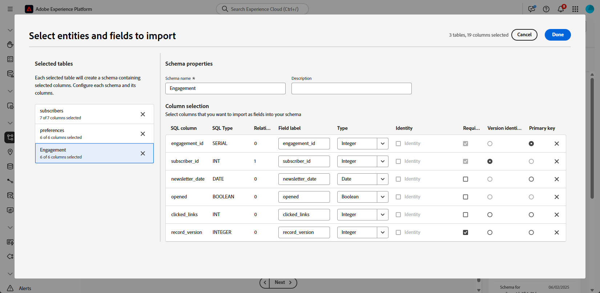
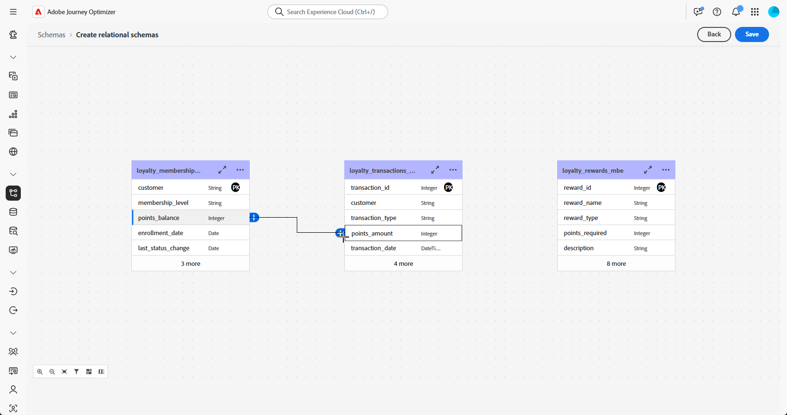
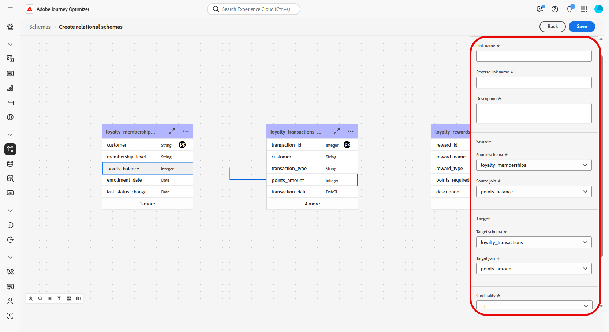
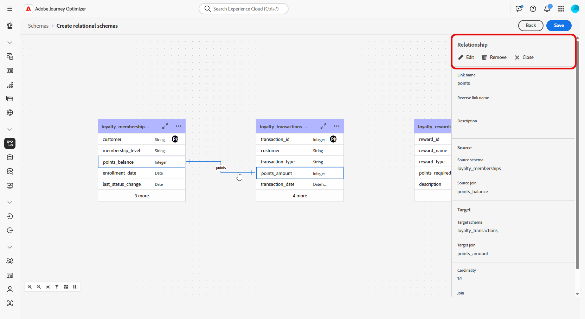
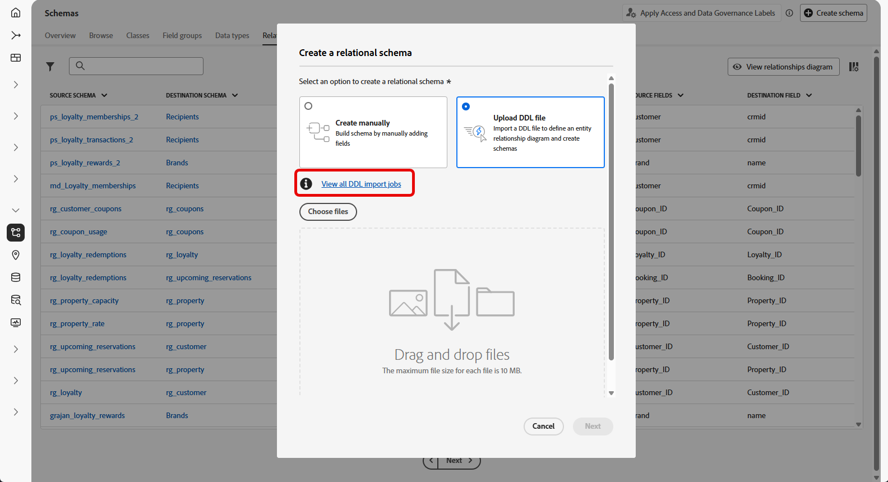
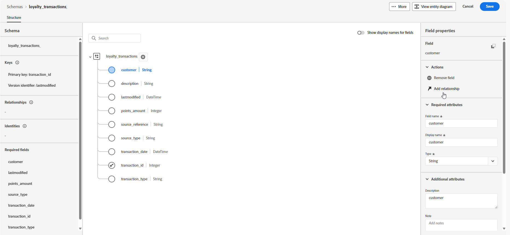
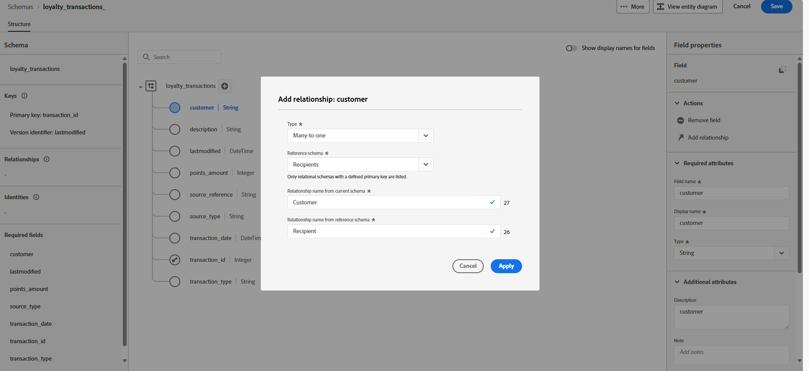
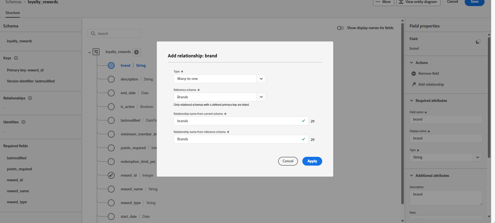

# File upload {#file-upload-schema}

+++ Table of Contents

| Welcome to orchestrated campaigns | Launch your first orchestrated campaign | Query the database | Ochestrated campaigns activities|
|---|---|---|---|
|[Get started with orchestrated campaigns](gs-orchestrated-campaigns.md)  Create and manage relational Schemas and Datasets:  <ul><li>[Get started with Schemas and Datasets](gs-schemas.mdmd)</li><li>[Manual schema](manual-schema.md)</li><li>[File upload schema](file-upload-schema.md)</li><li>[Ingest data](ingest-data.md)</li></ul>[Access and manage orchestrated campaigns](access-manage-orchestrated-campaigns.md)  [Key steps to create an orchestrated campaign](gs-campaign-creation.md)|[Create and schedule the campaign](create-orchestrated-campaign.md)  [Orchestrate activities](orchestrate-activities.md)  [Start and monitor the campaign](start-monitor-campaigns.md)  [Reporting](reporting-campaigns.md)|[Work with the rule builder](orchestrated-rule-builder.md)  [Build your first query](build-query.md)  [Edit expressions](edit-expressions.md)  [Retargeting](retarget.md)|[Get started with activities](activities/about-activities.md)  Activities: [And-join](activities/and-join.md) - [Build audience](activities/build-audience.md) - [Change dimension](activities/change-dimension.md) - [Channel activities](activities/channels.md) - [Combine](activities/combine.md) - [Deduplication](activities/deduplication.md) - [Enrichment](activities/enrichment.md) - [Fork](activities/fork.md) - [Reconciliation](activities/reconciliation.md) - [Save audience](activities/save-audience.md) - [Split](activities/split.md) - [Wait](activities/wait.md)|

{style="table-layout:fixed"}

+++

 

>[!BEGINSHADEBOX]

 

The content on this page is not final and may be subject to change.

>[!ENDSHADEBOX]

Define the relational data model required for orchestrated campaigns by creating schemas such as **Loyalty Memberships**, **Loyalty Transactions**, and **Loyalty Rewards**. Each schema must include a primary key, a versioning attribute, and appropriate relationships to reference entities like **Recipients** or **Brands**.

Schemas can be created manually through the interface or imported in bulk using a DDL file.

This section provides step-by-step guidance on how to create a relational schema within Adobe Experience Platform by uploading a DDL (Data Definition Language) file. Using a DDL file allows you to define the structure of your data model in advance, including tables, attributes, keys, and relationships. 

## Upload a DDL file{#ddl-upload}

By uploading a DDL file, you can define the structure of your data model in advance, including tables, attributes, keys, and relationships. 

1. Log in to Adobe Experience Platform.

1. Navigate to the **Data Management** > **Schema**.

1. Click on **Create Schema**.

1. You will be prompted to select between two schema types:

    * **Standard**
    * **Relational**, used specifically for orchestrated campaigns

    

1. Select **Upload DDL file** to define an entity relationship diagram and create schemas.

    The table structure must contain:
    * At least one primary key
    * A version identifier, such as a `lastmodified` field of type `datetime` or `number`.

1. Drag and drop your DDL file and click **[!UICONTROL Next]**.

1. Type-in your **[!UICONTROL Schema name]**.

1. Set up each schema and its columns, ensuring that a primary key is specified. 

    One attribute, such as `lastmodified`, must be designated as a version descriptor. This attribute, typically of type `datetime`, `long`, or `int`, is essential for ingestion processes to ensure that the dataset is updated with the latest data version.

    

1. Click **[!UICONTROL Done]** once done.

You can now verify the table and field definitions within the canvas. [Learn more in the section below](#entities)

## Define relationships {#relationships}

To define logical connections between tables within your schema, follow the steps below.

1. Access the canvas view of your data model and choose the two tables you want to link

1. Click the  button next to the Source Join, then drag and guide the arrow towards the Target Join to establish the connection.

    

1. Fill in the given form to define the link and click **Apply** once configured.

    

    **Cardinality**:

     * **1-N**: one occurrence of the source table can have several corresponding occurrences of the target table, but one occurrence of the target table can have at most one corresponding occurrence of the source table.

    * **N-1**: one occurrence of the target table can have several corresponding occurrences of the source table, but one occurrence of the source table can have at most one corresponding occurrence of the target table.

    * **1-1**: one occurrence of the source table can have at most one corresponding occurrence of the target table.

1. All links defined in your data model are represented as arrows in the canvas view. Click on an arrow between two tables to view details, make edits, or remove the link as needed.

    

1. Use the toolbar to customize and adjust your canvas.

    

    * **Zoom in**: Magnify the canvas to see details of your data model more clearly.

    * **Zoom out**: Reduce the canvas size for a broader view of your data model.

    * **Fit view**: Adjust the zoom to fit all schemas within the visible area.

    * **Filter**: Choose which schema to display within the canvas.

    * **Force auto layout**: Automatically arrange schemas for better organization.

    * **Display map**: Toggle a minimap overlay to help navigate large or complex schema layouts more easily.

1. Click **Save** once done. This action creates the schemas and associated data sets and enables the data set for use in Orchestrated Campaigns.

1. Click **[!UICONTROL Open Jobs]** to monitor the progress of the creation job. This process may take couple minutes, depending on the number of tables defined in the DDL file. 

    

## Link schema {#link-schema}

Establish a relationship between the **loyalty transactions** schema and the **Recipients** schema to associate each transaction with the correct customer record.

1. Navigate to **[!UICONTROL Schemas]** and open your previously create **loyalty transactions**.

1. Click **[!UICONTROL Add Relationship]** from the Customer **[!UICONTROL Field properties]**.

    

1. Select **[!UICONTROL Many-to-One]** as the relationship **[!UICONTROL Type]**.

1. Link to the existing **Recipients** schema.

    

1. Enter a **[!UICONTROL Relationship name from current schema]** and **[!UICONTROL Relationship name from reference schema]**.

1. Click **[!UICONTROL Apply]** to save your changes.

Continue by creating a relationship between the **loyalty rewards** schema and the **Brands** schema to associate each reward entry with the appropriate brand.

<!--### Setting Up Change data capture ingestion {#cdc-ingestion}

If you need to change the data source, you must delete the existing dataflow and create a new one pointing to the same dataset with the new source.

When using Change Data Capture (CDC), it is essential that the source and dataset remain in sync to ensure accurate incremental updates. Follow the steps below:

1. **Schema Requirements**
   - Your schema must include:
     - A **primary key** (e.g., `transaction_id`)
     - A **versioning field** (e.g., `lastmodified` or an incrementing `version_id`)
   - Enable the dataset for **Orchestrated Campaigns** if needed.

2. **CDC Dataflow Setup**
   - During dataflow creation, after choosing your source and files:
     - **Enable the CDC option**
     - Select your CDC-ready dataset
     - Confirm field mappings (especially version field)

3. **Keep Source and Target in Sync**
   - The source system must consistently update the version field so the platform can detect changes accurately.

Once set up, the platform will automatically ingest **only changed or new records** each time the flow runs.
-->