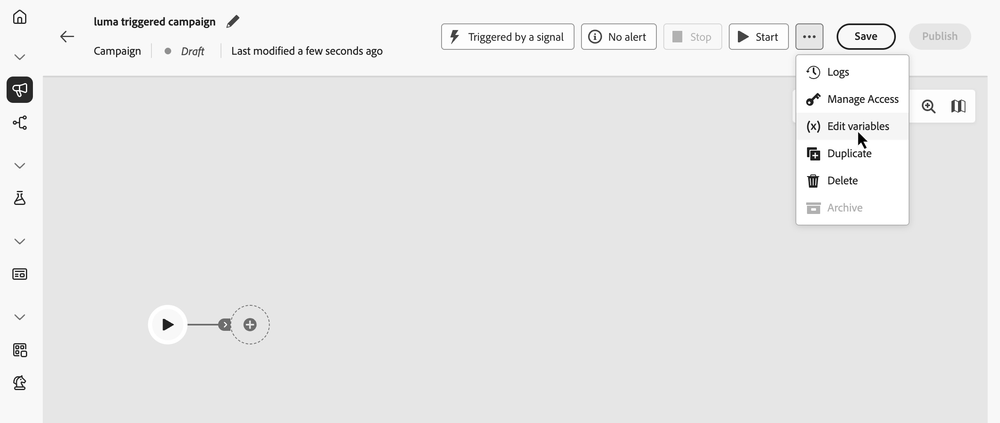
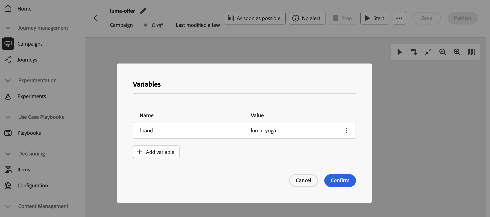

# Define global variables in Orchestrated campaigns {#define-global-variables}

>[!BEGINSHADEBOX]

**On this page:** Learn how to add and manage global variables on an Orchestrated campaign so you can reuse shared name-value pairs across the rule builder, test conditions, and other canvas logic.

>[!ENDSHADEBOX]

**Global variables** are name–value pairs you set on a single Orchestrated campaign and reuse on each run, so you can steer **[!UICONTROL Test]** conditions, the rule builder, and other canvas logic with shared values (for example, a default channel or test email) without pasting the same value into every activity.

This page explains how to define global variables. Once they are available, for details on how to use them in rules and **[!UICONTROL Test]** conditions, see [Use variables in Orchestrated campaigns](variables-orchestrated-campaigns.md).

To add or edit a global variable to an Orchestrated campaign, follow these steps:

1. Open the Orchestrated campaign.

1. Click the **...** icon next to **[!UICONTROL Save]**, then select **[!UICONTROL Edit variables]**.

   {zoomable="yes"}

1. Click **[!UICONTROL Add variable]** and set the variable’s name and value. To edit an existing variable, click the **...** button and select **[!UICONTROL Edit]**.

   {zoomable="yes"}

To learn how to use global variables in rules and **[!UICONTROL Test]** conditions once they are defined, see [Use variables in Orchestrated campaigns](variables-orchestrated-campaigns.md#use).
