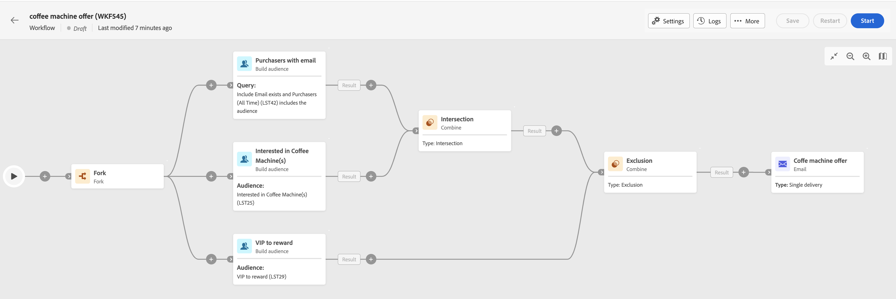

# Key steps for orchestrated campaign creation {#orchestrated-campaign-creation}

>[!CONTEXTUALHELP]
>id="ajo_targeting_workflow_list"
>title="Orchestrated campaign"
>abstract="In this screen, you can access the full list of orchestrated campaigns, check their current status, last/next execution dates, and create a new orchestrated campaign."

+++ Table of Contents

| Welcome to orchestrated campaigns | Launch your first orchestrated campaign | Query the database | Ochestrated campaigns activities|
|---|---|---|---|
|[Get started with orchestrated campaigns](gs-orchestrated-campaigns.md)  [Configuration steps](configuration-steps.md)  <b>[Key steps for orchestrated campaign creation](gs-campaign-creation.md)</b>|[Create an orchestrated campaign](create-orchestrated-campaign.md)  [Orchestrated campaigns settings](orchestrated-campaign-settings.md)  [Orchestrate activities](orchestrate-activities.md)  [Send messages with orchestrated campaigns](send-messages.md)  [Start and monitor the campaign](start-monitor-campaigns.md)  [Reporting](reporting-campaigns.md)|[Work with the rule builder](orchestrated-rule-builder.md)  [Build your first query](build-query.md)  [Edit expressions](edit-expressions.md)|[Get started with activities](activities/about-activities.md)  Activities: [And-join](activities/and-join.md) - [Build audience](activities/build-audience.md) - [Change dimension](activities/change-dimension.md) - [Combine](activities/combine.md) - [Deduplication](activities/deduplication.md) - [Enrichment](activities/enrichment.md) - [Fork](activities/fork.md) - [Reconciliation](activities/reconciliation.md) - [Split](activities/split.md) -  [Wait](activities/wait.md)|

{style="table-layout:fixed"}

+++

 

You can build orchestrated campaigns into a visual canvas to design cross-channel processes such as segmentation, campaign execution, file processing.

## Access orchestrated campaigns

The **[!UICONTROL Campaigns]** menu, browse to the Multi-step tab to access the full list of orchestrated campaigns. 

Each orchestrated campaign in the list displays information about its current [status](#status), the last time it was executed or modified, and the next scheduled execution date and time.

You can customize the displayed columns by clicking the **[!UICONTROL Configure column for a custom layout]** icon located in the upper-right corner of the list. This allows you to add additional information to the list, such as the last activity in error for each orchestrated campaign, or the applied targeting dimension.

In addition, a search bar and filters are available to facilitate easy searching within the list. For example, you can filter the orchestrated campaigns to display only those belonging to a campaign, or those processed during a specific date range.

To duplicate or delete an orchestrated campaign, click the ellipsis button then select **[!UICONTROL Duplicate]** or **[!UICONTROL Delete]**. 

>[!NOTE]
>
>When an orchestrated campaign that is in progress, you can duplicate it, but you cannot delete it.

## What's inside an orchestrated campaign? {#gs-ms-campaign-inside}

The orchestrated campaign canvas is a representation of what is supposed to happen. It describes the various tasks to be performed and how they are linked together. 

{zoomable="yes"} {zoomable="yes"}

Each orchestrated campaign contains:

* **Activities**: An activity is a task to be performed. The various activities are represented on the diagram by icons. Each activity has specific properties and other properties that are common to all activities.

    In an orchestrated campaign diagram, a given activity can produce multiple tasks, in particular when there is a loop or recurrent actions.

* **Transitions**: Transitions link a source activity to a destination activity and define their sequence. 

* **Worktables**: The worktable contains all the information carried by the transition. Each orchestrated campaign uses several worktables. The data conveyed in these tables can be used throughout the orchestrated campaign's life cycle.

## Statuses and lifecycle {#status}

Campaigns can have multiple statuses:

* **[!UICONTROL Draft]**: The orchestrated campaign has been created and saved.
* **[!UICONTROL In progress]**: The orchestrated campaign is currently running.
* **[!UICONTROL Finished]**: The orchestrated campaign execution is complete.
* **[!UICONTROL Paused]**: The orchestrated campaign has been paused.
* **[!UICONTROL Erroneous]**: The orchestrated campaign encountered an error. Open the orchestrated campaign and access the logs and tasks to identify the error and resolve it.
