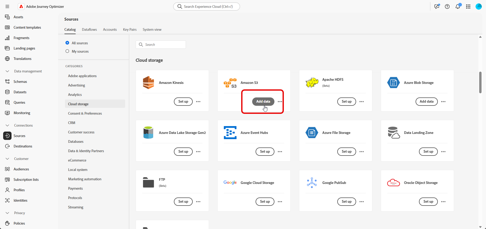
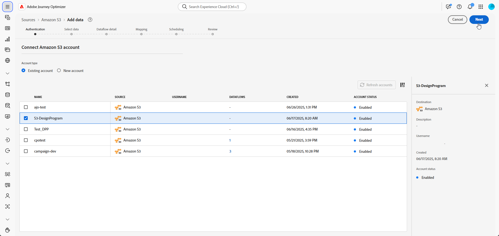
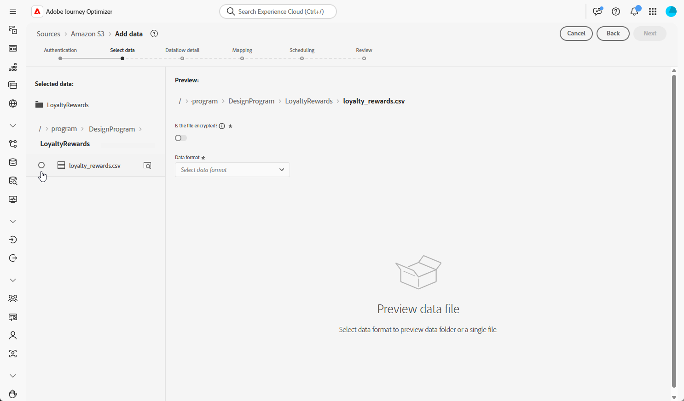
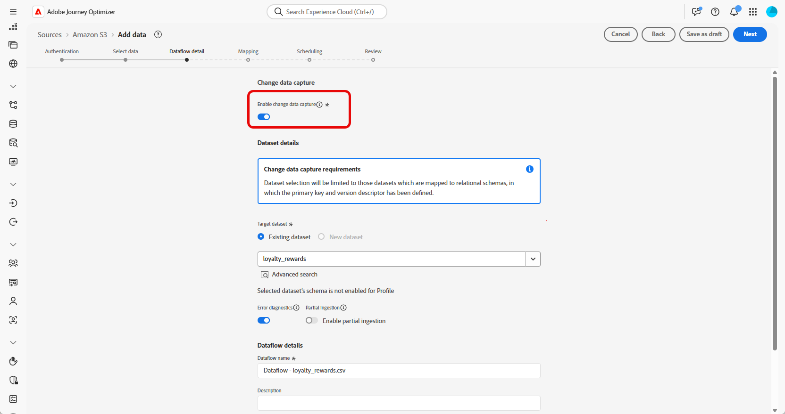
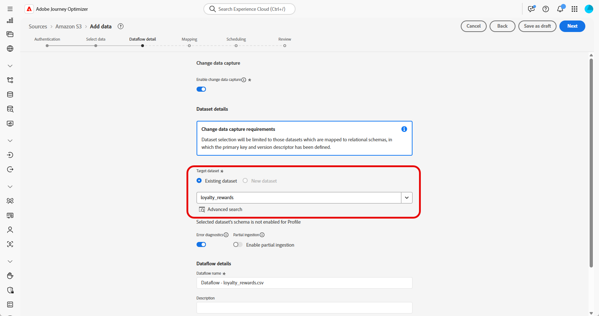
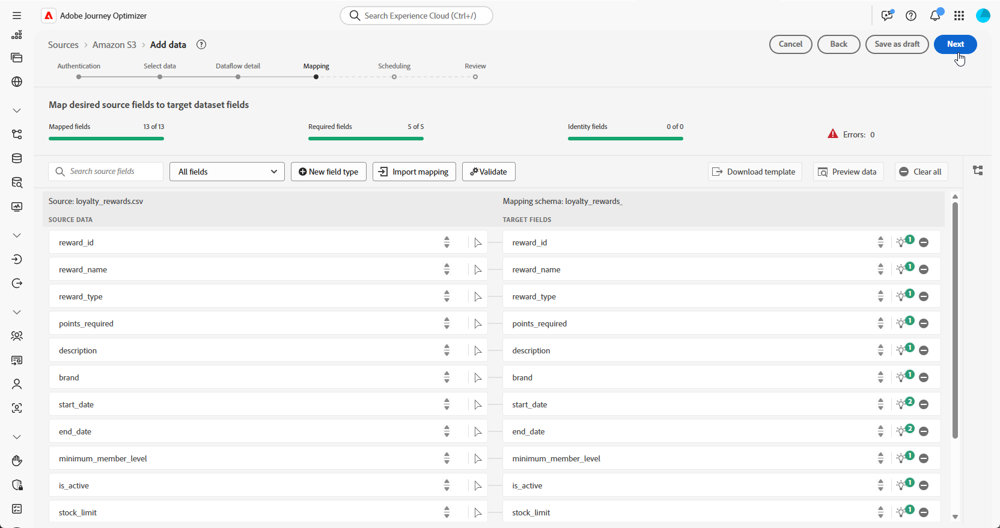
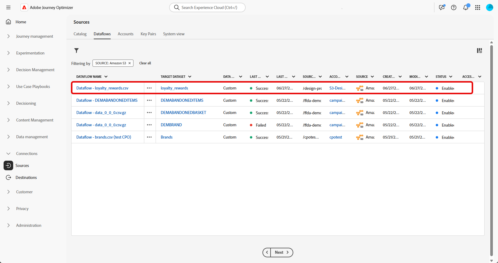

# Ingest data {#ingest-data}

>[!IMPORTANT]
>
>To change the data source for a dataset, you must first delete the existing dataflow before creating a new one that references the same dataset and the new source.
>
>Adobe Experience Platform enforces a strict one-to-one relationship between dataflows and datasets. This allows you to maintain synchronization between the source and the dataset for accurate incremental ingestion. 

Adobe Experience Platform allows data to be ingested from external sources while providing you with the ability to structure, label, and enhance incoming data using Experience Platform services. You can ingest data from a variety of sources such as Adobe applications, cloud-based storages, databases, and many others.

A dataset is a storage and management construct for a collection of data, typically a table, that contains a schema (columns) and fields (rows). Data that is successfully ingested into Experience Platform is stored within the data lake as datasets. 

## Supported sources for orchestrated campaigns {#supported}

The following Dources are supported for use with Orchestrated campaigns:

<table>
  <thead>
    <tr>
      <th>Type</th>
      <th>Source</th>
    </tr>
  </thead>
  <tbody>
    <tr>
      <td rowspan="3">Cloud Storage</td>
      <td><a href="https://experienceleague.adobe.com/en/docs/experience-platform/sources/ui-tutorials/create/cloud-storage/s3">Amazon S3</a></td>
    </tr>
    <tr>
      <td><a href="https://experienceleague.adobe.com/en/docs/experience-platform/sources/ui-tutorials/create/cloud-storage/google-cloud-storage">Google Cloud Storage</a></td>
    </tr>
    <tr>
      <td><a href="https://experienceleague.adobe.com/en/docs/experience-platform/sources/ui-tutorials/create/cloud-storage/sftp">SFTP</a></td>
    </tr>
      <td rowspan="4">Cloud Data Warehouses</td>
      <td><a href="https://experienceleague.adobe.com/en/docs/experience-platform/sources/ui-tutorials/create/databases/snowflake">Snowflake</a></td>
    </tr>
    <tr>
      <td><a href="https://experienceleague.adobe.com/en/docs/experience-platform/sources/ui-tutorials/create/databases/bigquery">Google BigQuery</a></td>
    </tr>
    <tr>
      <td><a href="https://experienceleague.adobe.com/en/docs/experience-platform/sources/ui-tutorials/create/cloud-storage/data-landing-zone">Data Landing Zone<a></td>
    </tr>
    <tr>
      <td><a href="https://experienceleague.adobe.com/en/docs/experience-platform/sources/ui-tutorials/create/databases/databricks">Azure Databricks</a></td>
    </tr>
    <tr>
      <td rowspan="3">File-Based Uploads</td>
      <td><a href="https://experienceleague.adobe.com/en/docs/experience-platform/sources/ui-tutorials/create/local-system/local-file-upload">Local File Upload<a></td>
    </tr>

  </tbody>
</table>

## Guidelines for relational Schema data hygiene {#cdc}

For datasets enabled with **[!UICONTROL Change data capture]**, all data changes including deletions, are automatically mirrored from the source system into Adobe Experience Platform.

Since Adobe Journey Optimizer Campaigns require all onboarded datasets to be enabled with **[!UICONTROL Change data capture]**, it is the customer's responsibility to manage deletions at the source. Any record deleted from the source system will automatically be removed from the corresponding dataset in Adobe Experience Platform.

To delete records via file-based ingestion, the customer's data file should mark the record using a `D` value in the `Change Request Type` field. This indicates that the record should be deleted in Adobe Experience Platform, mirroring the source system.

If customer wants to delete records only from Adobe Experience Platform without affecting the original source data, the following options are available:

* **Proxy or Sanitized Table for Change data capture Replication**
  
  Customer can create a proxy or sanitized source table to control which records are replicated into Adobe Experience Platform. Deletions can then be managed selectively from this intermediary table.

* **Deletion via Data Distiller**
  
  If licensed, **Data Distiller** can be used to support deletion operations directly within Adobe Experience Platform, independent of the source system.

  [Learn more on Data Distiller](https://experienceleague.adobe.com/en/docs/experience-platform/query/data-distiller/overview)

## Configure a dataflow

This example demonstrates how to configure a data flow that ingests structured data into Adobe Experience Platform. The configured data flow supports automated, scheduled ingestion and enables real-time updates.

1. From the **[!UICONTROL Connections]** menu, access the **[!UICONTROL Sources]** menu.

1. Choose your source depending on the [Supported Sources for Orchestrated campaigns](#supported).

    

1. Connect your Cloud Storage or Google Cloud Storage account if you chose cloud based sources.

    

1. Choose the data to ingest into Adobe Experience Platform.

    

1. From the **[!UICONTROL Dataset details]** page, check **[!UICONTROL Enable Change data capture]** to display only datasets that are mapped to relational schemas and include both a primary key and a version descriptor. 

    [Learn more on guidelines for relational Schemas data hygiene](#cdc)

    >[!IMPORTANT]
    >
    > For **file-based sources only**, each row in the data file must include a `_change_request_type` column with values `U` (upsert) or `D` (delete). Without this column, the system will not recognize the data as supporting change tracking, and the Orchestrated campaign toggle will not appear, preventing the dataset from being selected for targeting.

    

1. Select your previously created Dataset and click **[!UICONTROL Next]**.

    

1. If you are using a file-based sources only, from the **[!UICONTROL Select data]** window, upload your local files and preview their structure and contents.

    Note that the maximum supported size is 100MB.

1. In the **[!UICONTROL Mapping]** window, verify that each source file attribute is correctly mapped with the corresponding fields in the target schema. [Learn more about targeting dimensions](target-dimension.md).

    Click **[!UICONTROL Next]** once done.

    

1. Configure the data flow **[!UICONTROL Schedule]** based on your desired frequency.

1. Click **[!UICONTROL Finish]** to create the data flow. It will execute automatically according to the defined schedule.

1. From the **[!UICONTROL Connections]** menu, select **[!UICONTROL Sources]** and access the **[!UICONTROL Data Flows]** tab to track flow execution, review ingested records, and troubleshoot any errors.

    

