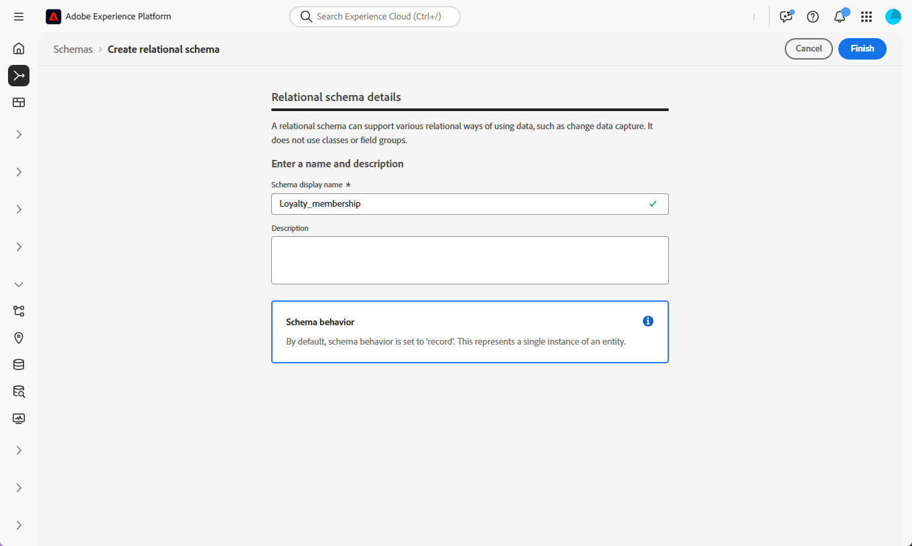
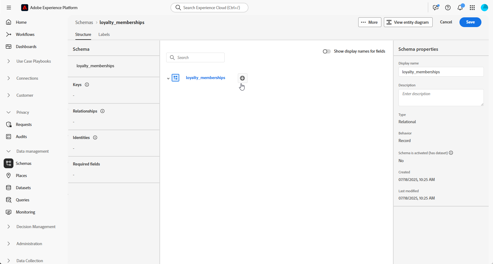
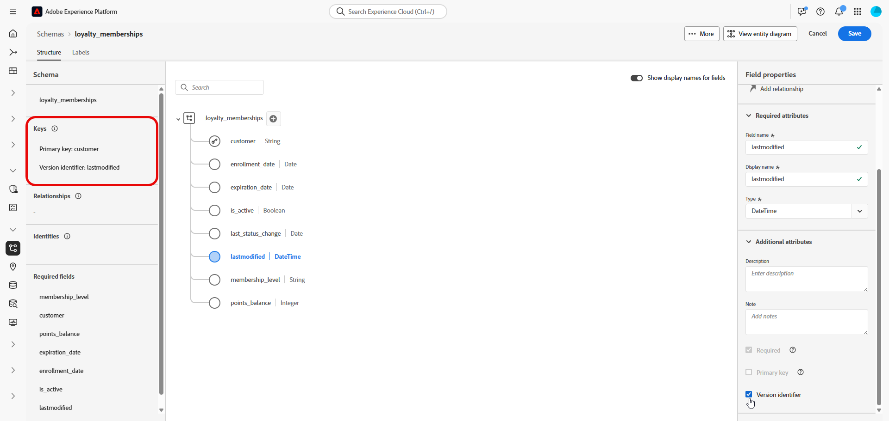
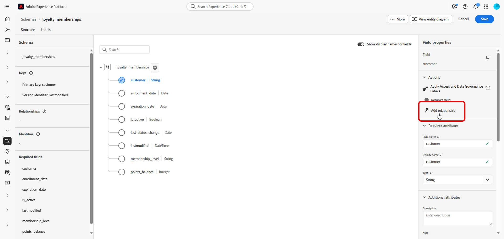
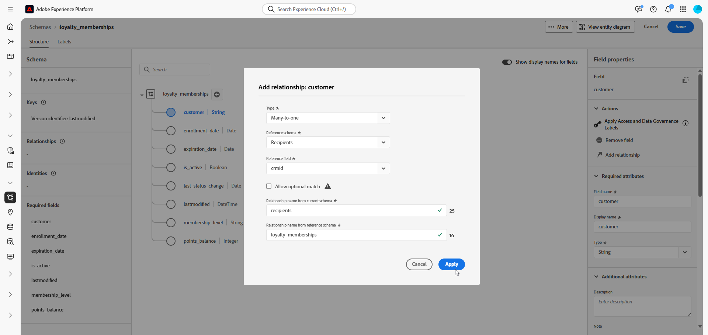
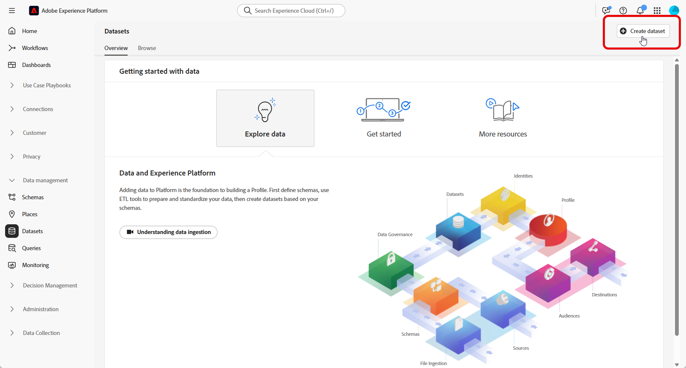
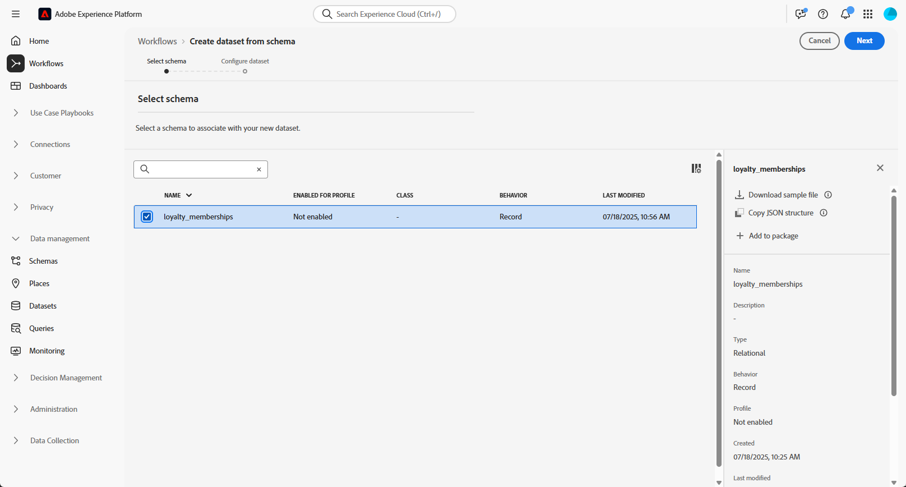
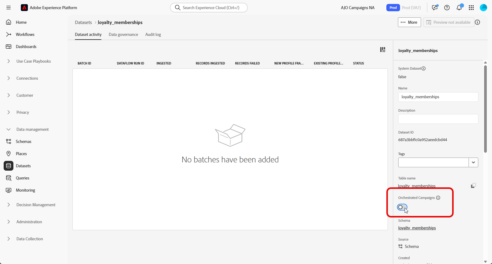

# Set up a manual model-based schema {#manual-schema}

Model-based schemas can be created directly through the user interface, enabling detailed configuration of attributes, primary keys, versioning fields, and relationships.  

The following example manually defines the **Loyalty Memberships** schema to illustrate the required structure for Orchestrated campaigns.

1. [Create a model-based schema manually](#schema) using the Adobe Experience Platform interface.

1. [Add attributes](#schema-attributes) such as customer ID, membership level, and status fields.

1. [Link your schema](#link-schema) to built-in schemas such as Recipients for campaign targeting.

1. [Create a dataset](#dataset) based on your schema and enable it for use in Orchestrated campaigns.

1. [Ingest data](ingest-data.md) into your dataset from supported sources.

➡️ [Learn more about manual model-based schemas in Adobe Experience Platform documentation](https://experienceleague.adobe.com/en/docs/experience-platform/xdm/ui/resources/schemas#create-manually)

## Create your schema {#schema}

Start by creating a new model-based schema manually in Adobe Experience Platform. This process allows you to define the schema structure from scratch, including its name and behavior.

1. Log in to Adobe Experience Platform.

1. Navigate to the **[!UICONTROL Data Management]** > **[!UICONTROL Schema]** menu.

1. Click **[!UICONTROL Create Schema]**.

1. Select **[!UICONTROL Model-based]** as your **Schema type**.

    {zoomable="yes"}

1. Choose **[!UICONTROL Create manually]** to build schema by manually adding fields.

1. Enter your **[!UICONTROL Schema display name]**.

    {zoomable="yes"}

1. Click **Finish** to proceed to your schema creation.

You can now start adding attributes to your schema to define its structure.

## Add attributes to your schema {#schema-attributes}

Next, add attributes to define the structure of your schema. These fields represent the key data points used in Orchestrated campaigns, such as customer identifiers, membership details, and activity dates. Defining them accurately ensures reliable personalization, segmentation, and tracking. 

Any schema used for targeting must include at least one identity field of type `String` with an associated identity namespace. This ensures compatibility with Adobe Journey Optimizer's targeting and identity resolution capabilities.

+++The following features are supported when creating model-based schemas in Adobe Experience Platform

* **ENUM**  
  ENUM fields are supported in both DDL-based and manual schema creation, allowing you to define attributes with a fixed set of allowed values.

* **Schema Label for Data Governance**  
  Labeling is supported at the schema field level to enforce data governance policies such as access control and usage restrictions. For more details, refer to [Adobe Experience Platform documentation](https://experienceleague.adobe.com/docs/experience-platform/xdm/home.html).

* **Composite Key**  
  Composite primary keys are supported in model-based schema definitions, enabling the use of multiple fields together to uniquely identify records.

+++

1. In the canvas, click  next to your **Schema name** to start adding attributes.

    {zoomable="yes"}

1. Enter your attribute **[!UICONTROL Field name]**, **[!UICONTROL Display name]** and **[!UICONTROL Type]**.

    In this example, we added the attributes detailed in the table below to the **Loyalty memberships** schema.

    +++ Attributes examples

    | Attribute Name       | Data Type | Additional Attributes  |
    |-|-|-|
    | customer             | STRING    | Primary Key             |
    | membership_level     | STRING    | Required                |
    | points_balance       | INTEGER   | Required                |
    | enrollment_date      | DATE      | Required                |
    | last_status_change   | DATE      | Required                |
    | expiration_date      | DATE      | -                       |
    | is_active            | BOOLEAN   | Required                |
    | lastmodified         | DATETIME  | Required                |

    +++ 

1. Assign the appropriate fields as the **[!UICONTROL Primary Key]** and **[!UICONTROL Version Descriptor]**.

    When creating a manual schema, ensure the following essential fields are included:

    * At least one primary key
    * A version identifier, such as a `lastmodified` field of type `datetime` or `number`.
    * For Change Data Capture (CDC) ingestion, a special column named `_change_request_type` of type `String`, which indicates the type of data change (e.g., insert, update, delete) and enables incremental processing. Note that `_change_request_type` should not be part of the table schema, it should only be added to the data file during ingestion.

    {zoomable="yes"}

1. Click **[!UICONTROL Save]**.

After creating and saving attributes, you can link the schema with other relational schemas by defining relationships.

➡️ [Learn more about relational schemas in Adobe Experience Platform documentation](https://experienceleague.adobe.com/en/docs/experience-platform/xdm/schema/relational#how-relational-schemas-differ-from-standard-xdm-schemas)

## Link schemas {#link-schema}

Creating a relationship between two schemas lets you enhance Orchestrated Campaigns with data beyond the primary profile schema.

1. From your newly created schema, select the attribute you want to use as the link and click **[!UICONTROL Add relationship]**.

    {zoomable="yes"}

1. Choose the **[!UICONTROL Reference schema]** and **[!UICONTROL Reference field]** to establish the relationship with.

    In this example, the `customer` attribute is linked to the `recipients` schema.

    {zoomable="yes"}

1. Enter a Relationship name from current schema and from reference schema.

1. Click **[!UICONTROL Apply]** once configured.

## Create a dataset for the schema {#dataset}

After defining your schema, you can now create a dataset based on it. The dataset stores your ingested data and must be enabled for Orchestrated Campaigns to be accessible.

1. Navigate to the **[!UICONTROL Data Management]** > **[!UICONTROL Datasets]** menu and click **[!UICONTROL Create dataset]**.

    {zoomable="yes"}

1. Select **[!UICONTROL Create dataset from schema]**.

1. Choose your previously created schema, here **Loyalty memberships**, and click **[!UICONTROL Next]**.

    {zoomable="yes"}

1. Enter a **[!UICONTROL Name]** for your **[!UICONTROL Dataset]** and click **[!UICONTROL Finish]**.

You now need to enable your Dataset for Orchestrated Campaigns.

## Enable Dataset for Orchestrated Campaigns {#enable}

>[!CONTEXTUALHELP]
>id="ajo_oc_enable_dataset_for_oc"
>title="Orchestrated Campaigns"
>abstract="After creating your dataset, you need to explicitly enable it for Orchestrated Campaigns. This step ensures your dataset is available for real-time orchestration and personalization within Adobe Journey Optimizer." 

After creating your dataset, you need to explicitly enable it for Orchestrated Campaigns. This step ensures your dataset is available for real-time orchestration and personalization within Adobe Journey Optimizer.

Refer to [Adobe Developer documentation](https://developer.adobe.com/journey-optimizer-apis/references/orchestrated-campaign-dataset/#tag/DatasetEnablement) to validate or enable Orchestrated Campaign Extension on Dataset.

1. Locate your dataset in the **[!UICONTROL Datasets]** list.

1. From the **[!UICONTROL Datasets]** settings, enable the **Orchestrated Campaigns** option to mark the dataset available for use in your Orchestrated Campaigns.

    {zoomable="yes"}

1. Wait a few minutes for the enablement process to complete. Note that data ingestion and campaign use will only be possible once this setting is fully activated.

You can now start ingesting data into your schema using the source of your choice. 

➡️ [Learn how to ingest data](ingest-data.md)
