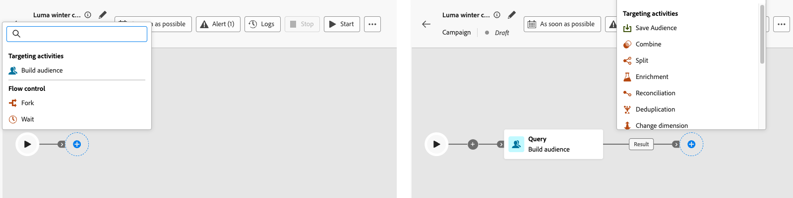
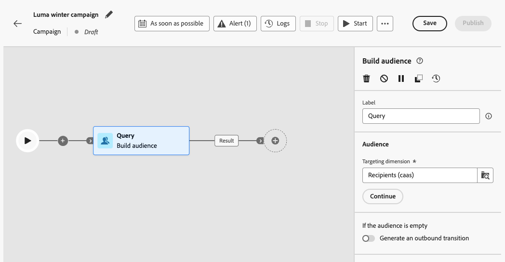
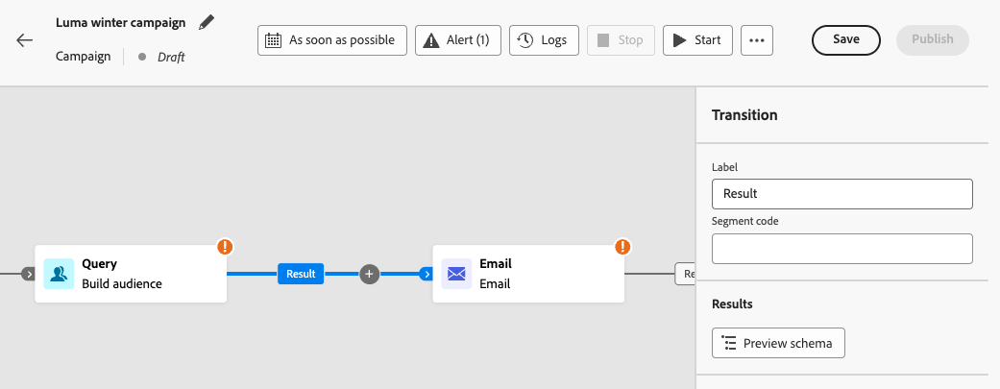
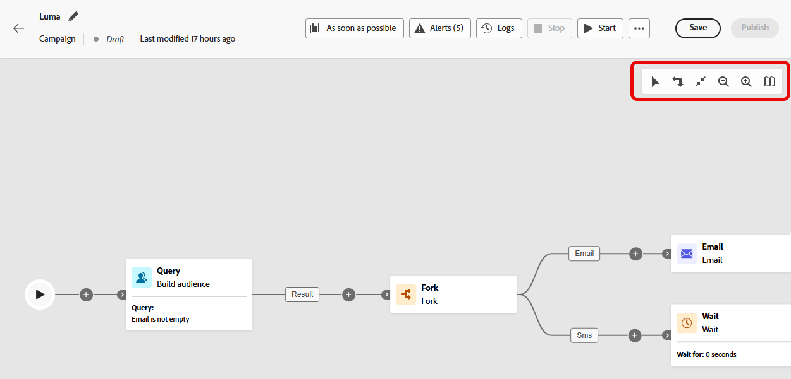
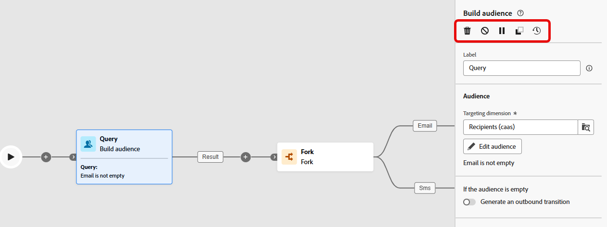
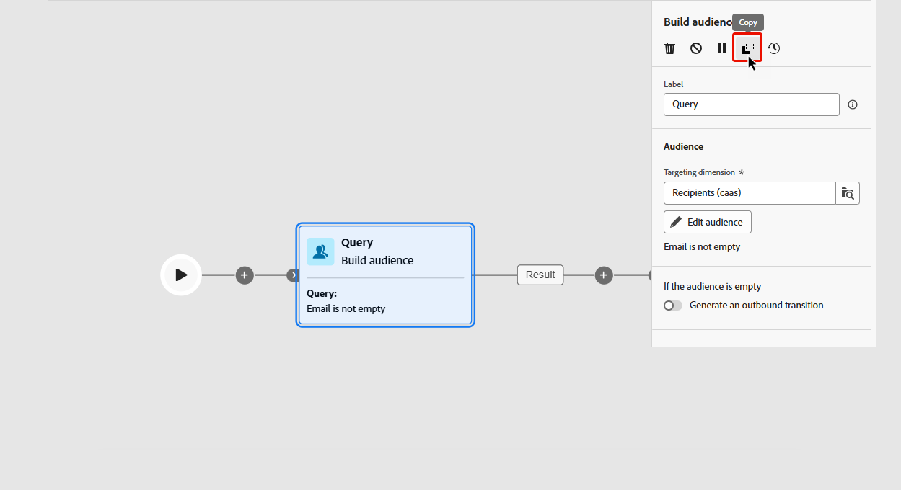
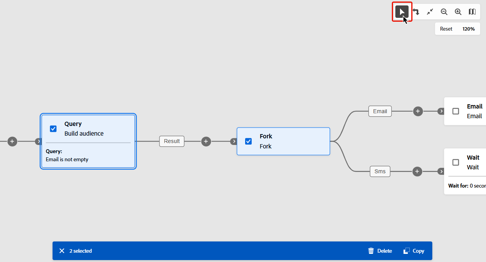
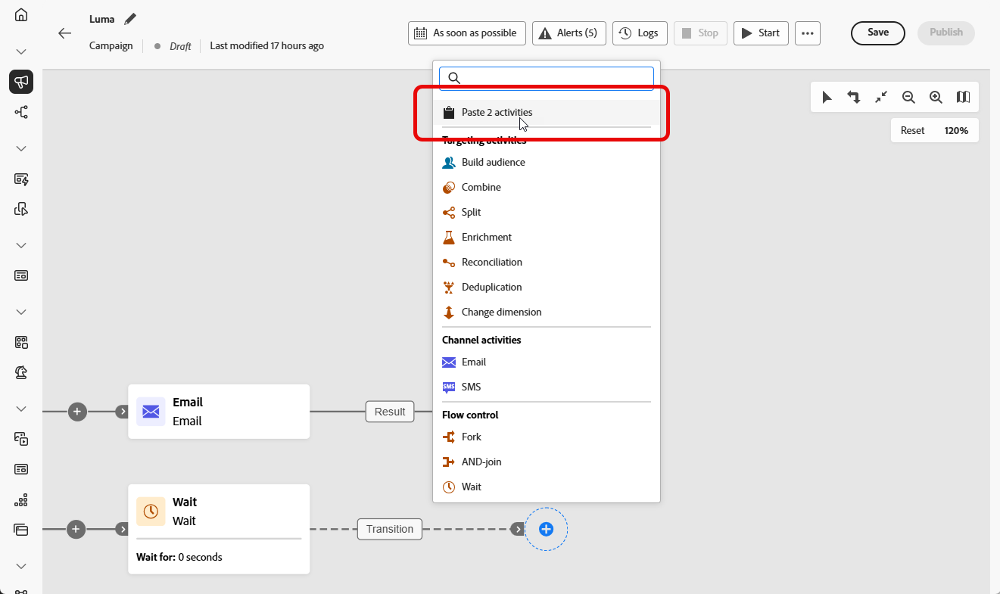
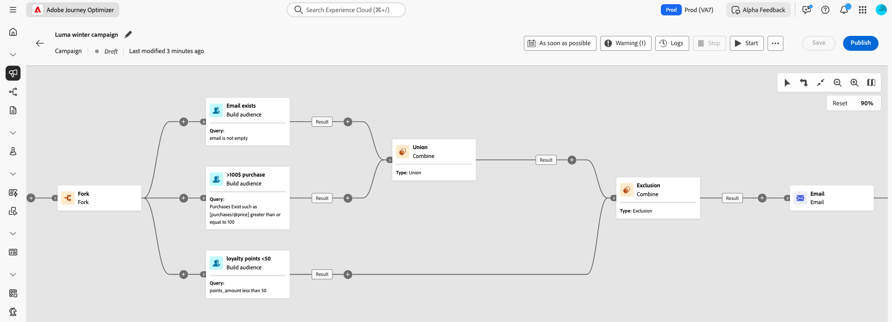

# Orchestrate campaign activities {#orchestrate}

+++ Table of Contents

| Welcome to orchestrated campaigns | Launch your first orchestrated campaign | Query the database | Ochestrated campaigns activities|
|---|---|---|---|
|[Get started with orchestrated campaigns](gs-orchestrated-campaigns.md)  Create and manage relational Schemas and Datasets:  <ul><li>[Manual schema](manual-schema.md)</li><li>[File upload schema](file-upload-schema.md)</li><li>[Ingest data](ingest-data.md)</li></ul>[Access and manage orchestrated campaigns](access-manage-orchestrated-campaigns.md)  [Key steps to create an orchestrated campaign](gs-campaign-creation.md)|[Create and schedule the campaign](create-orchestrated-campaign.md)  <b>[Orchestrate activities](orchestrate-activities.md)</b>  [Start and monitor the campaign](start-monitor-campaigns.md)  [Reporting](reporting-campaigns.md)|[Work with the rule builder](orchestrated-rule-builder.md)  [Build your first query](build-query.md)  [Edit expressions](edit-expressions.md)  [Retargeting](retarget.md)|[Get started with activities](activities/about-activities.md)  Activities: [And-join](activities/and-join.md) - [Build audience](activities/build-audience.md) - [Change dimension](activities/change-dimension.md) - [Channel activities](activities/channels.md) - [Combine](activities/combine.md) - [Deduplication](activities/deduplication.md) - [Enrichment](activities/enrichment.md) - [Fork](activities/fork.md) - [Reconciliation](activities/reconciliation.md) - [Save audience](activities/save-audience.md) - [Split](activities/split.md) - [Wait](activities/wait.md)|

{style="table-layout:fixed"}

+++

 

>[!BEGINSHADEBOX]

The content on this page is not final and may be subject to change.

>[!ENDSHADEBOX]

Once that you have [created an orchestrated campaign](gs-campaign-creation.md), you can start orchestrating the differents tasks it will perform. To do this, a visual canvas is provided, allowing you to construct an orchestrated campaign diagram. Within this diagram, you can add various activities and connect them in a sequential order.

## Add activities {#add}

At this stage of the configuration, the diagram is displayed with a start icon, representing the beginning of your orchestrated campaign. To add your first activity, click the **+** button connected to the start icon.

A list of activities that can be added to the diagram appears. The available activities depend on your position within the orchestrated campaign diagram. For example, when adding your first activity, you can start your orchestrated campaign by targeting an audience, splitting the orchestrated campaign path, or setting a **Wait** activity to delay the orchestrated campaign execution. On the other hand, after a **Build audience** activity, you can refine your target with targeting activities, send a delivery to your audience with channel activities, or organize the orchestrated campaign process with flow control activities.

{zoomable="yes"}

Once an activity has been added to the diagram, a right pane appears, allowing you to configure it with specific settings. Detailed information on how to configure each activity is available in [this section](activities/about-activities.md).

{zoomable="yes"}

Repeat this process to add as many activities as desired depending on the tasks that you want your orchestrated campaign to perform. Note that you can also insert a new activity between two activities. To do this, click the **+** button on the transition between the activities, select the desired activity and configure it in the right pane.

You have the option to personalize the name of the transitions between each activity. To do this, select the transition and change its label in the right pane.

### The canvas toolbar {#toolbar}

The canvas toolbar provides options to easily manipulate the activities and navigate in the canvas:

 Select multiple activities to delete them all at once or copy and paste them. [Learn how to copy-paste activities](#copy)

 Switch the canvas vertically.

 Adapt the canvas zoom level to your screen.

  Zoom out or in the canvas.

 Opens a snapshot of the canvas showing you are located.

### Manage activities {#manage}

When adding activities, action buttons are available in the properties pane, allowing you to perform multiple operations.

 Delete the activity from the canvas.

  Disable/Enable the activity. When the orchestrated campaign is executed, disabled activities and the following activities on the same path are not executed and the orchestrated campaign is stopped.

  Pause/Resume the activity. When the orchestrated campaign is executed, it pauses at the paused activity. The corresponding task as well as all those that follow it in the same path are not executed.

    You can use any activity in the canvas as a breaking point to pause the campaign execution. This means the campaign will run only until this activity, then pause execution. While pausing the execution, the segmentation engine keeps temporary data available for you to preview. You can select the inbound transition just before the paused activity to view the transpported data. Learn more on this section: [Visual flow monitoring](../orchestrated/start-monitor-campaigns.md#flow).

 Copy the activity. [Learn how to copy-paste activities](#copy)

 Access the activity's logs and tasks.

Several **Targeting** activities, such as **Combine** or **Deduplication**, allow you to process the remaining population and include it into an additional outbound transition. For example, if you are using a **Split** activity, the complement consists of the population that did not match any of the previously defined subsets. To use this capability, activate the **[!UICONTROL Generate complement]** option. 

### Copy-paste activities {#copy}

You can copy activities and paste them in any orchestrated campaign canvas. The destination campaign can be in a different browser tab. 

* To copy one activity, click the  button in the activity properties pane.
* To copy multiple activities, click the  icon in the canvas toolbar.

|Copy one activity|Copy multiple activities|
|  ---  |  ---  |
|{width="200" align="center" zoomable="yes"}|{width="200" align="center" zoomable="yes"}|

To paste the activities, click the **+** button on a transition and select "Paste x activity". 

{zoomable="yes"}{width="50%"}

## Diagram example {#example}

Here is an orchestrated campaign example designed to send an email to all customers that have made a purchase of at least 100$, while excluding all customers that have less than 50 loyalty points.

{zoomable="yes"}

To achieve this, activities below have been added:

* A **[!UICONTROL Fork]** activity divides the orchestrated campaign into three paths.
* **[!UICONTROL Build audience]** activities target the three sets of customers:

    * Customers with an email,
    * Customers who have made a purchase of at least 100$,
    * Customers who have less than 50 loyal points.

* A **[!UICONTROL Combine]** activity groups together customers with an email and those who've made a purchase of at least 100$,
* A **[!UICONTROL Combine]** activity excludes customers with less than 50 loyalty points,
* An **[!UICONTROL Email delivery]** activity sends an email to the resulting customers. 

## Next steps {#next}

After successfully designing the orchestrated campaign diagram, you can execute the orchestrated campaign and track the progress of its various tasks. [Learn how to start an orchestrated campaign and monitor its execution](start-monitor-campaigns.md)
