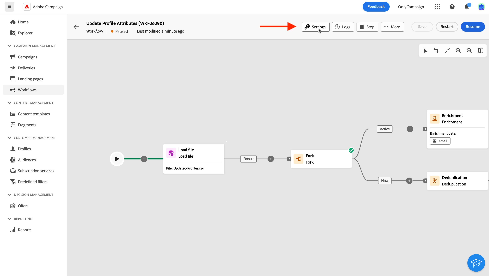
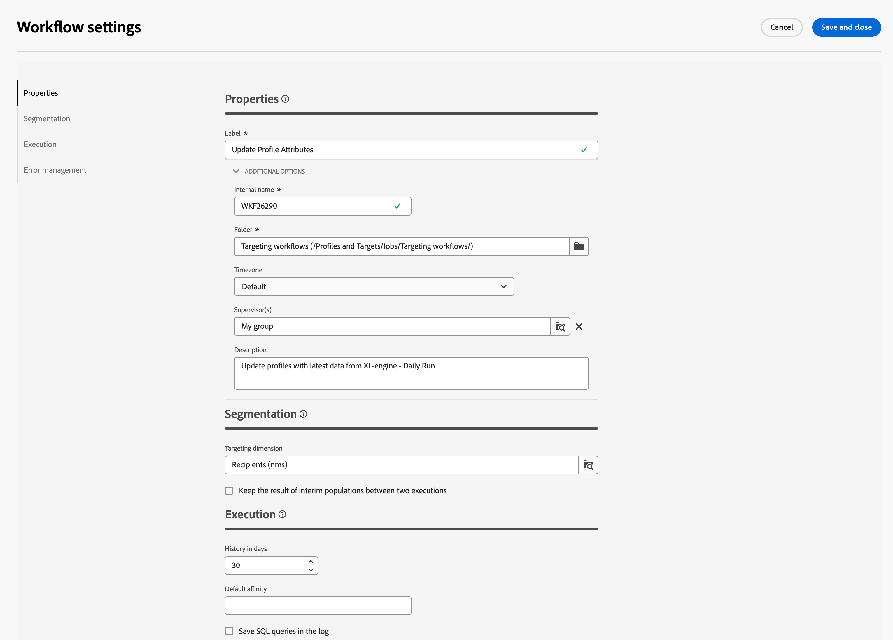

# Configure orchestrated campaign settings {#workflow-settings}

>[!CONTEXTUALHELP]
>id="ajo_workflow_creation_properties"
>title="Orchestrated campaign properties"
>abstract="In this screen, choose the template to use to create the orchestrated campaign and specify a label. Expand the **Additional options** section to configure more settings such as the orchestrated campaign internal name, its folder, timezone, and supervisor group. It is highly recommended to select a supervisor group so that operators are alerted if an error occurs."

+++ Table of Contents

| Welcome to orchestrated campaigns | Launch your first orchestrated campaign | Query the database | Ochestrated campaigns activities|
|---|---|---|---|
|[Get started with orchestrated campaigns](gs-orchestrated-campaigns.md)  [Configuration steps](configuration-steps.md)  [Key steps for orchestrated campaign creation](gs-campaign-creation.md)|[Create an orchestrated campaign](create-orchestrated-campaign.md)  [Orchestrate activities](orchestrate-activities.md)  [Send messages with orchestrated campaigns](send-messages.md)  [Start and monitor the campaign](start-monitor-campaigns.md)  [Reporting](reporting-campaigns.md)|[Work with the Query Modeler](orchestrated-query-modeler.md)  [Build your first query](build-query.md)  [Edit expressions](edit-expressions.md)|[Get started with activities](activities/about-activities.md)  Activities: [And-join](activities/and-join.md) - [Build audience](activities/build-audience.md) - [Change dimension](activities/change-dimension.md) - [Combine](activities/combine.md) - [Deduplication](activities/deduplication.md) - [Enrichment](activities/enrichment.md) - [Fork](activities/fork.md) - [Reconciliation](activities/reconciliation.md) - [Split](activities/split.md) -  [Wait](activities/wait.md)|

{style="table-layout:fixed"}

+++

  

When creating an orchestrated campaign or orchestrating orchestrated campaign activities in the canvas, you can access advanced settings related to the orchestrated campaign. For example, you can set a specific timezone for the orchestrated campaign, manage how the orchestrated campaign should behave in case of error, or manage the delay after which the orchestrated campaign history should be purged.

These settings are pre-configured in the template selected when creating the orchestrated campaign, but can be edited as needed for this specific orchestrated campaign.

{zoomable="yes"}{width="70%" align="left"}

## Orchestrated campaign properties {#properties}

>[!CONTEXTUALHELP]
>id="ajo_workflow_settings_properties"
>title="Orchestrated campaign properties"
>abstract="This section provides generic orchestrated campaign properties that are also accessible when creating the orchestrated campaign. You can choose the template to use to create the orchestrated campaign and specify a label. Expand the Additional options section to configure specific settings such as the orchestrated campaign storing folder or timezone."

The **[!UICONTROL Properties]** section provides generic settings which can be configured when creating an orchestrated campaign. To access the properties of an existing orchestrated campaign, click the **[!UICONTROL Settings]** button available in the actions bar above the orchestrated campaign canvas.

{zoomable="yes"}{width="70%" align="left"}

These properties are:

* The **[!UICONTROL Label]** of the orchestrated campaign that displays in the list.
* The **[!UICONTROL Internal name]** of the orchestrated campaign.
* The **[!UICONTROL Folder]** where the orchestrated campaign should be saved.
* The default **[!UICONTROL Timezone]** to use in all the orchestrated campaign's activities. By default, the orchestrated campaign's time zone is the one defined for the current Campaign operator.
    Possible values are:
    * **Server time zone** to use the time zone of your Adobe Experience Platform organization
    * **Operator time zone** to uses the time zone of the operator who executes the orchestrated campaign
    * **Time zone of the database** to use the time zone of the database server
    * A specific time zone
* When an orchestrated campaign fails, the operators belonging to the operators group selected in the **[!UICONTROL Supervisor(s)]** field are notified by email.
* You can also enter a **[!UICONTROL Description]** of your orchestrated campaign.

## Segmentation settings  {#segmentation-settings}

>[!CONTEXTUALHELP]
>id="ajo_workflow_settings_segmentation"
>title="Segmentation settings"
>abstract="In this section, you can select the targeting dimension to target profiles in the orchestrated campaign, and choose to keep the worklow results between two executions. This option should be used for testing purposes only and must never be enabled in a production orchestrated campaign."

* **[!UICONTROL Targeting dimension]**: Select the targeting dimension to use to target profiles: recipients, contract beneficiaries, operator, subscribers, etc.

* **[!UICONTROL Keep the result of interim populations between two executions]**: By default, only the working tables of the last execution of the orchestrated campaign are kept. Working tables from previous executions are purged by a technical orchestrated campaign, which runs on a daily basis.

    If this option is enabled, working tables will be kept even after the orchestrated campaign has been executed. You can use it for testing purposes and hence must be used **only** on development or staging environments. It must never be checked in a production orchestrated campaign.

## Execution settings  {#exec-settings}

>[!CONTEXTUALHELP]
>id="ajo_workflow_settings_execution"
>title="Execution settings"
>abstract="In this section, you can configure settings related to the execution of the worklow, such the number of days the orchestrated campaign history is kept."

* **[!UICONTROL History in days]**: Specifies the number of days after which the history must be purged. The history contains elements related to the orchestrated campaign: logs, tasks, events (technical objects linked to the orchestrated campaign operation). Default value is 30 days for out-of-the-box orchestrated campaign templates. Purge of the history is performed by the Database cleanup technical orchestrated campaign, which is executed by default everyday

    >[!IMPORTANT]
    >
    >If the **[!UICONTROL History in days]** field is left blank, its value will be considered as "1", meaning that the history will purged after 1 day.

* **[!UICONTROL Default affinity]**: If your installation includes several orchestrated campaign servers, use this field to specify the server which the orchestrated campaign will be executed on. This forces the execution of that orchestrated campaign on a particular server. You can choose any existing affinity name, but make sure you do not use spaces or punctuation marks. If you use different servers, specify different names, separated by commas.

    >[!IMPORTANT]
    >
    >If the value defined in this field does not exist on any server, the orchestrated campaign will remain pending.

    
* **[!UICONTROL Save SQL queries in log]**: Check this option to you to save the SQL queries from the workflmulti-step campaignow into the logs. This functionality is reserved for advanced users. It applies to orchestrated campaigns that contain targeting activities like **[!UICONTROL Build audience]**. When this option is enabled, the SQL queries sent to the database during orchestrated campaign execution are displayed in the orchestrated campaign's logs, allowing you to analyze them to optimize queries or diagnose issues.

## Error management settings  {#error-settings}

>[!CONTEXTUALHELP]
>id="ajo_workflow_settings_error"
>title="Error management settings"
>abstract="In this section, you can define how the orchestrated campaign should manage errors during its execution. You can choose to pause the process, ignore a certain number of errors, or stop the orchestrated campaign execution."

* **[!UICONTROL Error management]**: This field lets you define the actions to be taken if an orchestrated campaign task has errors. There are three possible options:
    
    * **[!UICONTROL Suspend the process]**: The orchestrated campaign is automatically paused and its status changes to **[!UICONTROL Failed]**. Once the issue is solved, resume the orchestrated campaign using the **[!UICONTROL Resume]** buttons.
    * **[!UICONTROL Ignore]**: The status of the task that triggered the error changes to **[!UICONTROL Failed]**, but the orchestrated campaign keeps the **[!UICONTROL Started]** status. <!-- TO ADD ONCE SCHEUDLER IS AVAILABLE This configuration is relevant for recurring tasks: if the branch includes a scheduler, it will start normally next time the workflow is executed.-->
    * **[!UICONTROL Abort the process]**: The orchestrated campaign is automatically stopped and its status changes to **[!UICONTROL Failed]**. Once the issue is solved, restart the orchestrated campaign using the **[!UICONTROL Start]** buttons.

* **[!UICONTROL Consecutive errors]**: This field becomes available when the **[!UICONTROL Ignore]** value is selected in the **[!UICONTROL In case of errors]** field. You can specify the number of errors that can be ignored before the process is stopped. Once this number is reached, the orchestrated campaign status changes to **[!UICONTROL Failed]**. If the value of this field is 0, the orchestrated campaign will never be stopped regardless of the number of errors.

