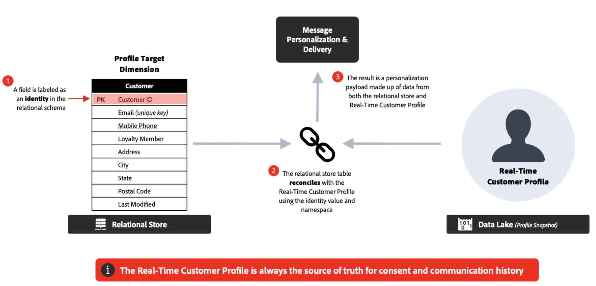

# Frequently Asked Questions {#faq-oc}

You will find below Frequently Asked Questions about Adobe Journey Optimizer Orchestrated campaigns.

Need more details? Use the feedback options at the bottom of this page to raise your question, or connect with [Adobe Journey Optimizer community](https://experienceleaguecommunities.adobe.com/t5/adobe-journey-optimizer/ct-p/journey-optimizer?profile.language=en){target="_blank"}.

## What is Campaign orchestration? {#what-are-oc}

Campaign Orchestration is a feature of Journey Optimizer that supports single-step or multi-step workflows that leverage the Relational Datastore to build and segment audiences for the purpose of batch engagement.

It brings a new type of campaigns to Journey Optimizer: **Orchestrated campaigns**. Orchestrated campaigns help brands run complex, one-to-many marketing campaigns at scale. They are designed for brand-initiated engagement, such as promotions, seasonal campaigns, or account-based communications.  

Compared with single-send/action campaigns, they bring **orchestration and sequencing** to outbound marketing: audiences move through a multi-step workflow together, rather than receiving a one-off blast.  

## What can I do with an Orchestrated campaign? {#what-can-i-do}

Key capabilities include:

* **On-Demand Audiences**: Instantly build and refine target groups using relational queries.  
* **Multi-Entity Segmentation**: Create precise audiences by connecting customer data with related entities (e.g., accounts, purchases, bookings).  
* **Pre-Send Visibility**: See accurate audience counts before launching to optimize targeting.  
* **Multi-Step Workflows**: Run sequenced campaigns such as seasonal promotions, product launches, or loyalty offers.  

>[!BEGINSHADEBOX]

**Best practices**

* Define a **clear campaign objective** before designing workflows.  
* Start with a **pilot audience** to validate counts and logic before scaling.  
* Keep segmentation rules **as simple as possible** to optimize performance and transparency.  
* Use **consistent naming conventions** for audiences and campaigns to make management easier.  

>[!ENDSHADEBOX]

## How to access Campaign orchestration? {#access-oc}

To access Campaign Orchestration, your license must include either the **Journey Optimizer – Campaigns & Journeys** or the **Journey Optimizer - Campaigns** package. Contact your Adobe representative to confirm your license and update if needed.

Learn more about Campaign Orchestration licensing model in [Adobe Journey Optimizer product description](https://helpx.adobe.com/legal/product-descriptions/adobe-journey-optimizer.html){target="_blank"}.

## How are Orchestrated campaigns different from Journeys? {#oc-vs-journeys}

* **Orchestrated campaigns**: Best for **batch, one-to-many** campaigns. Audiences progress in bulk, on a schedule.  
* **Journeys**: Best for **real-time, one-to-one** engagement. Each customer moves through the journey at their own pace, triggered by behavior or events.  

>[!BEGINSHADEBOX]

**Best practice**: Use them together — Journeys for triggered, reactive experiences, and Orchestrated Campaigns for planned, calendar-based initiatives.

>[!ENDSHADEBOX]

## What is multi-entity segmentation? {#multi-entity}

Campaign Orchestration in Adobe Journey Optimizer uses a relational database. This type of data model has separate schemas of data that are connected via 1:1 or 1:many relationships. This enables users to start a query on any schema – not just at recipient level- and then flip back and forth to other related schemas, such as purchases, products, bookings or recipient details providing great flexibility in how segments and audiences can be created and
refined.

>[!BEGINSHADEBOX]

**Example** - Target all recipients with subscriptions expiring in the next 30 days. In Campaign Orchestration the query can start with the Subscriptions schema, search just the expiry date column of that schema and return all subscriptions due to expire, then roll up to the recipient data that is related to those specific subscriptions IDs returning results faster and more efficiently than data models that begin each query at the recipient level. 

>[!ENDSHADEBOX]

## How does the data model work? {#data-model}

Campaigns use a **relational database**. This allows you to query across different data sets (e.g., customers, products, subscriptions) and connect them flexibly for advanced segmentation.  

>[!BEGINSHADEBOX]

**Best practices**

* Organize datasets so that **relationships (joins)** reflect business logic.  
* Avoid unnecessary joins to keep queries performant.  
* Validate sample results before running large-scale extractions.  

>[!ENDSHADEBOX]

## Can I personalize messages with relational data? {#personalization}

Yes. In Campaign Orchestration a recipient profile known as the 'People Entity' can be updated and that data used for personalization. Additionally, enriched data from linked entities in the relational database can also be used for personalization. You can use customer profiles along with linked data (like purchases or subscriptions) to personalize content across all supported channels.  

>[!BEGINSHADEBOX]

**Recommendations**

* Use **transactional and behavioral data** to make offers relevant.  
* Combine **static attributes** (e.g., loyalty tier) with **dynamic ones** (e.g., last purchase date).  
* Keep personalization concise—overloading messages with data can harm readability.  

>[!ENDSHADEBOX]

<!--
## Do Orchestrated campaigns integrate with other Adobe solutions? {#integrations}

Yes. Campaign orchestration is natively integrated with:

* **Customer Journey Analytics**: Campaign orchestration reports are available.  
* **Real-Time CDP**: Audiences built in Campaigns can be read in Real-Time CDP.  
* **Federated Audience Composition (FAC)**: Available as an add-on.  -->

## Which channels are supported? {#channels}

You can create Orchestrated campaigns to send **emails**, **SMS**, and **push notifications**.  

## Can multiple communications and different channels be launched within the same Orchestrated campaign?

Yes, Orchestrated campaigns supports cross-channel orchestration.

## Are Orchestrated campaign templates available?

No, you cannot define or use campaign templates, but you can use content templates for your communications.

## Is the content designer for messages specific to Orchestrated campaigns?

No, the content designer, including the Email Designer, is common across all Journey Optimizer capabilities.

## How are the different channels connected in Orchestrated campaigns?

The channel component & runtime are common to all Journey Optimizer campaigns, however, supported channels differ. 

## Can Orchestrated campaigns connect with outbound channels (web, inApp)?

No, outbound channels are not supported in Orchestrated campaigns.

## What about permissions and consent? {#permissions}

Permissions and consent for Orchestrated campaigns and journeys are managed centrally in Adobe Experience Platform. These settings are applied across both solutions for each recipient prior to send.

>[!BEGINSHADEBOX]

**Best practices**

* Apply **centralized governance**—avoid managing consent separately at campaign level.  
* Periodically audit consent data to detect inconsistencies.  
* Respect **channel-specific opt-outs** — do not assume global consent covers all channels.  

>[!ENDSHADEBOX]

## Can I do ad-hoc segmentation in Orchestrated campaigns? {#ad-hoc}

In Campaign Orchestration, we refer to ad-hoc segmentation as 'Live segmentation' where you can access all the data available in the relational store in real time, build a complex query on top of it and get the result for instant activation through outbound channels (ex: Email + SMS).

>[!BEGINSHADEBOX]

**Tips**

* Use ad-hoc segmentation for **time-sensitive needs** (e.g., flash promotions).  
* Save and document useful queries so they can be reused in future campaigns.  
* Validate the audience count before activation to prevent under- or over-sending.  

>[!ENDSHADEBOX]

## Does Campaign Orchestration only access data loaded via batch, or can it also query real-time updated tables (such as Analytics data)?

Journey Optimizer Campaign Orchestration can first build ad-hoc query on top of Relational Schemas. Relational Schemas supports Batch Sources only for now. In addition, it supports Read audience from any type of Adobe Experience Platform Audience.

## Do Orchestrated campaigns support decisioning? {#decisioning}

Yes. Decisioning can use relational data from Orchestrated campaigns. Once relational schema connected with XDM schemas, XDM data can be used in decisioning.

## How does deployment across environments work? {#deployment}

Objects created in Orchestrated campaigns (e.g., audiences, workflows) are tied to the sandbox in which they are built. Standard packaging and deployment workflows across environments (dev, stage, prod) are not currently available for Orchestrated campaigns.  

>[!BEGINSHADEBOX]

**Best practices**

* Maintain **separate sandboxes** for experimentation, QA, and production.  
* Document configurations thoroughly to enable manual replication if needed.  
* Align with governance teams to reduce configuration drift between environments.   

>[!ENDSHADEBOX]

<!--
## Are there recommended practices for running campaigns at scale? {#scale}

Yes, follow the best practices below:  

* **Plan campaigns around business calendars** (product launches, seasonal peaks) to align volume and resources.  
* Use **audience pre-views** before sending to confirm the expected size and avoid surprises.  
* Where possible, **stagger send times** to avoid overwhelming downstream systems (e.g., call centers, websites).  
* Establish a **monitoring routine**—track delivery logs, error rates, and opt-outs after each send.  
* Run **post-campaign analysis** in Customer Journey Analytics to refine targeting and orchestration for the next cycle.  
-->

## What is the relationship between Recipient and Profile Entities?

Segmentation is performed on Recipients while sending against the Adobe Experience Platform Profile. The Recipient target dimension extends the unified Profile with additional data that is used for segmentation within Orchestrated campaigns, while Recipient is reconciled with Profile at runtime for sending messages and check the consent policy and business rules. This reconciliation is useful for unifying business rules and consent application at profile level

## In which cases is it recommended to use Recipient vs. Profile Entities?

Answering 'Yes' suggests the best data store - but always confirm the best approach based on your use case and constraints with your Adobe representative.

|Relational Store | Real-Time Customer Profile | 
|---------|----------|
| Is the source the data relational already? | Is the source of the data streaming? | 
| Do you plan to ingest data as-it for marketing use cases? | Is data freshness a major requirement? | 
| Is there a large volume of historical data (`>` 2 months) that is needed for marketing activation use cases? | Are there scenarios where in-the-moment action or decision require data? | 
| Are there ad-hoc needs for audience creation, evaluation, and activation? | Can the behavioral data be limited to `<` 90 days using pre-comptuted aggregates?| 
|  | Is data needed for personalizing messages in real-time?| 

## What is the maximum number of activities per Orchestrated campaign?

The number of activities in an Orchestrated campaign is limited to 500.

## Is it possible to perform enrichments to add additional data?

Yes, you can enrich data from the relational store and from Adobe Experience Platform audiences.

## Must all filters be defined via audiences, or can some type of filter be configured?

Orchestrated campaigns support Predefined Filters: you can define and save a query as a filter, and add it to your favorites to be reused in further segmentation tasks.

>[!MORELIKETHIS]
>
>* [Orchestrated campaigns guardrails & limitations](../orchestrated/guardrails.md)
>* [Get started with schemas and datasets in Orchestrated campaigns](../orchestrated/gs-schemas.md)
>* [Create your first Orchestrated campaign](../orchestrated/gs-campaign-creation.md)
>* [Journey Optimizer Product Description](https://helpx.adobe.com/legal/product-descriptions/adobe-journey-optimizer.html){target="_blank"}
