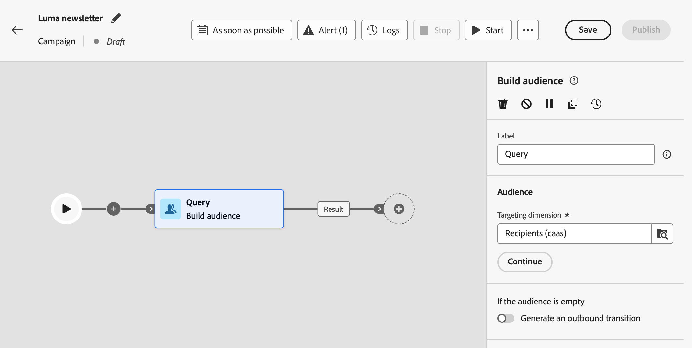
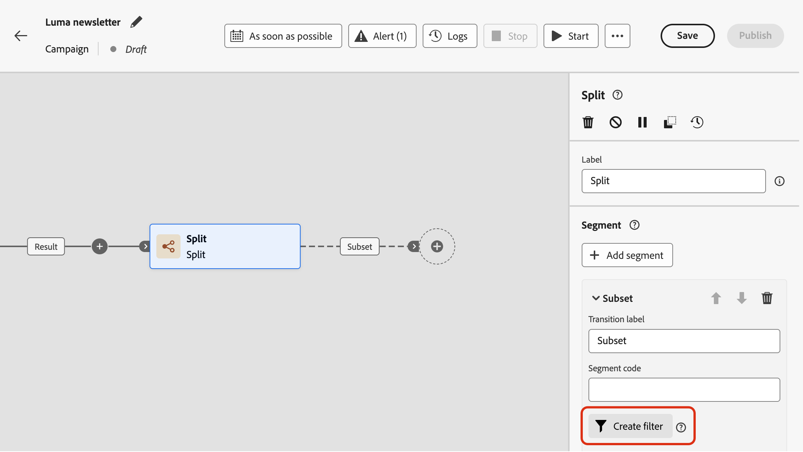
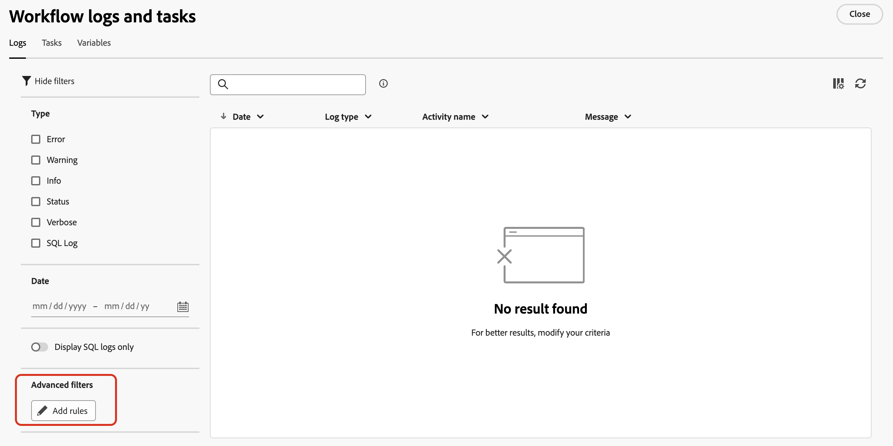

# Work with the rule builder {#orchestrated-rule-builder}

+++ Table of Contents

| Welcome to orchestrated campaigns | Launch your first orchestrated campaign | Query the database | Ochestrated campaigns activities|
|---|---|---|---|
|[Get started with orchestrated campaigns](gs-orchestrated-campaigns.md)  [Configuration steps](configuration-steps.md)  [Access and manage orchestrated campaigns](access-manage-orchestrated-campaigns.md)|[Key steps for orchestrated campaign creation](gs-campaign-creation.md)  [Create and schedule the campaign](create-orchestrated-campaign.md)  [Orchestrate activities](orchestrate-activities.md)  [Start and monitor the campaign](start-monitor-campaigns.md)  [Reporting](reporting-campaigns.md)|<b>[Work with the rule builder](orchestrated-rule-builder.md)</b>  [Build your first query](build-query.md)  [Edit expressions](edit-expressions.md)|[Get started with activities](activities/about-activities.md)  Activities: [And-join](activities/and-join.md) - [Build audience](activities/build-audience.md) - [Change dimension](activities/change-dimension.md) - [Channel activities](channels.md) - [Combine](activities/combine.md) - [Deduplication](activities/deduplication.md) - [Enrichment](activities/enrichment.md) - [Fork](activities/fork.md) - [Reconciliation](activities/reconciliation.md) - [Split](activities/split.md) - [Wait](activities/wait.md)|

{style="table-layout:fixed"}

+++

 

Orchestrated campaigns comes with a rule builder that simplifies the process of filtering the database based on various criteria. The rule builder manages very complex and long queries efficiently, offering enhanced flexibility and precision.

It also supports predefined filters within conditions, empowering you to refine queries with ease while utilizing advanced expressions and operators for comprehensive audience targeting and segmentation strategies.

## Access the rule builder

The query modeler is available in every context where you need to define rules to filter data.

|Usage|Example|
|  ---  |  ---  |
|**Build audiences**: Specify the population you want to target in your orchestrated campaigns using a **[!UICONTROL Build audience]** activity, and effortlessly create new audiences tailored to your needs. [Learn how to build audiences](../orchestrated/activities/build-audience.md)|{width="200" align="center" zoomable="yes"}|
|**Create condition in the campaign canvas**: Apply rules within the campaign canvas using a  **[!UICONTROL Split]** activity, to align with your specific requirements. [Learn how to use a Split activity](../orchestrated/activities/split.md)|{width="200" align="center" zoomable="yes"}|
|**Create advanced filters**: Build rules to filter the data displayed in lists such as workflow logs or targeting dimensions.|{width="200" align="center" zoomable="yes"}|

## Rule builder interface {#interface}

The rule builder provides a central canvas where you build your query and a properties pane that provides information on the rule.

*  The **central canvas** is where you add and combine the different components to build your rule. [Learn how to build a rule](../orchestrated/build-query.md)

* The **[!UICONTROL Rule properties]** pane provides information on your rule. It allows you to perform various operations to check the rule and ensure it suits your needs.

    This pane displays when building a query to create an audience. [Learn how to check and validate your query](build-query.md#check-and-validate-your-query)
