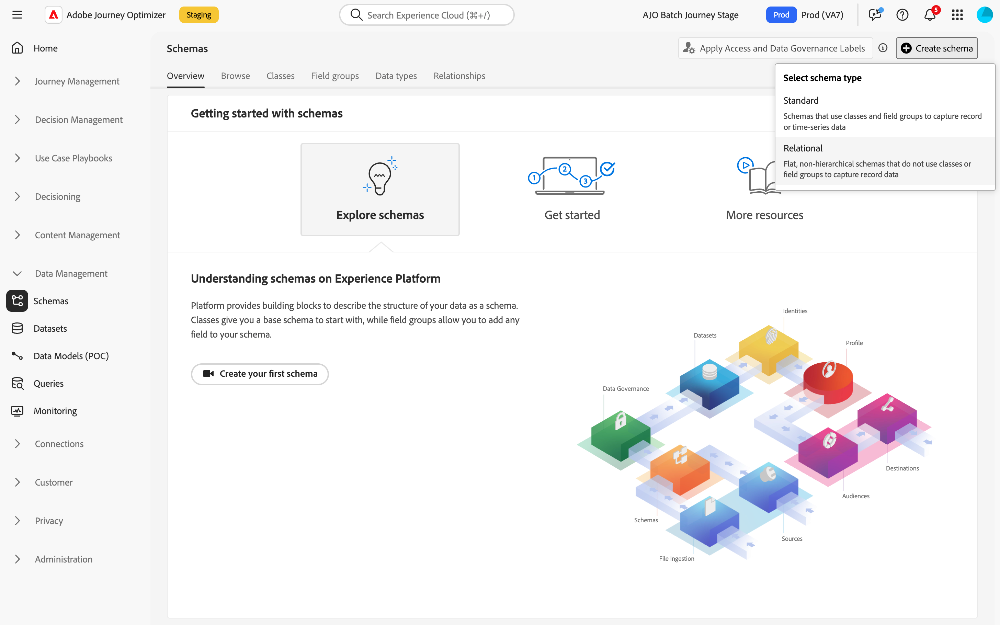

# Create relational schemas {#orchestrated-schemas} 

+++ Table of Contents

| Welcome to Orchestrated campaigns | Launch your first Orchestrated campaign | Query the database | Ochestrated campaigns activities|
|---|---|---|---|
|[Get started with Orchestrated campaigns](gs-orchestrated-campaigns.md)  Create and manage relational Schemas and Datasets:  <ul><li>[Get started with Schemas and Datasets](gs-schemas.md)</li><li>[Manual schema](manual-schema.md)</li><li>[File upload schema](file-upload-schema.md)</li><li>[Ingest data](ingest-data.md)</li></ul>[Access and manage Orchestrated campaigns](access-manage-orchestrated-campaigns.md)  [Key steps to create an Orchestrated campaign](gs-campaign-creation.md)|[Create and schedule the campaign](create-orchestrated-campaign.md)  [Orchestrate activities](orchestrate-activities.md)  [Start and monitor the campaign](start-monitor-campaigns.md)  [Reporting](reporting-campaigns.md)|[Work with the rule builder](orchestrated-rule-builder.md)  [Build your first query](build-query.md)  [Edit expressions](edit-expressions.md)  [Retargeting](retarget.md)|[Get started with activities](activities/about-activities.md)  Activities: [And-join](activities/and-join.md) - [Build audience](activities/build-audience.md) - [Change dimension](activities/change-dimension.md) - [Channel activities](activities/channels.md) - [Combine](activities/combine.md) - [Deduplication](activities/deduplication.md) - [Enrichment](activities/enrichment.md) - [Fork](activities/fork.md) - [Reconciliation](activities/reconciliation.md) - [Save audience](activities/save-audience.md) - [Split](activities/split.md) - [Wait](activities/wait.md)|

{style="table-layout:fixed"}

+++

 

>[!BEGINSHADEBOX]

 

The content on this page is not final and may be subject to change.

>[!ENDSHADEBOX]

A schema represents and validates the structure and format of data. It provides an abstract definition of a real-world object (such as a person) and outlines what data should be included in each instance of that object (such as name, birthday, and so on).

