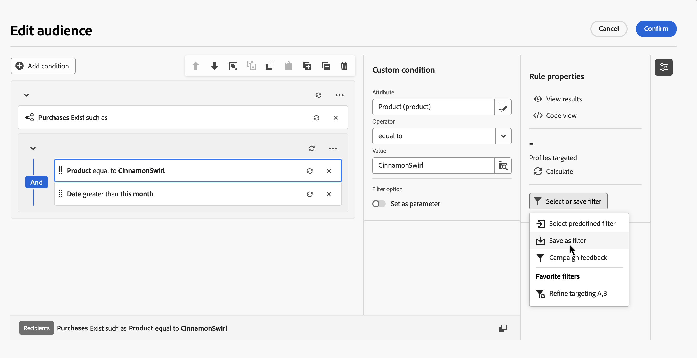
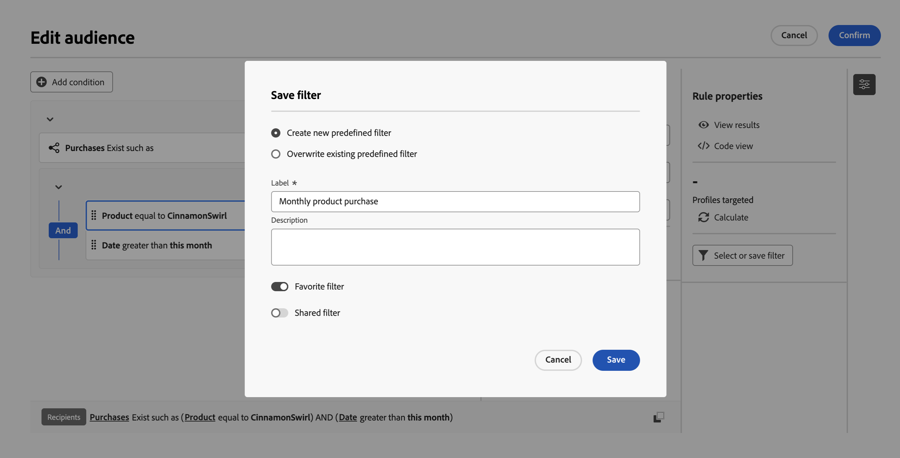
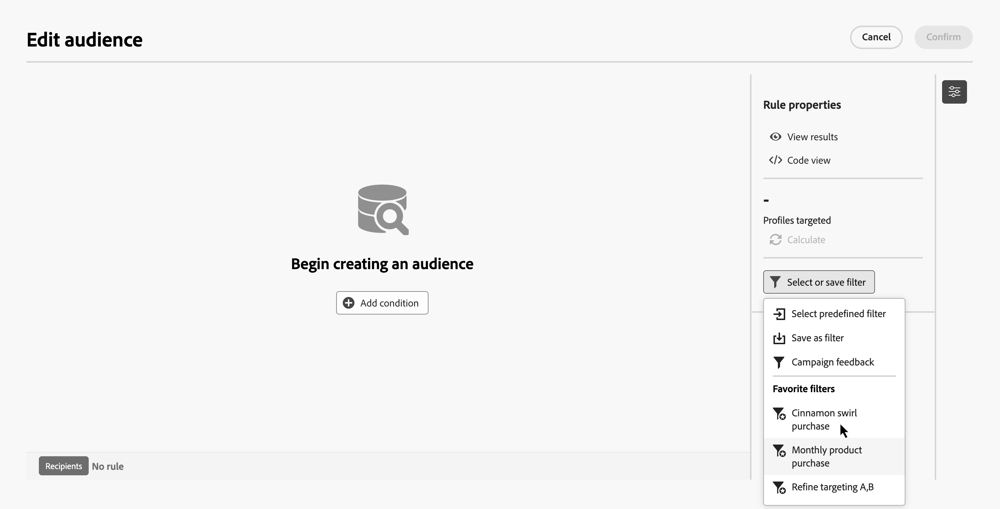
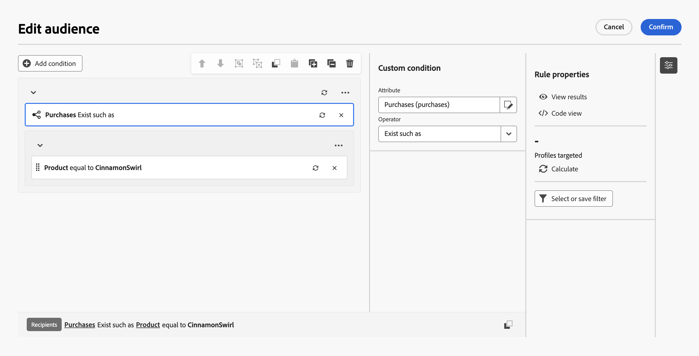
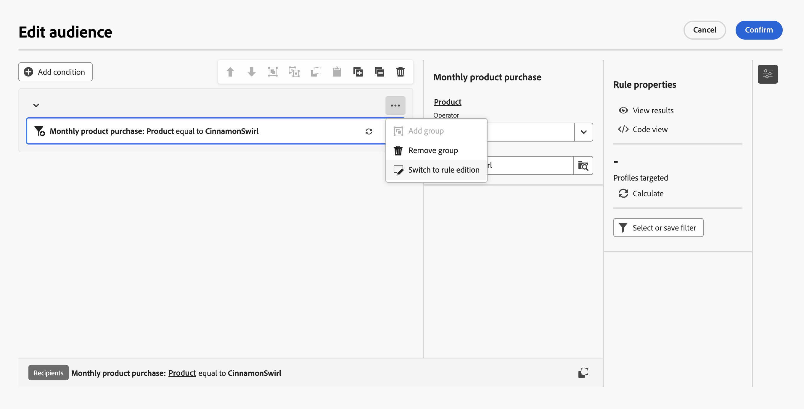
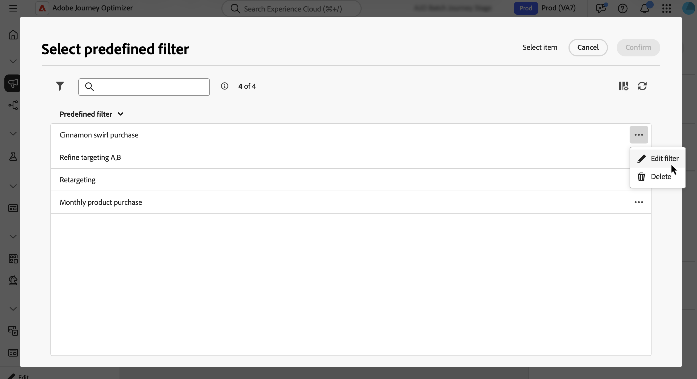

# Work with predefined filters {#predefined-filters}

Predefined filters are saved rules that you can reuse in the rule builder. Use them to avoid rebuilding common queries and to standardize targeting logic across orchestrated campaigns.

You can mark predefined filters as favorites, share them with other users, and add parameters so selected fields can be edited when the filter is applied.

## Create a predefined filter {#create}

Save a custom filter from the rule builder to make it available for future use. Follow these steps:

1. Open the rule builder and define your filtering conditions. [Learn how to build a rule](../orchestrated/build-query.md)

1. Optional: To make certain fields editable when using the filter, select the field and toggle on **[!UICONTROL Set as parameter]**. When you apply the filter, only these fields can be edited.

    

1. To save the filter, click **[!UICONTROL Select or save filter]**, and select **[!UICONTROL Save as filter]**.

    

1. Enter a label and a description for the filter, then click **[!UICONTROL Save]**.

    * To save the filter as a favorite, toggle on the **[!UICONTROL Favorite filter]** option. Learn more in [this section](#fav-filter).
    * To make the filter accessible to other users, enable the **[!UICONTROL Shared filter]** option. Learn more in [this section](#share-filter).

    

Your custom filter is now available in the **Predefined Filters** list.

## Use a predefined filter in a rule {#apply}

Predefined filters are available when defining queries in the rule builder.

1. In the **[!UICONTROL Rule properties]** pane, click **[!UICONTROL Select or save filter]**.

1. Choose **[!UICONTROL Select predefined filter]** and select a filter. You can also directly select a predefined filter from the list if it has been added to favorites.

    

    >[!IMPORTANT]
    >
    >Selecting a predefined filter replaces the rule that has been built in the canvas with the selected filter.

1. The filter opens in the canvas. Continue editing the condition as needed.

    

    If the filter you selected includes parameters, only the fields marked as parameters can be edited. They display in the pane next to the **[!UICONTROL Rule properties]** pane.

    

    To edit the predefined filter itself, click the  button and select **[!UICONTROL Switch to rule edition]**. All changes apply only to the current rule you are building. The predefined filter is not modified.

    

## Save a filter as a favorite {#fav-filter}

When creating a predefined filter, enable the **[!UICONTROL Favorite filter]** option to see this predefined filter in your favorites.

When a filter is saved as a favorite, it appears in the **[!UICONTROL Favorite filters]** section of the filter list, as shown below:

## Share a predefined filter {#share-filter}

By default, predefined filters you create are private and visible only to you. To make a filter accessible to other operators in your organization, enable the **[!UICONTROL Shared filter]** option.

Shared filters appear in the predefined filter list for all users, allowing them to use these filters in their own rules.

## Manage predefined filters {#manage-predefined-filter}

To edit or delete predefined filters, follow these steps:

1. Open the predefined filter list using the **[!UICONTROL Select or save filter]** button in the rule build.

1. Select the  button next to a filter and choose the desired action.

