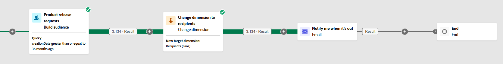
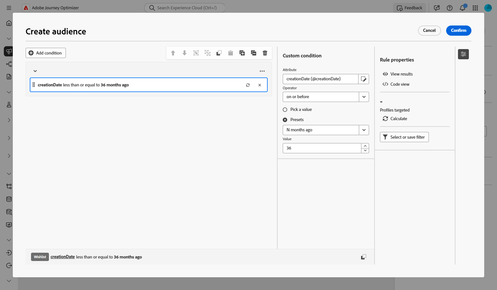
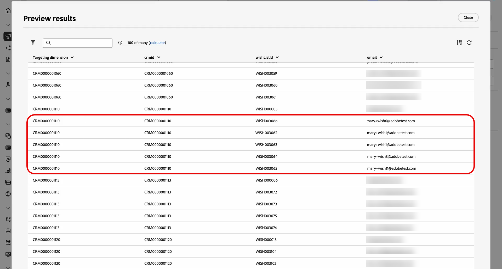
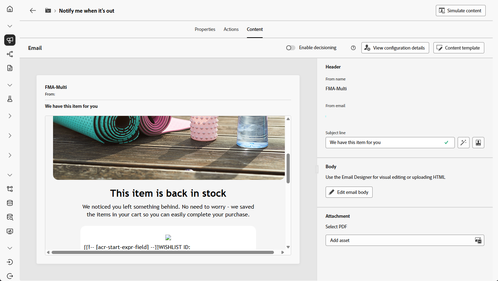

# Notify users about product availability {#product-availability-uc}

>[!BEGINSHADEBOX]

This use case showcases multi-level sending: generating a distinct email for each wishlist item by using the email address stored with the individual item rather than the recipient record. This enables customers to receive separate notifications for every product on their wishlist even if they use different email addresses for different items.

>[!ENDSHADEBOX]

{zoomable="yes"}

Design a back-in-stock notification to inform customers when items from their Wishlist become available again. This message helps re-engage interested customers and encourages them to complete their purchase while inventory is replenished.

1. Start by setting up a new campaign specifically aimed at Wishlist re-engagement. This ensures your messaging focuses on customers who have already shown purchase intent by saving products to their wishlist.

    {zoomable="yes"}

1. Fill in your **[!UICONTROL Campaign Settings]** such as the campaign name, description, start and end dates, and relevant tags.

1. Add a **[!UICONTROL Build audience]** activity with Wishlist as **[!UICONTROL Targeting dimension]**.

    {zoomable="yes"}

1. Add you condition to only include wishlists created over the last 36 months. 

    {zoomable="yes"}

1. Add a **[!UICONTROL Change dimension]** activity to shift from wishlists back to the respective customer set for targeting.

    {zoomable="yes"}

1. After starting draft mode, preview the audience with Wishlist details. For deeper insights, click an output result and select **[!UICONTROL Preview results]**.

    Here, the data displays both recipients and their Wishlist items. Some customers have multiple Wishlist items and, through multi-level sending, receive a separate email for each item. In some cases, customers use different email addresses for separate back-in-stock requests.

    {zoomable="yes"}

1. To be able to send a separate email for each item, make sure that [your email configuration](../orchestrated/target-dimension.md) is set with `Recipients - email` as **[!UICONTROL Profile Target Dimension]** and `Wishlistitems` as a **[!UICONTROL Secondary dimension]**. 

    Then, from the **[!UICONTROL Execution Address]** menu, select `wishlist.email` as **[!UICONTROL Secondary dimension]**. Each Wishlist item triggers a separate email, using the email address stored in the Wishlist data as the secondary dimension.

    {zoomable="yes"}

1. Add an **[!UICONTROL Email]** activity to create a product availability message. Click **[!UICONTROL Edit content]** to start designing your content.

   ➡️ [Learn more on email personalization](../email/content-from-scratch.md)

    {zoomable="yes"}

1. Once your campaign is tested and ready, click **[!UICONTROL Publish]** to make it live.

With this orchestrated campaign, customer receives a separate email for each of their wishlist items. Each message is sent to the specific email address associated with that wishlist, with personalized content drawn from the details of that particular wishlist item.

