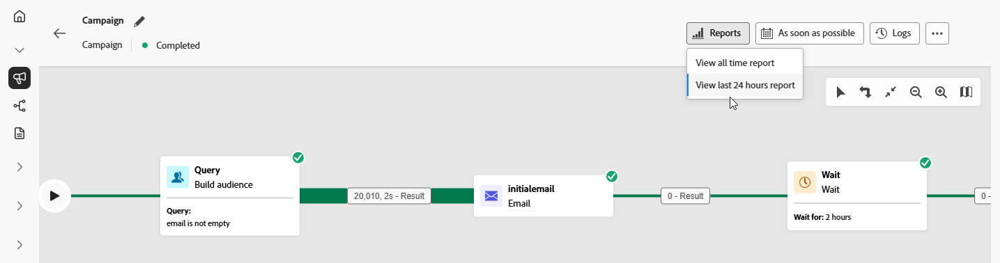

# Orchestrated campaigns reporting {#report-campaigns}

+++ Table of Contents

| Welcome to orchestrated campaigns | Launch your first orchestrated campaign | Query the database | Ochestrated campaigns activities|
|---|---|---|---|
|[Get started with orchestrated campaigns](gs-orchestrated-campaigns.md)  [Configuration steps](configuration-steps.md)  [Access and manage orchestrated campaigns](access-manage-orchestrated-campaigns.md)|[Key steps for orchestrated campaign creation](gs-campaign-creation.md)  [Create and schedule the campaign](create-orchestrated-campaign.md)  [Orchestrate activities](orchestrate-activities.md)  <b>[Start and monitor the campaign](start-monitor-campaigns.md)</b>  [Reporting](reporting-campaigns.md)|[Work with the rule builder](orchestrated-rule-builder.md)  [Build your first query](build-query.md)  [Edit expressions](edit-expressions.md)  [Retargeting](retarget.md)|[Get started with activities](activities/about-activities.md)  Activities: [And-join](activities/and-join.md) - [Build audience](activities/build-audience.md) - [Change dimension](activities/change-dimension.md) - [Channel activities](activities/channels.md) - [Combine](activities/combine.md) - [Deduplication](activities/deduplication.md) - [Enrichment](activities/enrichment.md) - [Fork](activities/fork.md) - [Reconciliation](activities/reconciliation.md) - [Save audience](save-audience.md) - [Split](activities/split.md) - [Wait](activities/wait.md)|

{style="table-layout:fixed"}

+++
 

Orchestrated campaign offers you actionable insights through its robust reporting capabilities. These insights help you better understand audience behavior, measure the performance of each step in your customer journey, and make data-driven decisions to optimize future campaigns. With detailed metrics and visualizations, you can track engagement and fine-tune your targeting strategies for maximum impact.

## Types of reports {#reporting-types}

<table style="table-layout:auto; width: 100%; border-collapse: collapse;">
  <tbody>
    <tr>
      <td></td>
      <td>
        Use the <b>Live report</b> to measure and visualize in real-time the impact and performances of your orchestrated campaigns in a built-in dashboard. Data are available in the <b>Live report</b> as soon as your orchestrated campaign is executed from the <b>View last 24 hours report</b> menu. Learn more about live reports <a href="../reports/live-report.md">in this section</a>.
      </td>
         
    </tr>
    <tr style="background-color: #FFFFFF;">
      <td></td>
      <td>
        <b>All time report</b> is fully integrated with Customer Journey Analytics capabilities, standardizing reporting across both platforms and improving data consistency and reliability. Learn more about all time reports <a href="../reports/report-gs-cja.md">in this section</a>.
      </td>
    </tr>
  </tbody>
</table>

## Dive into Channel reports

<table style="table-layout:fixed"><tr style="border: 0; text-align: center;" >
<td> <a href="../reports/campaign-global-report-cja-email.md"><strong>Email report</strong></a></td>
<td> <a href="../reports/campaign-global-report-cja-sms.md"><strong>SMS report</strong></a></td>
<td><a href="../reports/campaign-global-report-cja-push.md"><strong>Push report</strong></a></td>
</tr></table>

