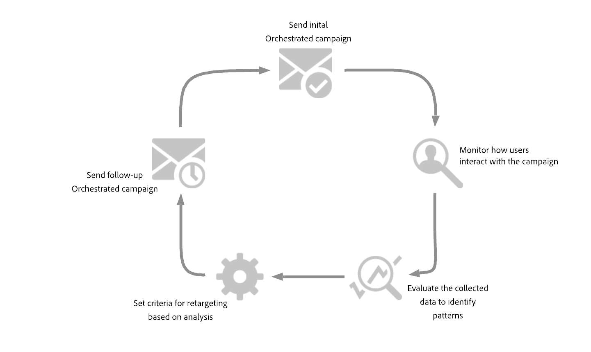
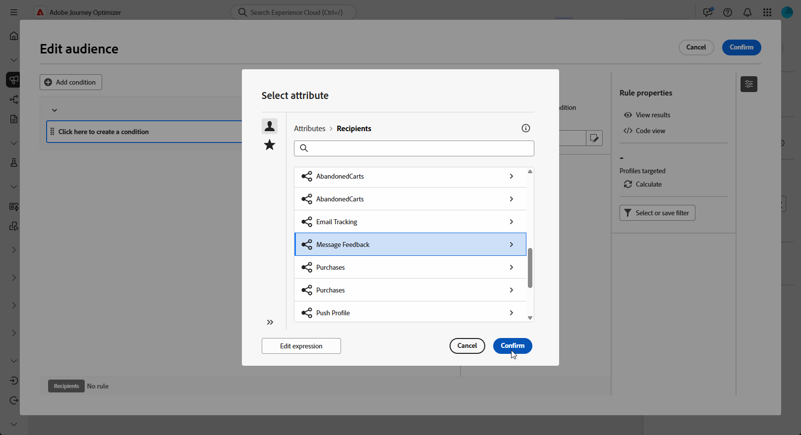
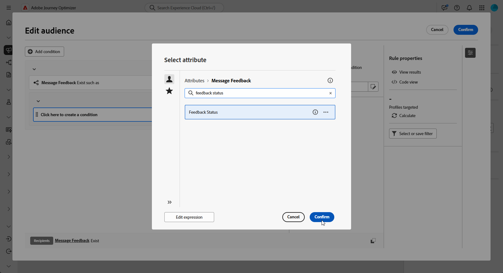
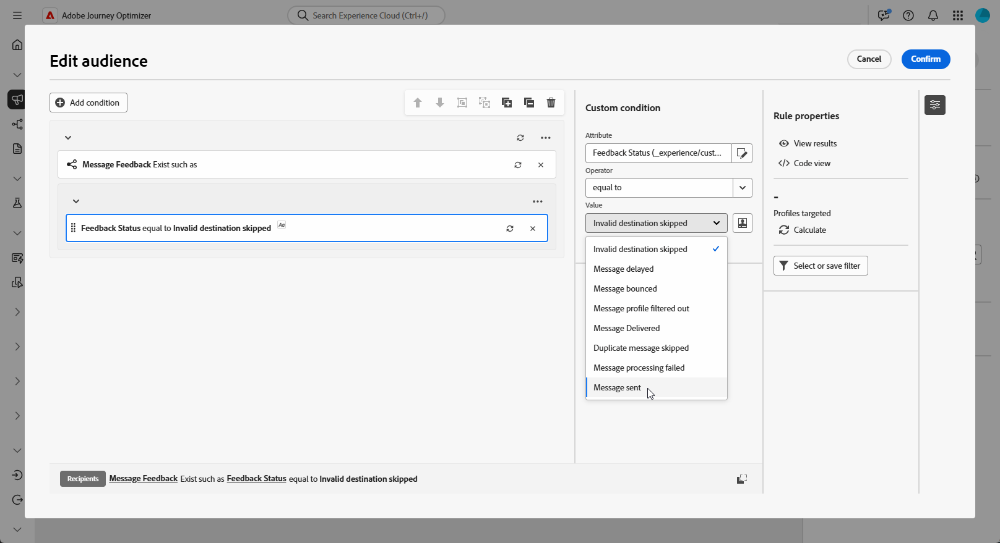
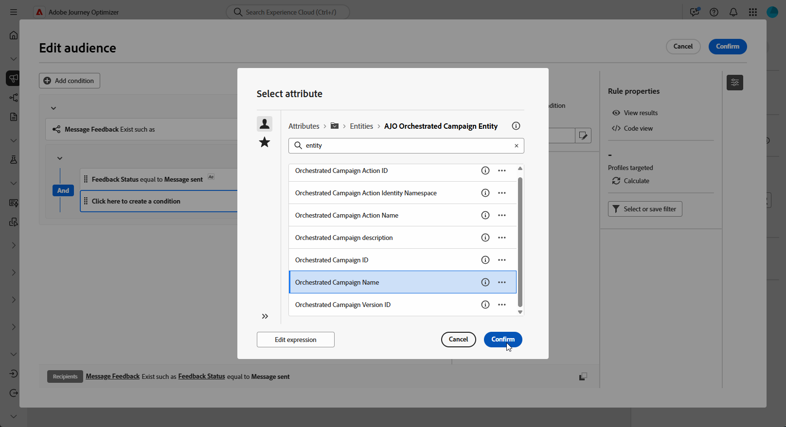
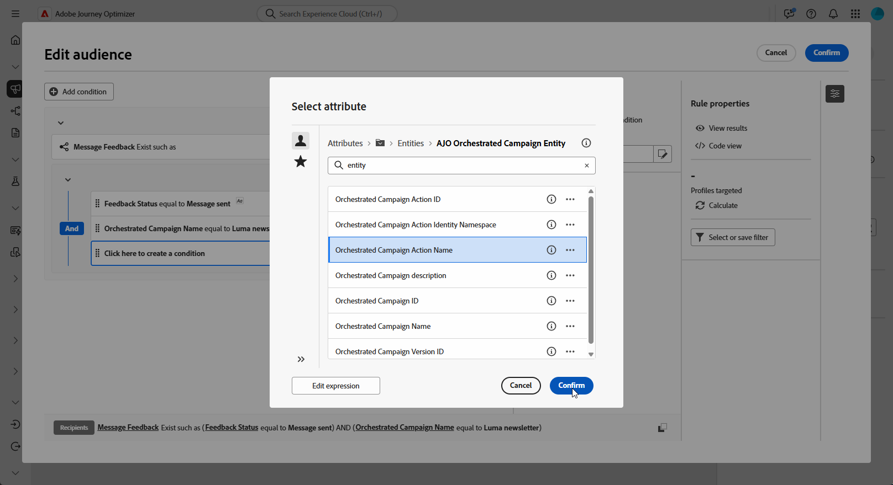
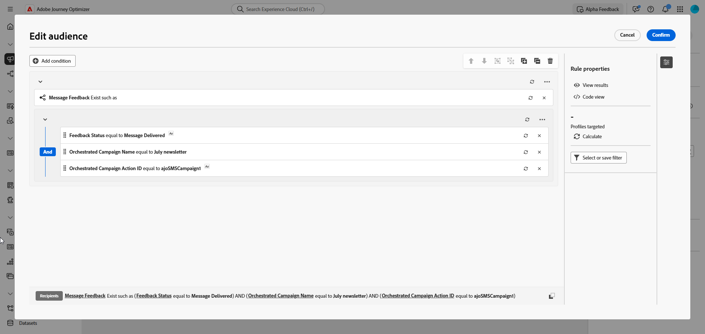
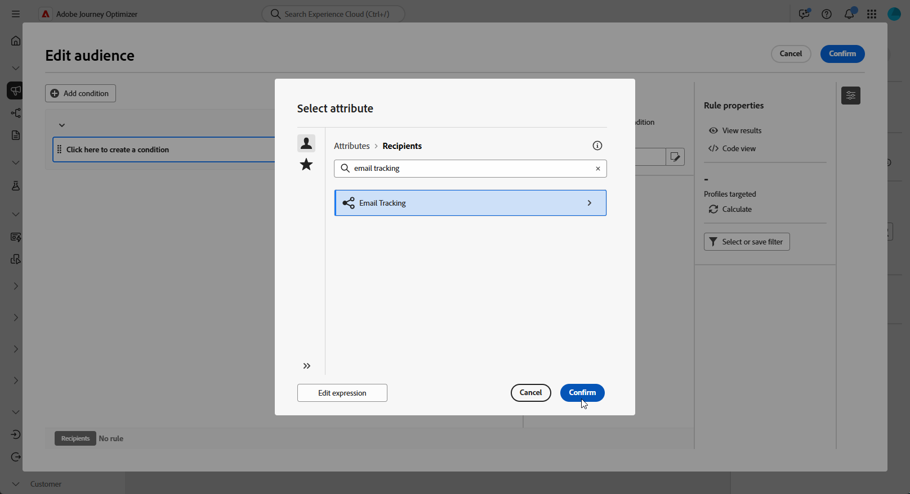
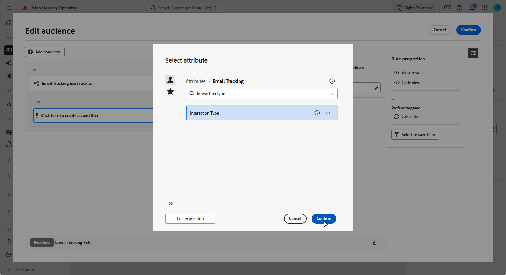
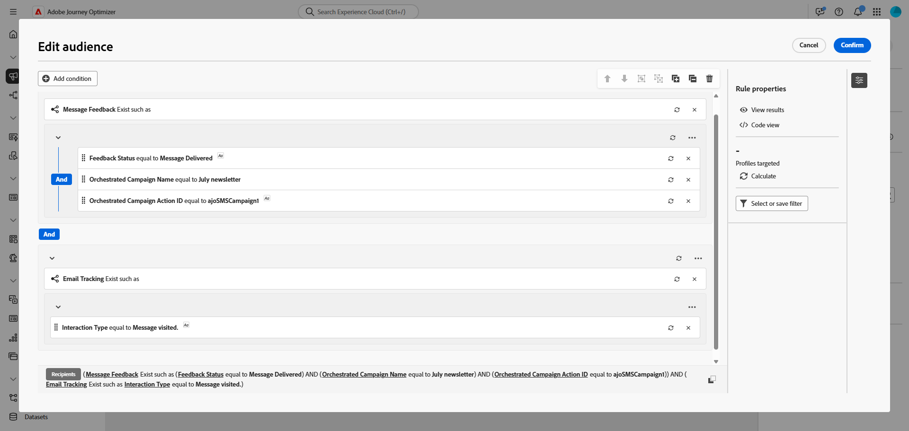

# Building retargeting queries {#retarget}

Retargeting allows you to follow up with recipients based on how they responded to a previous Orchestrated campaign. For example, you can send a second email to recipients who received but did not click the first one.

**[!UICONTROL Orchestrated Campaign]** provides two main attributes for this:

* **[!UICONTROL Message Feedback]**: captures delivery-related events, e.g. message sent, opened, bounced, etc.
* **[!UICONTROL Email Tracking]**: captures user actions, e.g. clicks and opens.

{zoomable="yes"}

## Create a Feedback-based Retargeting Rule {#feedback-retarget}

Feedback-based Retargeting Rule allows you to retarget recipients based on message delivery events captured in the **[!UICONTROL Message Feedback]** attribute. These events include outcomes such as messages being sent, opened, bounced, or marked as spam.

Using this data, you can define rules to identify recipients who received a previous message enabling follow-up communication based on specific delivery statuses.

1. Create a new **[!UICONTROL Orchestrated Campaign]**.

1. Add a **[!UICONTROL Build Audience]** activity and set the targeting dimension to **[!UICONTROL Recipient (caas)]**.

1. In the **[!UICONTROL Rule Builder]**, click **[!UICONTROL Add Condition]** and select **[!UICONTROL Message Feedback]** from the **[!UICONTROL Attributes Picker]**. Click **[!UICONTROL Confirm]** to create a **Message Feedback Exists such as** condition.

    {zoomable="yes"}

1. Choose the **[!UICONTROL Feedback Status]** attribute to target message delivery events.

   +++ Detailed step-by-step

   1. Add another condition linked to the **[!UICONTROL Message feedback]** attribute.

   1. Search for the **[!UICONTROL Feedback Status]** attribute and click **[!UICONTROL Confirm]**.

      {zoomable="yes"}

   1. In the **[!UICONTROL Custom condition]** menu, choose which delivery status to track in the **[!UICONTROL Value]** drop-down. 

      {zoomable="yes"}

   +++

1. Choose the **[!UICONTROL Orchestrated Campaign Name]** attribute to target a specific Orchestrated campaign.

    +++ Detailed step-by-step

   1. Add another condition linked to the **[!UICONTROL Message feedback]** attribute, search for **[!UICONTROL entity]**, and navigate to:

         `_experience > CustomerJourneyManagement > Entities > AJO Orchestrated Campaign entity`.

   1. Select **[!UICONTROL Orchestrated Campaign Name]**.

      {zoomable="yes"}

   1. In the **[!UICONTROL Custom condition]** menu, specify the campaign name in the **[!UICONTROL Value]** field.

   +++

1. Choose the **[!UICONTROL Orchestrated Campaign Action Name]** attribute to target a specific message or activity within an Orchestrated campaign.

   +++ Detailed step-by-step

   1. Add another condition linked to the **[!UICONTROL Message feedback]** attribute, search for **[!UICONTROL entity]**, and navigate to:

      `_experience > CustomerJourneyManagement > Entities > AJO Orchestrated Campaign entity`.

   1. Select **[!UICONTROL Orchestrated Campaign Action Name]**.

      {zoomable="yes"}

   1. In the **[!UICONTROL Custom condition]** menu, specify the campaign action name in the **[!UICONTROL Value]** field.

      Action names can be found by clicking the  next to the Label field of your activity.
   
   +++

1. Alternatively, you can also filter by the **[!UICONTROL Campaign ID]** (UUID), which can be found in your Campaign properties.

You have now configured a Feedback-based retargeting rule to identify recipients based on the delivery status of a previous message such as sent, opened, bounced, or marked as spam. With this audience defined, you can either add a follow-up email or further refine your targeting by [configuring a Tracking-based retargeting rule](#tracking-based), which uses user interaction data.

{zoomable="yes"}

## Create a Tracking-based retargeting rule {#tracking-based}

Tracking-based retargeting rule targets recipients based on their interactions with a message, using data from the **[!UICONTROL Email Tracking]** attribute. It captures user actions such as email opens and link clicks.

To retarget recipients based on message interactions (e.g., open or click), use the **[!UICONTROL Email Tracking]** entity as follows:

1. Create a new **[!UICONTROL Orchestrated Campaign]**.

1. Add a **[!UICONTROL Build Audience]** activity and set the targeting dimension to **[!UICONTROL Recipient (caas)]** to focus on previous Orchestrated campaign recipients.

1. In the **[!UICONTROL Rule Builder]**, click **[!UICONTROL Add Condition]** and select **[!UICONTROL Email Tracking]** from the **[!UICONTROL Attributes Picker]**. 

   Click **[!UICONTROL Confirm]** to create a **Email Tracking Exists such as** condition.

    {zoomable="yes"}

1. To target recipients' interactions with a message, add another condition linked to the **[!UICONTROL Email tracking]** attribute and search for the **[!UICONTROL Interaction Type]** attribute.

   {zoomable="yes"}

1. From the custom condition options, use **[!UICONTROL Included in]** as the operator and select one or more values depending on your use case, e.g. **[!UICONTROL Message Opened]** or **[!UICONTROL Message Link Clicked]**.

   {zoomable="yes"}

You have now configured a Tracking-based retargeting rule to target recipients based on their interactions with a previous message, such as email opens or link clicks, using data from the **[!UICONTROL Email Tracking]** attribute. With this audience defined, you can either add a follow-up action or further refine your targeting by combining it with a [Feedback-Based retargeting rule](#feedback-retarget) to include message outcomes such as sent, bounced, or marked as spam.

{zoomable="yes"}
