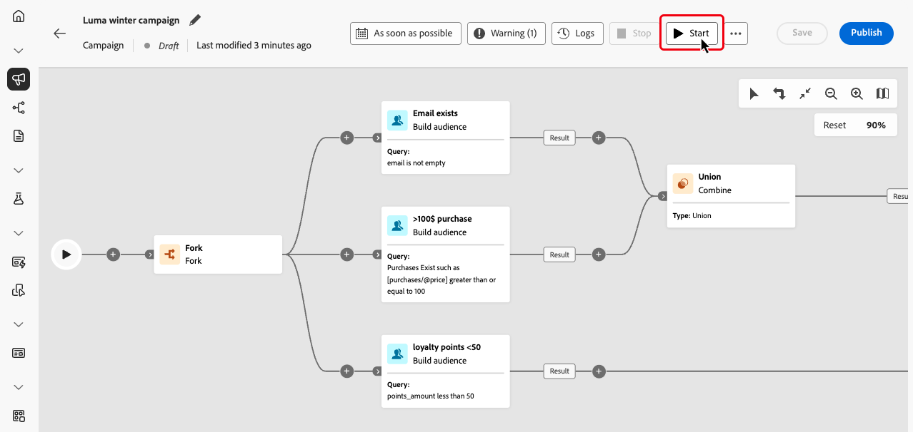
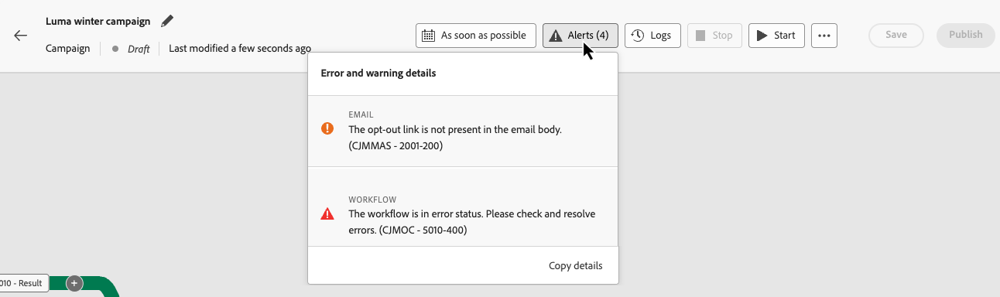
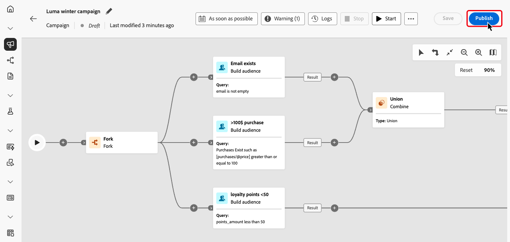
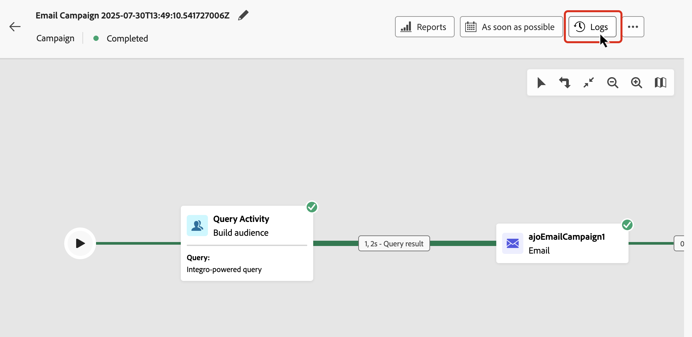

# Start and monitor your Orchestrated campaigns {#start-monitor}

>[!CONTEXTUALHELP]
>id="ajo_campaign_publication"
>title="Publish Orchestrated campaign"
>abstract="To start your campaign, you must publish it. Ensure all errors are cleared before publication."

Once that you have created your orchestrated and designed the tasks to perform in the canvas, you can publish it and monitor how it is being executed. 

You can also execute the campaign in test mode to check its execution and the result of the different activities.

## Test your campaign before publishing {#test}

[!DNL Journey Optimizer] allows you to test Orchestrated campaigns before going live. When a campaign is created, it enters the **Draft** state by default. In this state, you can execute the campaign manually to test the flow. 

>[!IMPORTANT]
>
>All activities in the canvas are executed except **[!UICONTROL Save audience]** activities and channel activities. There is no functional impact on your data or audience.

To test an Orchestrated campaign, open the campaign and select **[!UICONTROL Start]**.

{zoomable="yes"}

Each activity in the campaign is executed sequentially until the end of the diagram is reached. During the test, you can control the campaign execution using the action bar in the canvas. From there, you can:

* **Stop** the execution at any time.
* **Start** the execution again.
* **Resume** the execution if it was previously paused.

The **[!UICONTROL Alerts]** / **[!UICONTROL Warning]** icon in the canvas toolbar notifies you of issues, including warnings that may appear proactively before execution and errors that occur during or after execution.

{zoomable="yes"}

You can also quickly identify failed activities using the [visual status indicators](#activities) displayed directly on each activity. For detailed troubleshooting, open the [campaign's logs](#logs-tasks), which provide in-depth information about the error and its context.

If you have added channel activities in the canvas, you can preview and test the content of your messages using the **[!UICONTROL Simulate Content]** button. [Learn how to work with channel activities](activities/channels.md)

Once validated, the campaign can be published.

## Publish the campaign {#publish}

Once your campaign is tested and ready, click **[!UICONTROL Publish]** to make it live.

{zoomable="yes"}

>[!NOTE]
>
>If the **[!UICONTROL Publish]** button is disabled (greyed out), access the logs from the action bar and check the error messages. All errors must be fixed before being able to publish a campaign.

The visual flow restarts, and real profiles begin flowing through the journey in real-time.

If the publish action fails (e.g., due to missing message content), you are alerted and must fix the issue before retrying. On successful publishing, the campaign begins start executing (immediately or on schedule), moves from **Draft** to **Live** status, and becomes "Read only".

## Monitor campaign execution {#monitor}

### Visual flow monitoring {#flow}

While running (in test or live mode), the visual flow shows how profiles move through the journey in real time. The number of profiles transitioning between tasks is displayed.

{zoomable="yes"}

Data transported from one activity to another through transitions is stored in a temporary work table. This data can be displayed for each transition. To inspect data passed between activities:

1. Select a transition.
1. In the properties pane, click **[!UICONTROL Preview schema]** to view the work table schema. Select **[!UICONTROL Preview results]** to see the transported data.

    {zoomable="yes"}

### Activity execution indicators {#activities}

Visual status indicators help you understand how each activity is performing:

|Visual indicator | Description | 
|-----|------------|
|{zoomable="yes"}{width="70%"}| The activity is currently being executed. |
|{zoomable="yes"}{width="70%"}| The activity requires your attention. This may involve confirming the sending of a delivery or taking a necessary action. |
|{zoomable="yes"}{width="70%"}|The activity has encountered an error. To resolve the issue, open the  Orchestrated campaign logs for more information.|
|{zoomable="yes"}{width="70%"}|The activity has been succesfully executed. | 

### Logs and tasks {#logs-tasks}

>[!CONTEXTUALHELP]
>id="ajo_campaign_logs"
>title="Logs and tasks"
>abstract="The **Logs and tasks** screen provides an history of the Orchestrated campaign execution, recording all user actions and encountered errors."

Monitoring logs and tasks is a key step to analyze your Orchestrated campaigns and make sure they are running properly. Logs and tasks are accessible from the **[!UICONTROL Logs]** button which is available in both test and live mode in the canvas toolbar.

{zoomable="yes"}

The **[!UICONTROL Logs and tasks]** screen provides a complete history of your campaign execution, recording all user actions and encountered errors.

{zoomable="yes"}

Two types of information are available:

* The **[!UICONTROL Log]** tab contains the chronological history of all operations and errors.
* The **[!UICONTROL Tasks]** tab details the step-by-step execution sequence of activities.

In both tabs, you can choose the displayed columns and their order, apply filters, and use the search field to quickly find the desired information.

## Next steps {#next}

After starting the Orchestrated campaign diagram, you can use Journey Optimizer reporting capabilities to get insights such as understanding audience behavior, and measuring the performance of each step in your customer journey. [Learn more on Orchestrated campaigns reporting](../orchestrated/reporting-campaigns.md)
