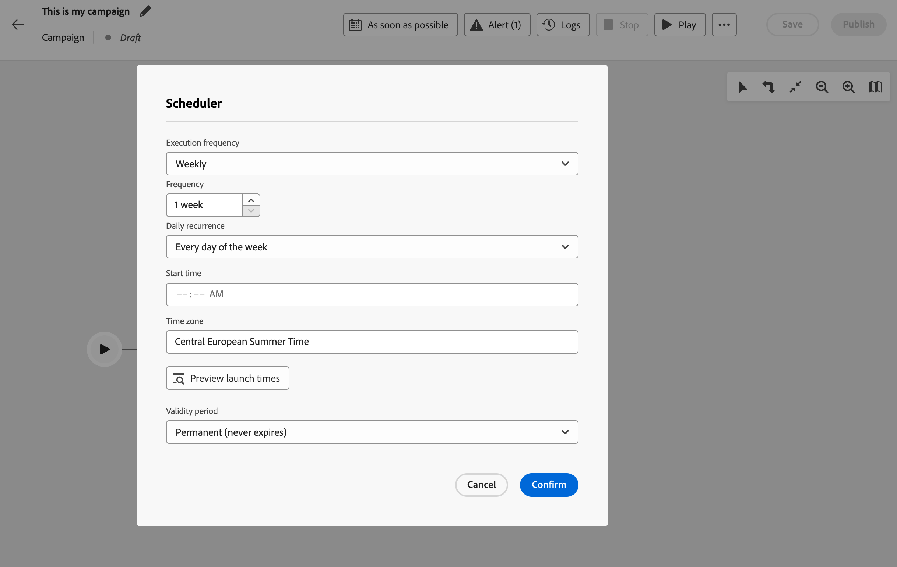
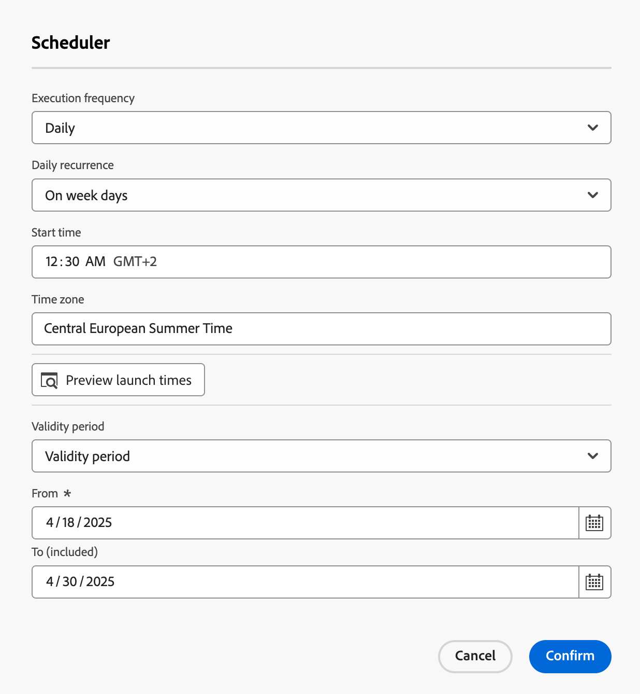
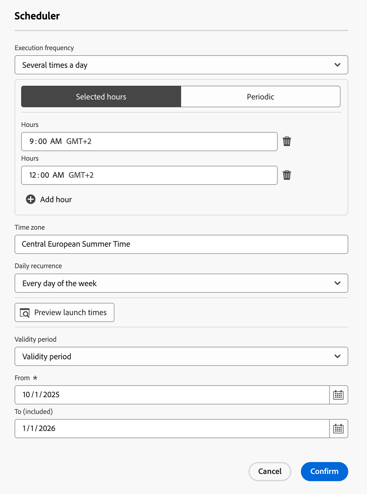
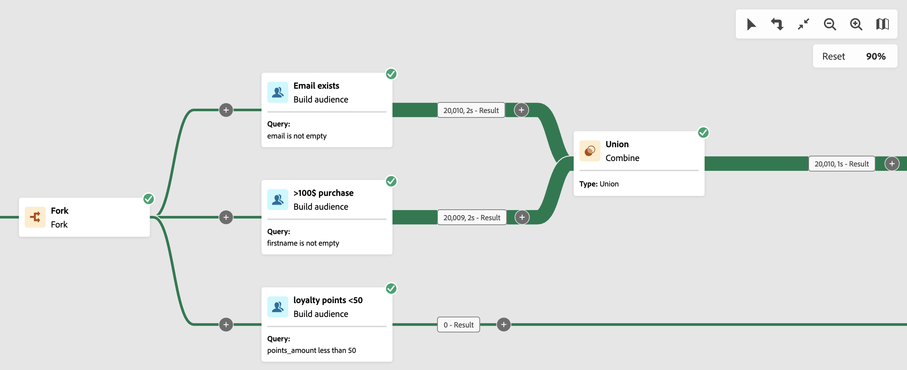
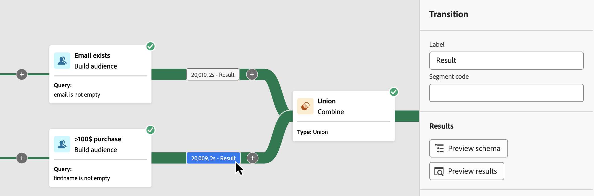
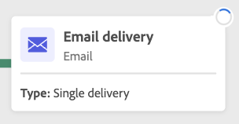
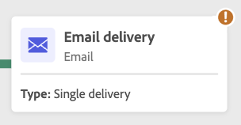
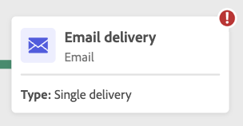
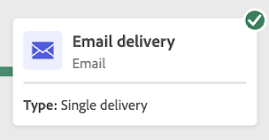
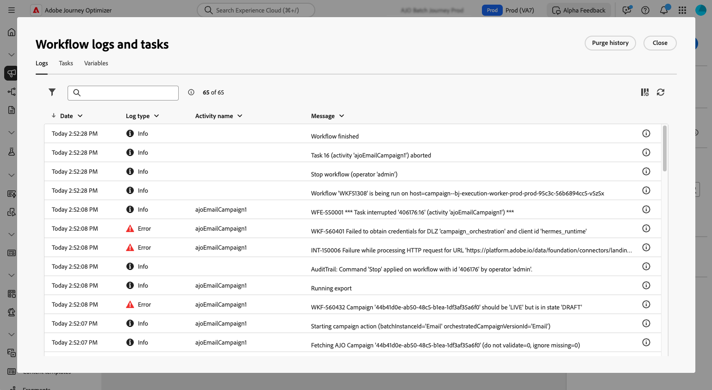

# Schedule and start your orchestrated campaigns {#start-monitor}

>[!CONTEXTUALHELP]
>id="ajo_campaign_publication"
>title="Publish orchestrated campaign"
>abstract="To start your campaign, you must publish it. Ensure all warnings are cleared before publication."

+++ Table of Contents

| Welcome to orchestrated campaigns | Launch your first orchestrated campaign | Query the database | Ochestrated campaigns activities|
|---|---|---|---|
|[Get started with orchestrated campaigns](gs-orchestrated-campaigns.md)  [Configuration steps](configuration-steps.md) <br/[Access and manage orchestrated camapaigns](access-manage-orchestrated-campaigns.md)|[Key steps for orchestrated campaign creation](gs-campaign-creation.md)  [Create and configure the campaign](create-orchestrated-campaign.md)  [Orchestrate activities](orchestrate-activities.md)  [Send messages with orchestrated campaigns](send-messages.md)  <b>[Start and monitor the campaign](start-monitor-campaigns.md)</b>  [Reporting](reporting-campaigns.md)|[Work with the rule builder](orchestrated-rule-builder.md)  [Build your first query](build-query.md)  [Edit expressions](edit-expressions.md)|[Get started with activities](activities/about-activities.md)  Activities: [And-join](activities/and-join.md) - [Build audience](activities/build-audience.md) - [Change dimension](activities/change-dimension.md) - [Combine](activities/combine.md) - [Deduplication](activities/deduplication.md) - [Enrichment](activities/enrichment.md) - [Fork](activities/fork.md) - [Reconciliation](activities/reconciliation.md) - [Split](activities/split.md) -  [Wait](activities/wait.md)|

{style="table-layout:fixed"}

+++

 

Once that you have created your orchestrated and designed the tasks to perform in the canvas, you can publish it and monitor how it is being executed. 

## Schedule orchestrated campaigns {#schedule}

>[!CONTEXTUALHELP]
>id="ajo_orchestration_scheduler"
>title="Scheduler activity"
>abstract="The campaign **Scheduler** allows you to schedule when the orchestrated campaign gets started. This activity should be considered as a scheduled start. It can only be used as the first activity of the orchestrated campaign."

As a campaign manager, you can schedule campaigns to automatically launch at specific times, enabling precise timing and accurate targeting data for marketing communications. 

### Best practices {#scheduler-best-practices}

* Do not schedule an orchestrated campaign to run more than every 15 minutes as it may impede overall system performance and create blocks in the database.
* If you want to send a one-shot message in your orchestrated campaign, you can set it to run **Once**. 
* If you want to send a recurring message in your orchestrated campaign, you need to use a **Scheduling** options and set the execution frequency. The recurring delivery activity does not allow you to define a schedule.

### Configure the campaign schedule {#scheduler-configuration}

>[!CONTEXTUALHELP]
>id="ajo_orchestration_schedule_validity"
>title="Scheduler validity"
>abstract="You can define a validity period for the scheduler. It can be permanent (default), or can be valid until a specific date."

>[!CONTEXTUALHELP]
>id="ajo_orchestration_schedule_options"
>title="Scheduler options"
>abstract="Define the frequency of the scheduler. It can be executed at a specific moment, once or several times a day, week or month."

Follow these steps to configure the **orchestrated campaign schedule**:

1. Select the **As soon as possible** button on the top of your orchestrated campaign canvas.

1. Configure the **Execution frequency**:

   * **Once**: the orchestrated campaign is executed a single time.

   * **Daily**: the orchestrated campaign is executed at a specific time, once a day.

   * **Several times a day:** the orchestrated campaign is regularly executed several times a day. You can set up executions at specific times or periodically.

   * **Weekly**: the orchestrated campaign is executed at a specified moment, once or several times a week.

   * **Monthly**: the orchestrated campaign is executed at a specified moment, once or several times a month. You can select months, when you need the orchestrated campaign to be executed. You can also set up executions on specified week days of the month, such as the second Tuesday of the month.

      {width="50%" align="left"}

1. Define the execution details according to the frequency selected. The detail fields varies depending on the frequency used (time, repetition frequency, specified days, etc.).

1. Click **Preview launch times** to check the schedule of the next ten executions of your orchestrated campaign.

1. Define the validity period of the scheduler:

   * **Permanent (never expires)**: the orchestrated campaign is executed, according to the frequency specified, without any limits to the time frame or number of iterations.

   * **Validity period**: the orchestrated campaign is executed according to the frequency specified, up until a specific date. You need to specify start and end dates. 

1. Select **Confirm** to save your settings. The execution frequency is displayed above the orchestrated campaign canvas. 

>[!TIP]
>
>If you want to start the orchestrated campaign right away, keep the **As soon as possible** default value.

### Example {#scheduler-example}

In the following example, the activity is configured so that the orchestrated campaign runs twice a day at 9 and 12 AM, every day of the week from October 1st, 2025 to January 1st, 2026.

{width="50%" align="left"}

## Start an orchestrated campaign {#start}

To start an orchestrated campaign, navigate to the **[!UICONTROL Orchestration]** tab of the **[!UICONTROL Campaigns]** menu and select the campaign to start, then click the **[!UICONTROL Play]** button in the upper-right corner of the canvas.

Once the  orchestrated campaign is running, each activity in the canvas is executed in a sequential order, until the end of the  orchestrated campaign is reached.

You can track the progress of targeted profiles in real-time using a visual flow. This allows you to quickly identify the status of each activity and the number of profiles transitioning between them.

{zoomable="yes"}

In  orchestrated campaigns, data transported from one activity to another through transitions is stored in a temporary work table. This data can be displayed for each transition. To do this, select a transition to open its properties in the right hand side of the screen.

* Click **[!UICONTROL Preview schema]** to display the schema of the work table.
* Click **[!UICONTROL Preview results]** to visualize the data transported in the selected transition.

{zoomable="yes"}

## Monitor the campaign execution

### Monitor activity execution {#activities}

Visual indicators in the upper-right corner of each activity box allows you to check their execution:

|Visual indicator | Description | 
|-----|------------|
|{zoomable="yes"}{width="70%"}| The activity is currently being executed. |
|{zoomable="yes"}{width="70%"}| The activity requires your attention. This may involve confirming the sending of a delivery or taking a necessary action. |
|{zoomable="yes"}{width="70%"}|The activity has encountered an error. To resolve the issue, open the  orchestrated campaign logs for more information.|
|{zoomable="yes"}{width="70%"}|The activity has been succesfully executed. | 

### Monitor logs and tasks {#logs-tasks}

>[!CONTEXTUALHELP]
>id="ajo_campaign_logs"
>title="Logs and tasks"
>abstract="The **Logs and tasks** screen provides an history of the  orchestrated campaign execution, recording all user actions and encountered errors."

Monitoring logs and tasks is a key step to analyze your orchestrated campaigns and make sure they are running properly. They are accessible from the **[!UICONTROL Logs]** icon which is available in the action tool bar, and in each activity's properties pane.

The **[!UICONTROL Logs and tasks]** menu provides an history of the  orchestrated campaign execution, recording all user actions and encountered errors.

{zoomable="yes"}

Two types of information are available:

* The **[!UICONTROL Log]** tab contains the execution history of all the  orchestrated campaign activities. It indexes the operations carried out and execution errors by chronological order.
* The **[!UICONTROL Tasks]** tab details the execution sequencing of the activities. 

In both tabs, you can choose the displayed columns and their order, apply filters, and use the search field to quickly find the desired information.

## Orchestrated campaign execution commands {#execution-commands}

The action bar in the upper-right corner provides commands that allow you to manage the  orchestrated campaign execution. You can:

* **[!UICONTROL Start]** / **[!UICONTROL Resume]** the execution of the   orchestrated campaign, which then takes on the In progress status. If the  orchestrated campaign was paused, it is resumed, otherwise it is started and the initial activities are then activated.

* **[!UICONTROL Pause]** the execution of the  orchestrated campaign, which then takes on the Paused status. No new activities will be activated until it is resumed, but operations in progress are not suspended.

* **[!UICONTROL Stop]** a  orchestrated campaign that is being executed, which will then take on the Finished status. The operations in progress are interrupted if possible. You cannot resume from the  orchestrated campaign from the same place that it was stopped.
