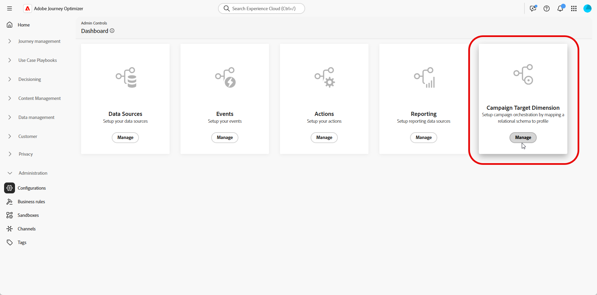
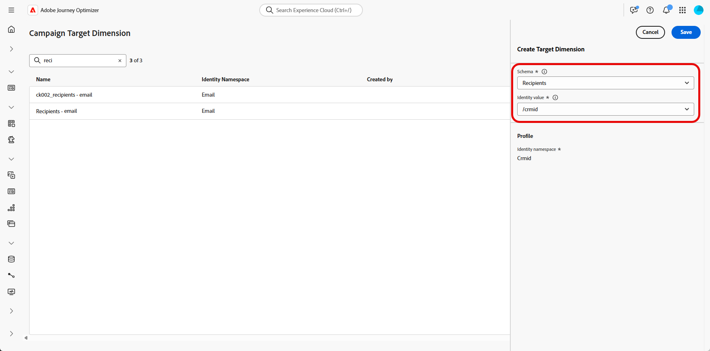
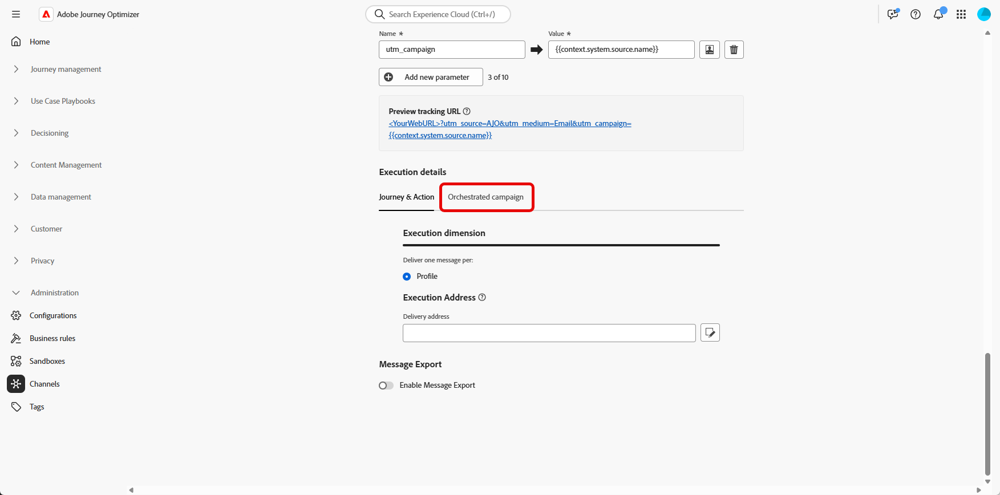
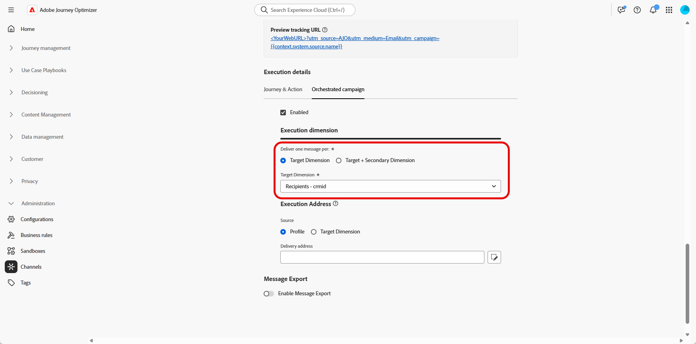

# Configure a Targeting dimension {#configuration}

+++ Table of Contents

| Welcome to orchestrated campaigns | Launch your first orchestrated campaign | Query the database | Ochestrated campaigns activities|
|---|---|---|---|
|[Get started with orchestrated campaigns](gs-orchestrated-campaigns.md)  Create and manage relational Schemas and Datasets:  <ul><li>[Get started with Schemas and Datasets](gs-schemas.md)</li><li>[Manual schema](manual-schema.md)</li><li>[File upload schema](file-upload-schema.md)</li><li>[Ingest data](ingest-data.md)</li></ul>[Access and manage orchestrated campaigns](access-manage-orchestrated-campaigns.md)  [Key steps to create an orchestrated campaign](gs-campaign-creation.md)  [Configure a Target dimension](target-dimension.md)|<b>[Create and schedule the campaign](create-orchestrated-campaign.md)</b>  [Orchestrate activities](orchestrate-activities.md)  [Start and monitor the campaign](start-monitor-campaigns.md)  [Reporting](reporting-campaigns.md)|[Work with the rule builder](orchestrated-rule-builder.md)  [Build your first query](build-query.md)  [Edit expressions](edit-expressions.md)  [Retargeting](retarget.md)|[Get started with activities](activities/about-activities.md)  Activities: [And-join](activities/and-join.md) - [Build audience](activities/build-audience.md) - [Change dimension](activities/change-dimension.md) - [Channel activities](activities/channels.md) - [Combine](activities/combine.md) - [Deduplication](activities/deduplication.md) - [Enrichment](activities/enrichment.md) - [Fork](activities/fork.md) - [Reconciliation](activities/reconciliation.md) - [Save audience](activities/save-audience.md) - [Split](activities/split.md) - [Wait](activities/wait.md)|

{style="table-layout:fixed"}

+++

 

>[!BEGINSHADEBOX]

 

The content on this page is not final and may be subject to change.

>[!ENDSHADEBOX]

In many cases, a single customer profile can be linked to multiple related entities, such as subscriptions, service contracts, or devices, each with its own unique identifier and communication needs. 

With **Orchestrated Campaigns**, you can now design and deliver targeted communications at the entity level, using **Adobe Experience Platform's relational schema capabilities**. This allows you to segment, personalize, and report per entity instead of per recipient.

## Create your Targeting dimension {#targeting-dimension}

A single customer profile can be associated with multiple related entities, such as contracts, devices, or subscriptions, each having its own unique identifier. This setup lets you target, segment, and report on each entity individually. 

Start by setting up campaign orchestration by mapping a relational schema to the customer profile.

1. From **[!UICONTROL Administration]**, access the **[!UICONTROL Configurations]** menu and select **[!UICONTROL Campaign Target Dimension]**.
     
     

1. Click **[!UICONTROL Create]** to start creating your **[!UICONTROL Targeting dimension]**.

1. Choose your [previously configured Schema](gs-schemas.md) ​from the drop-down.

1. Select the **[!UICONTROL Identity value]** that represents the entity you want to target.
     
     In this example, the customer profile is linked to multiple subscriptions, each represented by a unique `crmID` in the `Recipient` schema. By setting the **[!UICONTROL Target Dimension]** to use the `Recipient` schema and its `crmID` identity, you can send messages at the subscription level, rather than to the main customer profile, ensuring each contract or line receives its own personalized message.

     [Learn more in Adobe Experience Platform documentation](https://experienceleague.adobe.com/en/docs/experience-platform/xdm/schema/composition#identity)

     

1. Click **[!UICONTROL Save]** to complete the setup.

After configuring the **[!UICONTROL Target Dimension]**, proceed to create and set up your **[!UICONTROL Channel Configuration]** and define the corresponding **[!UICONTROL Execution Details]**.

## Configure your Channel configuration {#channel-configuration}

After setting up your **[!UICONTROL Target Dimension]**, you need to configure your Email or SMS **[!UICONTROL Channel Configuration]** and define the appropriate **[!UICONTROL Execution Details]**. This ensures messages are sent using the correct identity and targeting logic.

1. Start by creating and configuring your **[!UICONTROL Channel configuration]**.

     You can also update an existing **[!UICONTROL Channel configuration]**.

     ➡️ [Follow the steps detailed in this page](../email/surface-personalization.md)

1. From the **[!UICONTROL Execution details]** section of your **[!UICONTROL Channel configuration]**, access the **[!UICONTROL Orchestrated campaigns]** tab.

     

1. Click **[!UICONTROL Enabled]** to make it compatible with Orchestrated campaigns.

1. Choose your delivery method:

     * **[!UICONTROL Target Dimension]**: send to the primary entity e.g., recipient.

     * **[!UICONTROL Target + Secondary Dimension]**: send using both primary and secondary entities e.g., recipient + contract.

1. Select from the drop-down your [previously created Target Dimension](#targeting-dimension).

     

1. Under the **[!UICONTROL Execution Address]** section, choose which **[!UICONTROL Source]** should be used to fetch the delivery address, such as the email address or phone number:

     * **[!UICONTROL Profile]**: Select this option if the delivery address, e.g. email, is stored directly in the main customer profile.

          Useful when sending messages to the main customer, not a specific associated entity.

     * **[!UICONTROL Target Dimension]**: Choose this if the delivery address is stored in the related entity, e.g. a recipient or subscription.
     
          Useful when each recipient has their own delivery address such as a different email or phone number.

1. From the **[!UICONTROL Delivery address]** field, click  to choose the specific field to use for your message delivery.

     

1. Once configured, click **[!UICONTROL Submit]**.

Your channel is now ready to use with **Orchestrated Campaigns**, and messages will be delivered according to the selected target dimension.
