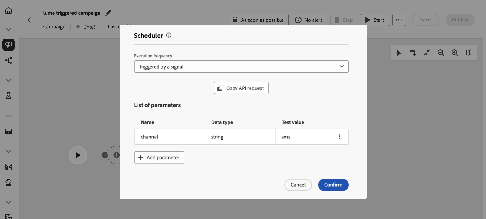
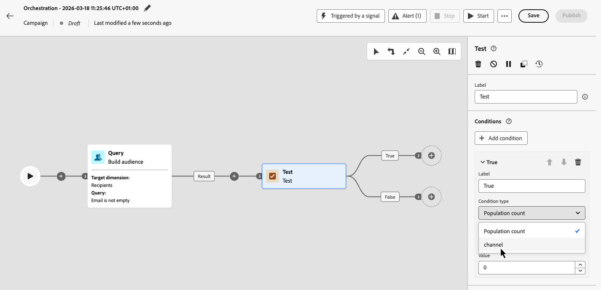
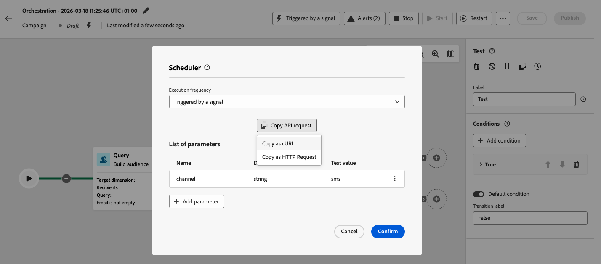

# Trigger Orchestrated campaigns using a signal {#trigger-signal}

You can trigger an Orchestrated campaign by sending it a signal instead of running it on a schedule. The signal is sent via an API call from an external system or application. When using a signal, you can pass parameters. They are then made available in the orchestrated campaign as event variables in the execution context — for use in targeting, conditions, or expressions.

For the full REST specification of the trigger endpoint (paths, headers, body, responses, and errors), see [Trigger Orchestrated campaigns API](https://developer.adobe.com/journey-optimizer-apis/references/oc-trigger){target="_blank"} in the Adobe Journey Optimizer API documentation.

End-to-end process to trigger an Orchestrated campaign using a signal:

1. [Schedule the campaign to be triggered by a signal](#set-an-orchestrated-campaign-to-wait-for-a-signal-configure-signal)
1. [Add parameters for the signal payload](#add-parameters-for-the-signal-payload-optional-parameters) (optional)
1. [Build and test the campaign](#build-and-test-the-campaign-build-and-test)
1. [Publish and trigger the campaign](#publish-and-trigger-the-campaign-publish)

>[!NOTE]
>
>To trigger an Orchestrated campaign using a signal, you need the **[!DNL Publish orchestrated campaigns]** permission (`orchestrated-campaign.publish`). See [Built-in permissions](../administration/ootb-permissions.md).

## Schedule the campaign to be triggered by a signal {#configure-signal}

To set an orchestrated campaign to start on a signal instead of a schedule, follow these steps:

1. Open the Orchestrated campaign you want to trigger using a signal.

1. Open the schedule configuration. [Learn how to schedule an Orchestrated campaign](create-orchestrated-campaign.md#schedule).

1. Select **[!UICONTROL Triggered by a signal]** so that the campaign waits for a signal instead of running on a schedule.

   {zoomable="yes"}

## Add parameters for the signal payload (optional) {#parameters}

You can pass parameters in the trigger signal and use them in your campaign in the execution context—for example, in targeting, conditions, or expressions. Define each parameter in the schedule settings first, then pass its value when you call the trigger API.

1. Open the campaign scheduler and select **[!UICONTROL Add parameter]**.

1. Define each parameter's name and data type to send in the signal payload. You can also provide **Test values** that will be used when you trigger the campaign in test mode. [Learn how to test a triggered campaign](#build-and-test).

   {zoomable="yes"}

>[!NOTE]
>
>If you pass a parameter in the API call that has not been defined in the scheduler, the API call still succeeds and the parameter is propagated, and you can use it in expressions. However, the orchestrated campaign interface will not help you use it—for example, the Test activity will not list or show parameters that were not defined in the scheduler.

## Build and test the campaign {#build-and-test}

Build your campaign on the canvas, then optionally test it in draft by triggering the signal via the API before you publish.

1. Add and connect activities (audience, targeting, deliveries) on the canvas. [Learn how to orchestrate campaign activities](orchestrate-activities.md)

1. If you've defined parameters in the signal, you can wire them into your canvas logic (for example, in conditions or targeting). In this example, the "channel" parameter is used as a condition in a **[!UICONTROL Test]** activity.

   

   To use a signal parameter in the expression editor (for example, to build a query in a **[!UICONTROL Build audience]** activity), type `$(vars/@<parameterName>)` in the expression field. Replace `<parameterName>` with the parameter name defined in the scheduler—for example, `$(vars/@channel)`. [Learn how to work with the expression editor](edit-expressions.md).

1. Open the campaign scheduler, select **[!UICONTROL Copy API request]** and choose the format (cURL or HTTP Request).

   The copied information includes the orchestrated campaign ID, sandbox name, organization ID, and test values for your parameters if you have added some.

   

   +++Sample cURL request with a parameter and a test value

   ```bash
   
   POST https://platform.adobe.io/ajo/campaign-orchestration/orchestratedCampaigns/1c7529c7-7a8c-491a-a2c6-3d8131d2e17d/trigger

   Headers:
   Authorization: Bearer ## Access token ##
   Content-Type: application/json
   x-api-key: ## Provide API Key here ##
   x-api-version: 1
   x-gw-ims-org-id: 123456ABCDEFG@LumaOrg
   x-sandbox-name: prod

   Body:
   {
   "variables": {
      "channel": "sms"
   }
   }

   ```

   +++

1. Click **[!UICONTROL Start]** to start the campaign.

1. Send the trigger API call using the sample request you have copied from the scheduler. See [Trigger Orchestrated campaigns API](https://developer.adobe.com/journey-optimizer-apis/references/oc-trigger){target="_blank"} for request and response details.

When you are satisfied with the test results, [publish the campaign](#publish).

## Publish and trigger the campaign {#publish}

After you have [built and tested the campaign](#build-and-test), publish the campaign so it can be triggered from your application.

1. Click **[!UICONTROL Publish]** in the campaign canvas. The campaign must be published before it can be triggered from an external system. [Learn more on starting and monitoring the campaign](start-monitor-campaigns.md#publish).

1. Open the campaign scheduler, select **[!UICONTROL Copy API request]**  and choose the format (cURL or HTTP Request).

   The copied information includes the orchestrated campaign ID, sandbox name, organization ID, and parameters if you have added some.

   

1. Call the trigger API from your system. Refer to [Trigger Orchestrated campaigns API](https://developer.adobe.com/journey-optimizer-apis/references/oc-trigger){target="_blank"} for the live endpoint specification.

   >[!IMPORTANT]
   >
   >For a live orchestrated campaign, a throttle guardrail enforces a **minimum interval of one hour** between two API trigger executions. If you call the API again before that interval has elapsed, the API returns **HTTP 429** error (Too many requests). This guardrail is not applied when you trigger a draft version to test it.

   If you added parameters to the signal payload, the values you pass in the API call are exposed as campaign event variables when the campaign runs. To inspect them, open the campaign logs from the campaign canvas toolbar. In the **[!UICONTROL Tasks]** tab, identify the task corresponding to the signal and click the pencil icon to access the related event variables. [Learn how to access logs and tasks](start-monitor-campaigns.md#logs-tasks).

   {zoomable="yes"}
