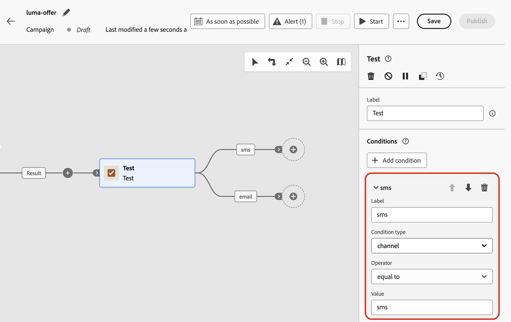

# Use variables in Orchestrated campaigns {#variables-oc}

>[!BEGINSHADEBOX]

**On this page:** Learn how to set variables from a signal or from global definitions and use them to drive targeting, conditions, and Test activity logic in Orchestrated campaigns.

>[!ENDSHADEBOX]

## How to set variables {#set}

In an Orchestrated campaign, you can work with variables, i.e. values that drive targeting, **[!UICONTROL Test]** conditions, and other canvas logic. Those values can come from two places:

* **A signal** — If the campaign schedule is **[!UICONTROL Triggered by a signal]**, you can pass parameters when you fire the campaign. Those parameters become available as variables in the triggered Orchestrated campaign for that run. [Learn how to trigger an Orchestrated campaign using a signal](trigger-orchestrated-campaign.md)

* **Global variables** — You can define name–value pairs directly on the campaign using the **[!UICONTROL Edit variables]** menu, with no API or signal required. [Learn how to define global variables in Orchestrated campaigns](global-variables.md)

>[!NOTE]
>
>For now, variables support **text** values only.
>
>Variables drive **canvas logic** (rules, conditions) and cannot be used for message personalization.

## Use variables in the canvas {#use}

Variables are available in the following places on the canvas:

* **Rule builder** — Open the expression editor for a rule and use the **event variables** picker to select a variable and insert its reference into your expression. [Learn how to edit expressions](edit-expressions.md)

  In the example below, a variable named `brand` was passed in, and the rule uses it as a filter condition.

  {zoomable="yes"}

* **[!UICONTROL Test] activity** — When you define a condition, the **[!UICONTROL Condition type]** drop-down lists all variables in scope alongside **[!UICONTROL Population count]**. Select a variable to use it as the basis for a test branch. [Learn how to configure the **[!UICONTROL Test]** activity](activities/test.md)

  In the example below, the `channel` variable is used to route the flow to different transitions depending on its value.

  {zoomable="yes"}
