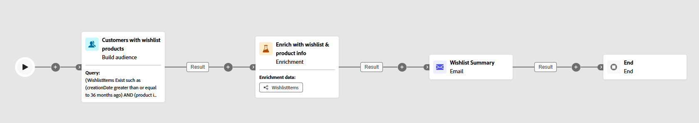
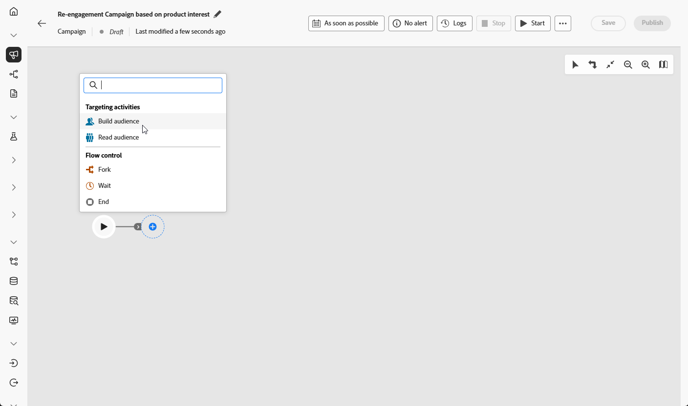
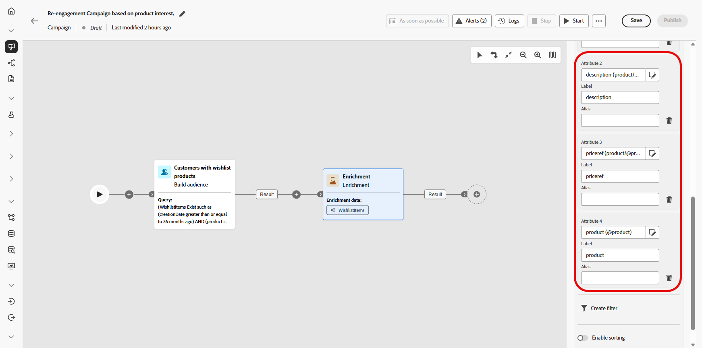

# Send wishlist item updates {#wishist-uc}

>[!BEGINSHADEBOX]

While this example uses a **Wishlist** schema, the same method applies to any entity with a one-to-many relationship to **Recipients** such as **Purchases**, **Subscriptions**, or any custom schema in which each recipient may have multiple associated records.

**Schemas needed for this use case:**

* **Recipients**: used as the targeting dimension
* **WishlistItems**: with fields: `creationDate`, `product`, `Wishlistid`
* **Product**: with fields: `description`, `priceref`, `imageurl`
* **AbandonedCarts** (optional): with field: `lastmodified`

➡️ [Learn how to configure relational schemas](gs-schemas.md)

>[!ENDSHADEBOX]

{zoomable="yes"}

This orchestrated campaign focuses on re-engaging visitors by reminding them of products saved to their Wishlist. Using Campaign Orchestration, define the audience with conditions based on Wishlist activity, helping drive visitors back to convert.

1. Start by creating a new campaign specifically aimed at Wishlist re-engagement. This will help focus messaging on customers who have shown purchase intent by saving items.

    {zoomable="yes"}

1. Fill in your **Campaign settings**.

1. Add a **[!UICONTROL Build audience]** activity to identify the group of customers to target based on Wishlist behavior.

    {zoomable="yes"}

1. Set a descriptive **[!UICONTROL Label]** for this audience and choose **[!UICONTROL Recipients]** as **[!UICONTROL Targeting dimension]**. Then click **[!UICONTROL Continue]** to configure the audience.

1. Click **[!UICONTROL Add condition]** to refine your audience by creating the following condition:

    `WishlistItems Exist such as (creationDate greater than or equal to 36 months ago) AND (product is not empty`
    OR
    `AbandonedCarts Exist such as lastmodified greater than or equal to 36 months ago`

    This audience is based on recipients who have a Wishlist, contain items with product images, or have an abandoned cart within the defined timeframe.

    {zoomable="yes"}

1. Click **[!UICONTROL Calculate]** to see the number of profiles impacted by these conditions and **[!UICONTROL View results]** to inspect details for each condition and confirm the audience matches your target segment.

    {zoomable="yes"}

1. Click **[!UICONTROL Confirm]**.

1. Add an **[!UICONTROL Enrichment]** activity to personalize the campaign with **Wishlist** and **product information**. 

    {zoomable="yes"}

1. Click **[!UICONTROL Add enrichment data]**.

1. Access `Targeting dimension > Wishlistitems > Wishlistid`.

    {zoomable="yes"}

1. Select how the data is collected, in this case, **[!UICONTROL Collect data]** to gather Wishlist details for your audience.

1. Choose the number of lines to retrieve. By default, three items per Wishlist are retrieved, but this can be adjusted depending on campaign needs to highlight more or fewer products.

1. Click **[!UICONTROL Add attribute]** to create following three attributes:

    * `Product > description`
    * `Product > priceref`
    * `Product > imageurl`

    This enriches the message with detailed product information to drive conversions.

    {zoomable="yes"}

1. Add an email activity to create an individually personalized re-engagement message for each customer. Click **[!UICONTROL Edit content]** to start designing your content.

   ➡️ [Learn more on email personalization](../email/content-from-scratch.md)

    {zoomable="yes"}

1. After finalizing the email, save and run the campaign in draft mode by clicking **[!UICONTROL Start]** from your orchestrated campaign.

1. After starting draft mode, preview the audience with Wishlist details. 

    For deeper insights, click an output result and select **[!UICONTROL Preview results]**.

    {zoomable="yes"}

After the campaign has run, we can explore our reports, which gives us a robust set of data and KPIs about how our campaign is performing.

➡️ [Learn more on reporting](../reports/campaign-global-report-cja.md)
