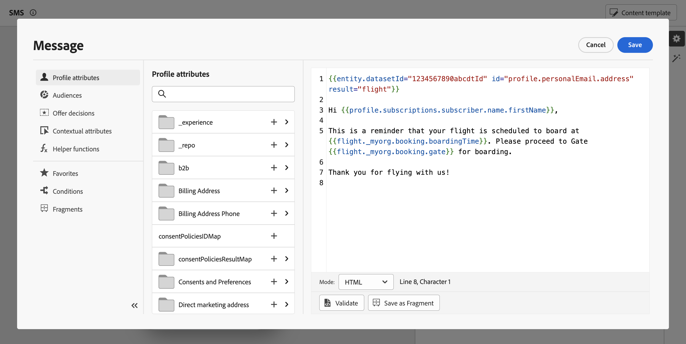

# Use Adobe Experience Platform data for personalization {#aep-data}

>[!BEGINSHADEBOX]

**On this page:** Learn how to use the datasetLookup helper function in the personalization editor to retrieve fields from Adobe Experience Platform record datasets and personalize your content.

>[!ENDSHADEBOX]

>[!AVAILABILITY]
>
>This feature is currently available to all customers as a limited availability release.
>
>For now, the "datasetLookup" helper function can be used within expression fragments for a limited set of customers. To gain access, contact your Adobe representative.

Journey Optimizer allows you to leverage data from Adobe Experience Platform record datasets in the personalization editor to [personalize your content](../personalization/personalize.md). Before starting, datasets needed for lookup personalization must first be enabled for lookup. Detailed information is available in this section: [Use Adobe Experience Platform data](../data/lookup-aep-data.md).

Once a dataset has been enabled for lookup personalization, you can use its data to personalize your content into [!DNL Journey Optimizer].

1. Open the personalization editor, which is available in every context where you can define personalization such as messages. [Learn how to work with the personalization editor](../personalization/personalization-build-expressions.md)

1. Navigate to the helper functions list and add the **datasetLookup** helper function to the code pane.

    

1. This function provides a predefined syntax to allow you to call fields from your Adobe Experience Platform datasets. The syntax is as follows:

    ```

    {{datasetLookup datasetId="datasetId" id="key" result="store" required=false}}

    ```

    * **datasetId** is the ID of the dataset you are working with.
    * **id** is the ID of the source column that should be joined with the primary identity of the look up dataset. 

        >[!NOTE]
        >
        >The value entered for this field can be either a field ID (`profile.packages.packageSKU`), a field passed in a journey event (`context.journey.events.event_ID.productSKU`), or a static value (`sku007653`). In any case, the system will use the value and lookup into the dataset to check if it matches a key.
        >
        >If using a literal string value for the key, keep the text in quotes. Eg: `{{datasetLookup datasetId="datasetId" id="SKU1234" result="store" required=false}}`. If using an attribute value as a dynamic key, remove the quotes. Eg: `{{datasetLookup datasetId="datasetId" id=category.product.SKU result="SKU" required=false}}`

    * **result** is an arbitrary name that you need to provide to reference all the field values you are going to retrieve from the dataset. This value will be used in your code to call each field.

    * **required=false**: If required is set to TRUE, the message will only be delivered if a matching key is found. If set to false, a matching key is not required and the message can still be delivered. Note that, if set to false, it is recommended that you account for fallback or default values in your message content.

    +++Where to retrieve a dataset ID?

    Dataset IDs can be retrieved in Adobe Experience Platform user interface. Learn how to work with datasets in the [Adobe Experience Platform documentation](https://experienceleague.adobe.com/en/docs/experience-platform/catalog/datasets/user-guide#view-datasets){target="_blank"}.

    

    +++

1. Adapt the syntax to suit your needs. In this example, we want to retrieve data related to passengers' flights. The syntax is as follows:

    ```

    {{datasetLookup datasetId="1234567890abcdtId" id=profile.upcomingFlightId result="flight"}}

    ```
    
    * We are working in the dataset whose ID is "1234567890abcdtId",
    * The field we want to use to make a join with the look up dataset is *profile.upcomingFlightId*,
    * We want to include all the field values under the "flight" reference.

1. Once that the syntax to call in the Adobe Experience Platform dataset has been configured, you can specify which fields you want to retrieve. The syntax is as follows:

    ```

    {{result.fieldId}}

    ```

    >[!NOTE]
    >
    >When referencing a dataset field, make sure that you match the full field path as defined within the schema.
    >
    >There are no hard limits on the number of fields that can be pulled using the helper function. However, for best performance, it is recommended to keep the number of fields under 50 to avoid impacting throughput.

    * **result** is the value that you have assigned to the **result** parameter in the **datasetLookup** helper function. In this example, "flight".
    * **fieldID** is the ID of the field you want to retrieve. This ID is visible in [!DNL Adobe Experience Platform] user interface when browsing the record schema related to your dataset:

        +++Where to retrieve a field ID?

        Fields IDs can be retrieved when previewing a dataset in Adobe Experience Platform user interface. Learn how to preview datasets in the [Adobe Experience Platform documentation](https://experienceleague.adobe.com/en/docs/experience-platform/catalog/datasets/user-guide#preview){target="_blank"}.

        

        +++

    In this example, we want to use information related to the passengers' boarding time and gate. We therefore add these two lines:

    * `{{flight._myorg.booking.boardingTime}}`
    * `{{flight._myorg.booking.gate}}`

1. Now that your code is ready, you can complete your content as usual, and test it using either simulation method: click **[!UICONTROL Simulate content]** to test content variations with sample input data or AI auto-generation, or click **[!UICONTROL Simulate content]**, then select **[!UICONTROL Simulate content (AEP profiles)]** from the dropdown to preview with test profiles. [Learn how to preview and test content](../content-management/preview-test.md)


    

## Quick reference {#quick-reference}

This section contains structured knowledge intended to support interpretation, retrieval, and question answering related to this topic.

For complete understanding, this information should be combined with the documentation on this page. Neither source is intended to stand alone; the page describes the feature, while this section provides additional context that helps disambiguate terminology, intent, applicability, and constraints.

>[!BEGINTABS]

>[!TAB Overview]

**TL;DR**

This page teaches how to use the `datasetLookup` helper function in the Journey Optimizer personalization editor to retrieve fields from Adobe Experience Platform record datasets and incorporate them into message personalization.

**Intents**

* Enable an AEP record dataset for lookup personalization
* Add the `datasetLookup` helper function to a personalization expression
* Configure the function with a dataset ID, join key, result alias, and required flag
* Reference retrieved dataset fields in personalization expressions using the result alias
* Test personalized content using the Simulate content flow

>[!TAB Glossary]

* **datasetLookup**: A helper function in the personalization editor that retrieves field values from an AEP record dataset by joining on a specified key. *(product-specific)*
* **Record dataset**: An Adobe Experience Platform dataset type containing record-level data that can be enabled for lookup personalization. *(product-specific)*
* **Lookup personalization**: The process of fetching fields from an AEP record dataset at send time to personalize message content. *(product-specific)*
* **result parameter**: An arbitrary alias assigned in the `datasetLookup` call; used to reference all retrieved field values in subsequent expressions (e.g. `{{result.fieldId}}`).
* **required parameter**: A boolean flag in `datasetLookup` that controls whether message delivery requires a matching key to be found in the dataset.

>[!TAB Terminology]

* **Canonical name:** datasetLookup — variants: dataset lookup, dataset lookup helper, dataset lookup helper function
* **Synonyms:** "datasetLookup" = "dataset lookup helper function"
* **Do not confuse:** "datasetId" (identifier of the AEP dataset) ≠ "id" (the source column used to join with the dataset's primary identity) ≠ "result" (the alias for referencing retrieved field values)

>[!TAB Guardrails & Limitations]

* Feature is in Limited Availability — not yet generally available to all customers.
* The `datasetLookup` helper function within expression fragments is available to a limited set of customers only; contact your Adobe representative to gain access.
* Datasets must be explicitly enabled for lookup personalization before they can be used with `datasetLookup`.
* Keep the number of fields retrieved per `datasetLookup` call under 50 to avoid impacting throughput (recommended limit — no hard limit is stated on the page).

>[!TAB FAQ]

**Q: What is the `datasetLookup` helper function?**

It is a helper function in the personalization editor that retrieves field values from Adobe Experience Platform record datasets, allowing you to incorporate that data into message personalization.

**Q: What happens if `required=false` and no matching key is found in the dataset?**

The message can still be delivered. It is recommended to account for fallback or default values in your message content when using `required=false`.

**Q: What happens if `required=true` and no matching key is found?**

The message will only be delivered if a matching key is found in the dataset.

**Q: Where do I find the dataset ID and field IDs needed for the syntax?**

Dataset IDs can be retrieved in the Adobe Experience Platform UI under Datasets. Field IDs are visible when previewing a dataset and browsing the record schema in the AEP UI.

**Q: How do I test content that uses `datasetLookup`?**

Use the **Simulate content** button to test with sample input data or AI auto-generation, or select **Simulate content (AEP profiles)** from the dropdown to preview with test profiles.

>[!ENDTABS]

<!-- ai-section-version: 1 | source-hash: 89d99e47 -->
