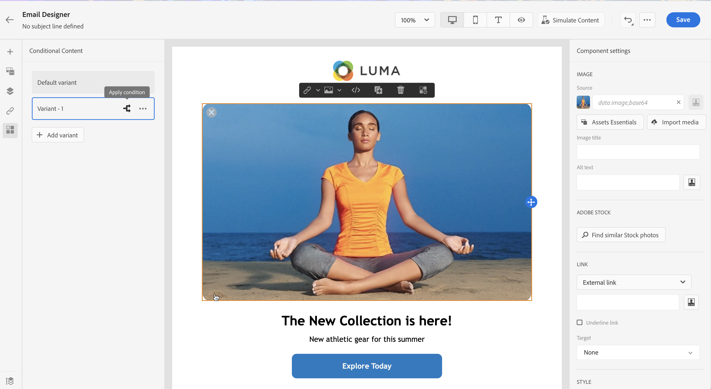
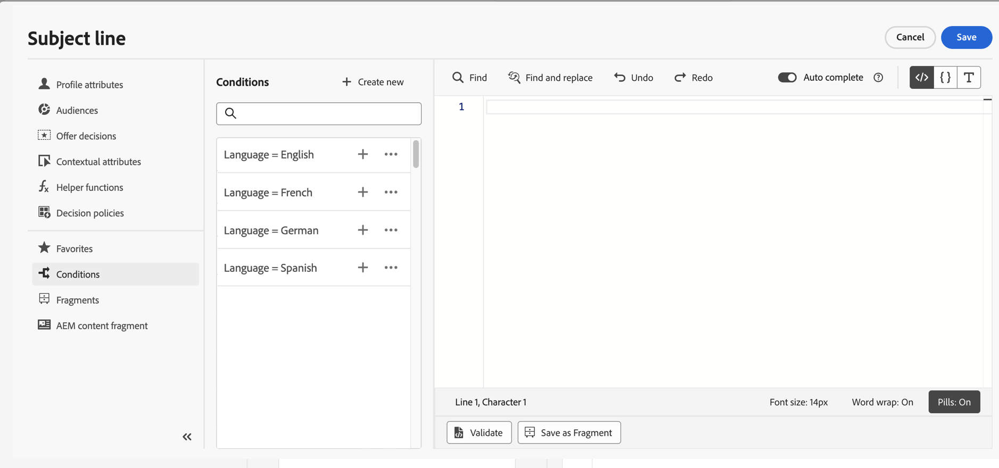
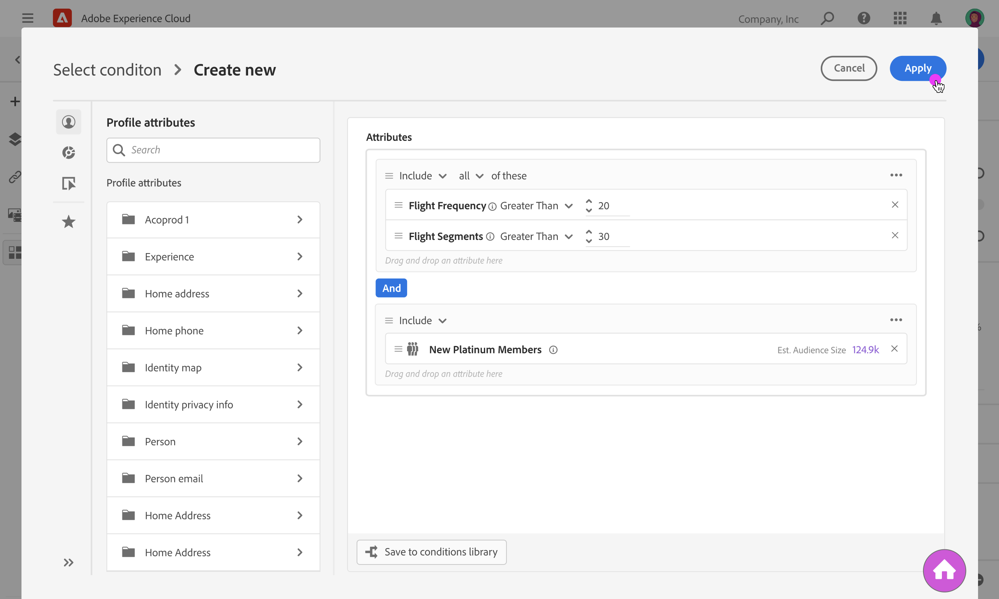
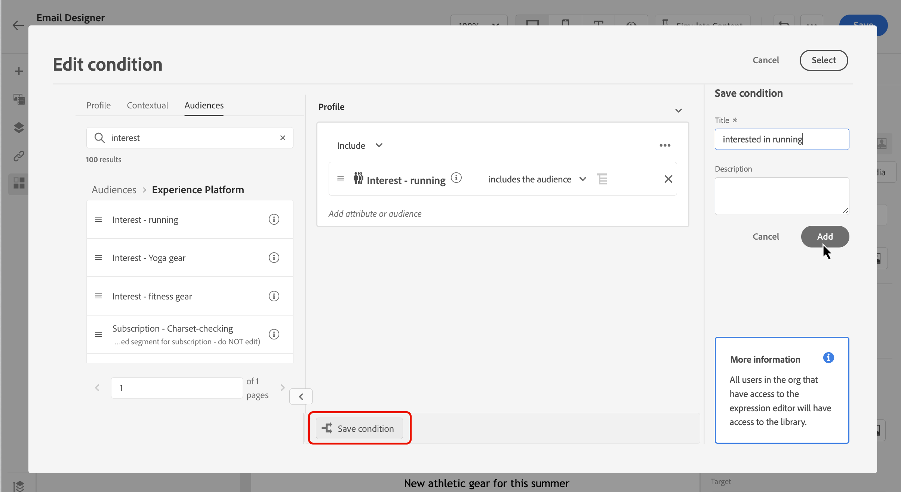
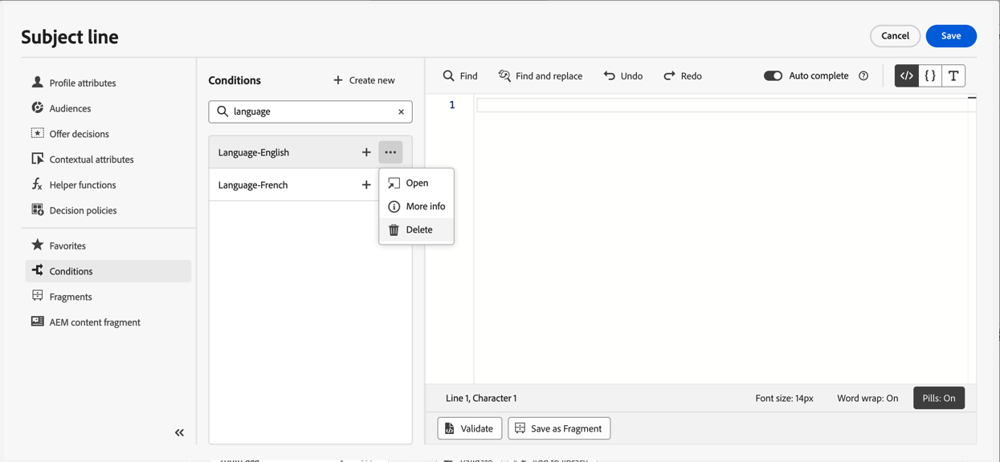

# Work with conditional rules {#conditions}

>[!BEGINSHADEBOX]

**On this page:** Learn how to build conditional rules from profile attributes, contextual events, and audiences in the personalization editor, and save them to the library for reuse across your content.

>[!ENDSHADEBOX]

Conditional rules are sets of rules that define which content should be displayed in your messages, depending on various criteria like profiles' attributes, audience membership or contextual events.

Conditional rules are created using the personalization editor and can be stored if you want to reuse them across your contents. [Learn how to save a conditional rule to the library](#save)

>[!NOTE]
>
>Individuals will need the [Manage Library Items](../administration/ootb-product-profiles.md) permission to save or delete conditional rules. Saved conditions are available for use by all users within an organization.

## Access the conditional rule builder {#access}

Conditional rules are created from the **[!UICONTROL Conditions]** menu within the personalization editor, which is accessible either:

* From the Email Designer, when enabling dynamic content for a component in the email body. [Learn how to add dynamic content into emails](dynamic-content.md#emails)

    

* In any field where you can add personalization using the [personalization editor](personalization-build-expressions.md).

    

## Create a conditional rule {#create-condition}

>[!CONTEXTUALHELP]
>id="ajo_expression_editor_conditions_create"
>title="Create condition"
>abstract="Combine profile attributes, contextual events or audiences to build rules that define which content should be displayed in your messages."

>[!CONTEXTUALHELP]
>id="ajo_expression_editor_conditions"
>title="Create condition"
>abstract="Combine profile attributes, contextual events or audiences to build rules that define which content should be displayed in your messages."

The steps to create a conditional rule are as follows:

1. Access the **[!UICONTROL Conditions]** menu from the personalization editor or the Email Designer, then click **[!UICONTROL Create new]**.

1. Build the conditional rule according to your needs. To do this, drag and drop and arrange the desired attributes from the left menu into the canvas. 

    The steps to combine attributes into the canvas are similar to the segment building experience. For more information on how to work with the rule builder canvas, refer to [this documentation](https://experienceleague.adobe.com/docs/experience-platform/segmentation/ui/segment-builder.html#rule-builder-canvas).
    
    

    Attributes are organized into three tabs:

    * **[!UICONTROL Profile]**:
        * **[!UICONTROL Audiences]** lists all audience attributes (i.e. status, version etc.) for [Adobe Experience Platform Segmentation service](https://experienceleague.adobe.com/docs/experience-platform/segmentation/home.html){target="_blank"},
        * **[!UICONTROL XDM Individual profiles]** lists all the profile attributes associated to the [Experience Data Model (XDM) schema](https://experienceleague.adobe.com/docs/experience-platform/xdm/home.html){target="_blank"} defined in Adobe Experience Platform.
    * **[!UICONTROL Contextual]**: when your message is used in a journey, contextual journey fields are available through this tab.
    * **[!UICONTROL Audiences]**: lists all the audiences generated from segment definitions created in [Adobe Experience Platform Segmentation service](https://experienceleague.adobe.com/docs/experience-platform/segmentation/home.html){target="_blank"}.

1. Once your conditional rule is ready, you can add it to your message to create dynamic content. [Learn how to add dynamic content](dynamic-content.md)

    You can also save the rule to allow further reuse. [Learn how to save a condition](#save)

## Save a conditional rule {#save}

If there are condition rules that you will frequently reuse, you can save them to the conditions library. All saved rules are shared and can be accessed and used by individuals within your organization.

>[!NOTE]
>
>Conditional rules that leverage journeys contextual attributes cannot be saved to the library.

1. In the condition edition screen, click the **[!UICONTROL Save condition]** button.

1. Give a name and a description (optional) to the rule, then click **[!UICONTROL Add]**.

    

1. The conditional rule is saved to the library. You can now use it to create dynamic content into your messages. [Learn how to add dynamic content](dynamic-content.md)

>[!CAUTION]
>
>When naming conditional content variants, use only alphanumeric characters (A-Z, a-z, 0-9). The use of special characters (such as `<`, `>`, `=`, `{`, `}`, etc.) in variant names can cause the template editor to break or hide components. 

## Edit and delete saved conditional rules {#edit-delete}

You can delete a conditional rule at any time using the ellipsis button.

Conditional rules saved to the library cannot be modified. However, you can still use them to create new rules. To do this, open the conditional rule, make the desired changes then save it to the library. [Learn how to save a condition to the library](#save)

## Quick reference {#quick-reference}

This section contains structured knowledge intended to support interpretation, retrieval, and question answering related to this topic.

For complete understanding, this information should be combined with the documentation on this page. Neither source is intended to stand alone; the page describes the feature, while this section provides additional context that helps disambiguate terminology, intent, applicability, and constraints.

>[!BEGINTABS]

>[!TAB Overview]

**TL;DR**

This page explains how to build conditional rules from profile attributes, contextual events, and audiences in the personalization editor, and how to save them to the library for reuse across message content.

**Intents**

* Access the conditional rule builder from the personalization editor or Email Designer
* Build a conditional rule by combining profile attributes, audience membership, and contextual journey fields
* Add a conditional rule to a message to create dynamic content
* Save a conditional rule to the conditions library for reuse across the organization
* Edit or delete a saved conditional rule

>[!TAB Glossary]

* **Conditional rule**: A set of rules that defines which content should be displayed in messages, based on criteria such as profile attributes, audience membership, or contextual events. *(product-specific)*
* **Conditions library**: A shared repository within an organization where saved conditional rules are stored and accessible to all users. *(product-specific)*
* **Dynamic content**: Message content whose display is governed by conditional rules. *(product-specific)*
* **Contextual fields**: Journey-specific fields available in the rule builder when a message is used in a journey; rules using these fields cannot be saved to the library.
* **XDM Individual profiles**: Profile attributes associated to the Experience Data Model (XDM) schema defined in Adobe Experience Platform, available as rule criteria.

>[!TAB Terminology]

* **Canonical name:** conditional rule — variants: condition, conditions, conditional content rule
* **Synonyms:** "conditional rule" = "condition" (as labeled in the UI)
* **Do not confuse:** "Profile" tab (contains both Audiences attributes and XDM Individual profiles sub-sections) ≠ "Audiences" tab (lists all audiences generated from segment definitions in AEP Segmentation service)
* **Do not confuse:** "save a condition" (storing a rule to the shared library) ≠ "create a condition" (building a new rule in the editor)

>[!TAB Guardrails & Limitations]

* Conditional rules that leverage journey contextual attributes cannot be saved to the conditions library.
* Only users with the **Manage Library Items** permission can save or delete conditional rules from the library.
* Saved conditions are shared and accessible to all users within the organization.
* Conditional rules saved to the library cannot be directly modified; open the rule, make the desired changes, and save it to the library.
* Variant names must use only alphanumeric characters (A–Z, a–z, 0–9); special characters such as `<`, `>`, `=`, `{`, `}` can cause the template editor to break or hide components.

>[!TAB FAQ]

**Q: What criteria can I use to build a conditional rule?**

Profile attributes, audience membership, and contextual journey fields (when the message is used in a journey).

**Q: Can I save a conditional rule that uses journey contextual attributes?**

No. Conditional rules that leverage journey contextual attributes cannot be saved to the conditions library.

**Q: Who can save or delete conditional rules in the library?**

Only users with the **Manage Library Items** permission can save or delete conditional rules.

**Q: Can I modify a conditional rule that is already saved to the library?**

Conditional rules saved to the library cannot be directly modified. You can open a saved rule, make the desired changes, and save it to the library.

**Q: Are there restrictions on naming conditional content variants?**

Yes. Variant names must contain only alphanumeric characters (A–Z, a–z, 0–9). Special characters such as `<`, `>`, `=`, `{`, `}` can cause the template editor to break or hide components.

>[!ENDTABS]

<!-- ai-section-version: 1 | source-hash: f375658d -->
