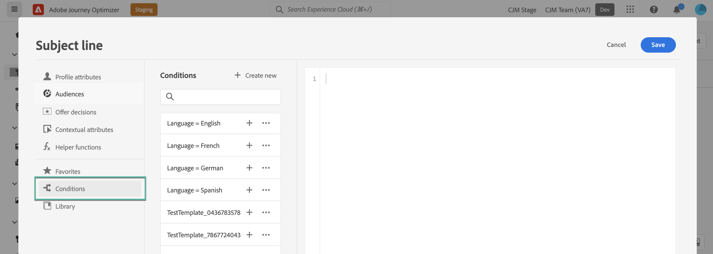
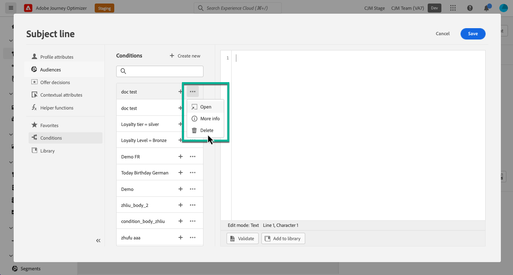

# Work with conditional rules {#conditions}

Conditional rules are sets of rules that define which content should be displayed in your messages, depending on various criteria like profiles' attributes, segment membership or contextual events.

Conditional rules are created using the expression editor and can be stored if you want to reuse them across your contents. [Learn how to save a conditional rule to the library](#save)

>[!NOTE]
>
>Individuals will need the [Manage Library Items](../administration/ootb-product-profiles.md) permission to save or delete conditional rules. Saved conditions are available for use by all users within an organization.

## Access the conditional rule builder {#access}

Conditional rules are created from the **[!UICONTROL Conditions]** menu within the expression editor, which is accessible either:

* From the Email Designer, when enabling dynamic content for a component in the email body. [Learn how to add dynamic content into emails](dynamic-content.md#emails)

    

* In any field where you can add personalization using the [Expression Editor](personalization-build-expressions.md).

    

## Create a conditional rule {#create-condition}

>[!CONTEXTUALHELP]
>id="ajo_expression_editor_conditions"
>title="Create condition"
>abstract="Combine profile attributes, contextual events or audiences to build rules that define which content should be displayed in your messages."

>[!CONTEXTUALHELP]
>id="ajo_expression_editor_conditions_create"
>title="Create condition"
>abstract="Combine profile attributes, contextual events or audiences to build rules that define which content should be displayed in your messages."

The steps to create a conditional rule are as follows:

1. Access the **[!UICONTROL Conditions]** menu from the Expression Editor or the Email Designer, then click **[!UICONTROL Create new]**.

1. Build the conditional rule according to your needs. To do this, drag and drop and arrange the desired attributes from the left menu into the canvas. 

    The steps to combine attributes into the canvas are similar to the segment building experience. For more information on how to work with the rule builder canvas, refer to [this documentation](https://experienceleague.adobe.com/docs/experience-platform/segmentation/ui/segment-builder.html?lang=en#rule-builder-canvas).

    

    Attributes are organized into three tabs:

    * **[!UICONTROL Profile]**:
        * **[!UICONTROL Segment Membership]** lists all segment attributes (i.e. status, version etc.) for [Adobe Experience Platform Segmentation service](https://experienceleague.adobe.com/docs/experience-platform/segmentation/home.html),
        * **[!UICONTROL XDM Individual profiles]** lists all the profile attributes associated to the [Experience Data Model (XDM) schema](https://experienceleague.adobe.com/docs/experience-platform/xdm/home.html) defined in Adobe Experience Platform.
    * **[!UICONTROL Contextual]**: when your message is used in a journey, contextual journey fields are available through this tab.
    * **[!UICONTROL Audiences]**: lists all the audiences generated from segments created in [Adobe Experience Platform Segmentation service](https://experienceleague.adobe.com/docs/experience-platform/segmentation/home.html).

1. Once your conditional rule is ready, you can add it to your message to create dynamic content. [Learn how to add dynamic content](dynamic-content.md)

    You can also save the rule to allow further reuse. [Learn how to save a condition](#save)

## Save a conditional rule {#save}

If there are condition rules that you will frequently reuse, you can save save them to the conditions library. All saved rules are shared and can be accessed and used by individuals within your organization.

>[!NOTE]
>
>Conditional rules that leverage journeys contextual attributes cannot be saved to the library.

1. In the condition edition screen, click the **[!UICONTROL Save condition]** button.

1. Give a name and a description (optional) to the rule, then click **[!UICONTROL Add]**.

    

1. The conditional rule is saved to the library. You can now use it to create dynamic content into your messages. [Learn how to add dynamic content](dynamic-content.md)

## Edit and delete saved conditional rules {#edit-delete}

You can delete a conditional rule at any time using the ellipse button.

Conditional rules saved to the library cannot be modified. However, you can still use them to create new rules. To do this, open the conditional rule, make the desired changes then save it to the library. [Learn how to save a condition to the library](#save)
